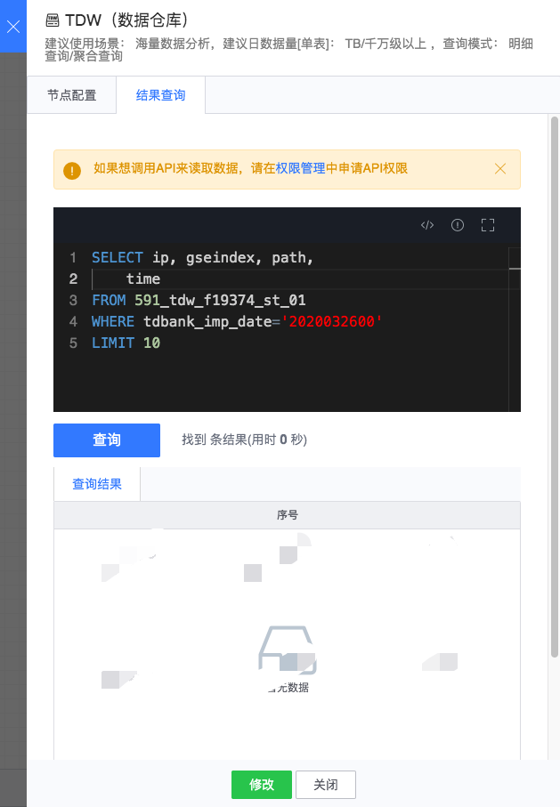

# TDW

TDW 节点底层为基于公司级数据仓库 TDW 构建的分布式数据仓库。

图例，TDW 节点

#### 使用方式
- 节点名称： 自动生成，由上游结果表和当前节点类型组成
- 结果数据表：从上游节点继承过来
- 输出中文名：节点显示的名称
- 应用组名称：对应 tdw 应用组的名称
- BID：对应一个 tdbank 集群 id
- TdBank 地址：访问 TdBank 集群的地址
- KV 分隔符：kv 分隔的字符，如记录 k1=v1&k2=v2，=是 KV 分隔符
- 记录分隔符：记录分隔的字符，如记录 k1=v1&k2=v2，&是记录分隔符
- 存储集群：通常可选有默认集群组集群，其它可选集群与任务所属项目相关
- DB：tdw 中数据库的名称
- 过期时间：数据入库后保存的过期时间

配置例子如下：

对于运行中的任务，双击节点后，在数据查询标签页可对 TDW 中的数据进行查询：

对于实时计算节点，可在下游接 TDW 存储节点，将数据导入到 TDBank。更多 TDW 相关用法详见**[TDW 功能介绍](../../tdw.md)**。
