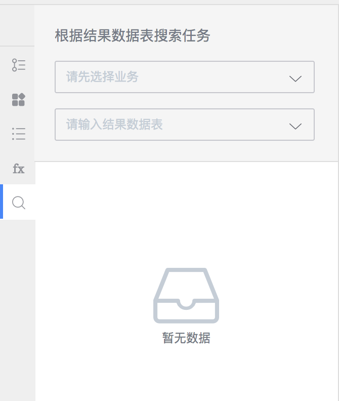
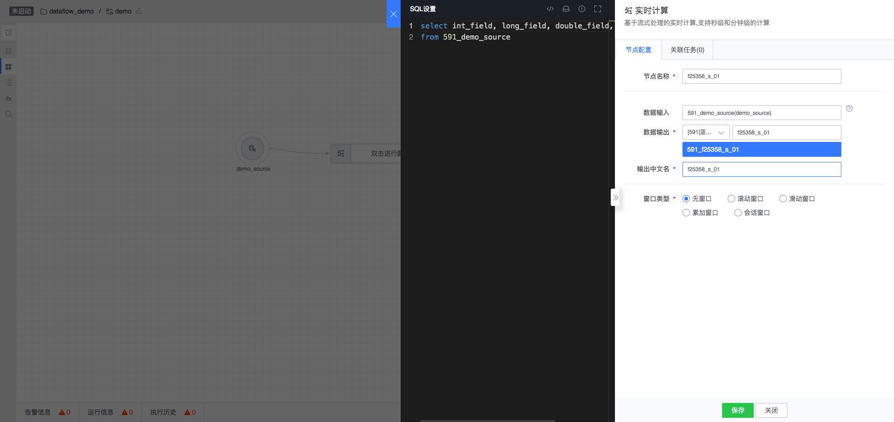
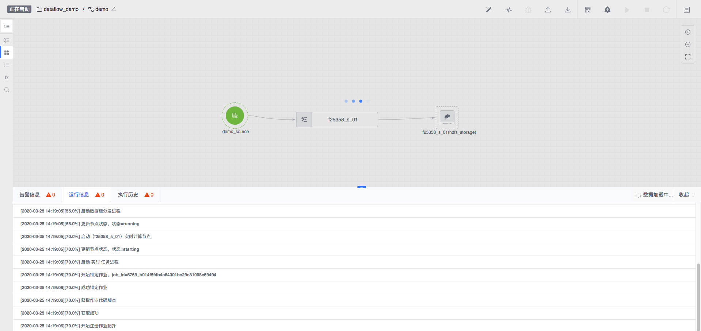

# 画布工作台

数据开发的工作台为开发者打造一个在线 IDE，通过在画布区域拖拽工作流，为清洗结果表、计算结果表等已格式化结果表提供数据开发功能。

## 工作台概览

#### 操作栏

集合了所有对任务的操作，主要为自动排版、监控、调试、启停、任务详情与新手介绍等。

#### 侧边栏

- 项目任务列表

    包含二级列表，可选择指定项目，查看当前项目下任务列表，可创建任务和查看任务。其中，任务列表当前按照最近修改时间排序。

- 组件库

    包含数据源、数据处理、机器学习、数据存储等节点，用于拖拽至画布完成任务流程。

- 节点列表

    节点列表会显示所有已拖拽至画布中的节点。

- 函数库

    当需要对计算节点进行 SQL 设置时，可参考函数库里提供的介绍。

- 搜索

  对于数据开发产生的结果表，可通过该入口进行搜索并支持跳转。

#### 信息栏

操作任务时相关信息都会在该处展示。

- 告警信息

    展示当前任务所有告警信息。

- 运行信息

    展示当前任务部署或调试的运行信息。

- 执行历史

    展示当前任务所有部署历史信息。

#### 画布区

通过拖拽组件库中节点到画布区，并在节点之间建立连线，形成有向无环的数据流拓扑。该拓扑将数据源、数据处理、数据存储关联为一个数据开发任务。

节点通过连线规则进行有向关联，表达了任务中数据流的关系，当前数据开发提供了以下节点组件类型，详细节点类型可参考大数据组件库介绍。

<table style="text-align: center;">
    <tr>
        <td>节点组件类型</td>
        <td>功能描述</td>
   </tr>
   <tr>
        <td>数据源</td>
        <td>配置结果数据作为数据处理的源</td>
   </tr>
    <tr>
        <td>数据处理</td>
        <td>提供诸如实时计算、离线计算等数据处理能力</td>
    </tr>
    <tr>
        <td>机器学习</td>
        <td>提供机器学习能力</td>
    </tr>
    <tr>
        <td>数据存储</td>
        <td>配置节点，将数据入库到指定类型存储</td>
    </tr>
</table>

## 基本功能使用

### Step 1. 创建任务

在侧边栏选择特定项目后，点击创建任务按钮，创建一个新任务。

### Step 2. 创建节点与连线

在侧边栏组件库中选择节点，如数据源节点，并根据连线规则可创建实时节点、HDFS 存储节点等。

- 创建实时数据源节点

- 创建实时节点

- 创建 HDFS 存储节点
  

### Step 3. 启动任务

通过点击操作栏启动按钮，运行任务。

####  启动配置

​	启动任务前，需要配置任务信息。

- 计算集群组

  用于标识当前画布任务启动所属集群组，若集群组与特定计算集群绑定，任务将启动在与集群组绑定的集群中。

- 数据处理模式

|  处理模式   | 说明  |
|  ----  | ----  |
| 继续  | 任务启动后从上次停止处理位置继续处理，在平台缓存数据时间内，可保证当前及下游数据的连续性 |
| 尾部  | 任务启动后从最新到达数据开始处理，上次停止至当前启动时间内的数据将不会处理 |
| 头部  | 任务启动后从平台缓存最久数据开始处理，若上次停止时已处理了部分数据，可能造成当前及下游数据的重复处理 |

说明：对于第一次启动的新任务，选择“继续”会从头部消费。之后，再次重启时，选择"继续"会从上次停止处理的位置继续消费。

#### 启动说明

- 若当前画布仅有数据源节点，不允许启动
- 若当前画布不存在落地存储的节点，不允许启动
- 若画布中存在实时计算节点叶子节点未落存储，不允许启动

### Step 4. 重启任务

通过点击操作栏重启按钮，重启任务。

#### 重启配置

重启任务的启动配置同 **Step 3.** 中描述。

#### 重启说明

- 若数据处理模式选择为继续
  - 若画布中所有节点都未进行过修改，重启无效
  - 若对运行中任务进行了节点、连线的增删改操作，仅重启受影响的任务
- 若数据处理模式选择为尾部
  - 重启所有任务，实时计算任务将从最新数据开始处理
- 若数据处理模式选择为头部
  - 重启所有任务，实时计算任务从平台缓存最久数据开始处理

### Step 5. 停止任务

通过点击操作栏停止按钮，停止任务。

