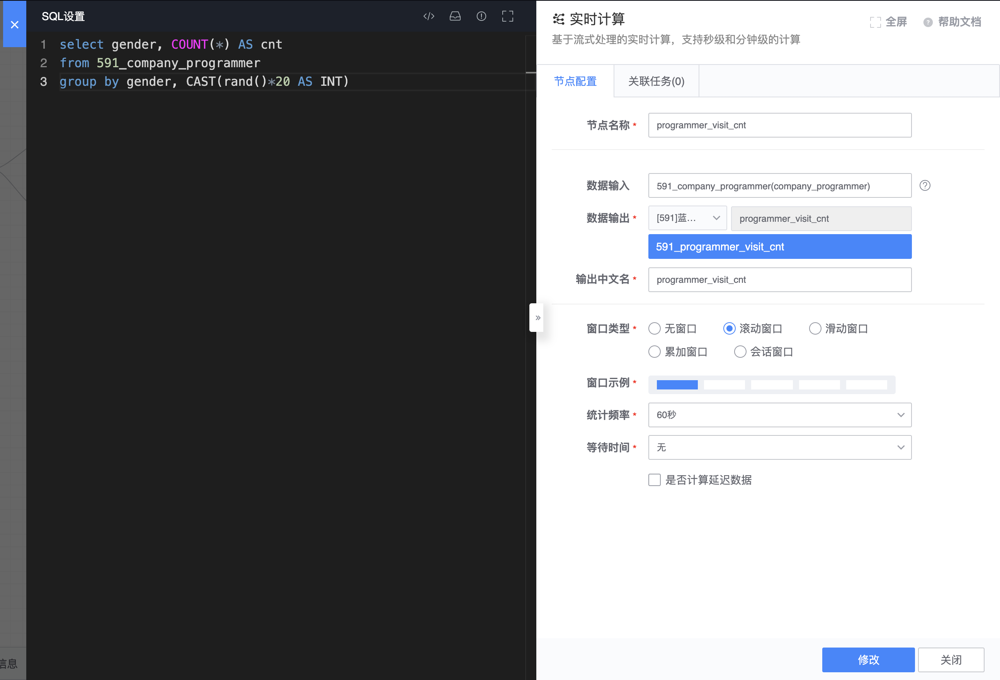

## 降低数据倾斜

## 典型案例

实时计算 SQL 在对含有窗口的节点根据某些 key 进行分组聚合时，由于原始数据自身的特性，可能存在数据倾斜的情况，此时数据处理的并行度不能得到有效扩展。譬如：

输入表 company_programmer：

|      数据时间        |  gender |  name  |
| :-----------------: | :-----: | :----: |
| 2020-01-01 00:00:01 |   male  |   n1   |
| 2020-01-01 00:00:02 |   male  |   n2   |
| 2020-01-01 00:00:03 |   male  |   n3   |
| 2020-01-01 00:00:04 |   male  |   n4   |
| 2020-01-01 00:00:05 |   male  |   n5   |
| 2020-01-01 00:00:06 |  female |   n6   |
| 2020-01-01 00:00:07 |  female  |  n7   |
| 2020-01-01 00:00:08 |   male  |   n8   |
| 2020-01-01 00:00:09 |   ...   |   ...  |
| 2020-01-01 00:00:10 |   ...   |   ...  |

如上图所示，针对每个 60 秒的窗口，根据字段 `gender` 的值进行分组后并计数。由于 `gender` 值为只有两种类型，且 `male` 的数据远远多于 `female`，而分组时相同 key 的值会在同一个 task 中处理，因此分组计算最多只有 2 个并发度，计算存在数据倾斜的情况。

## 优化

当数据源数据量大并且存在数据倾斜时，无法及时处理，造成数据延迟。可针对具体的 SQL 使用进行优化，以上图为例，可以构造如下两个实时计算节点，将数据打散进行预聚合后再最终执行聚合，达到同样的计算效果。

