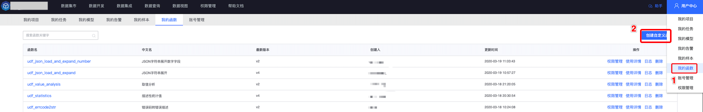
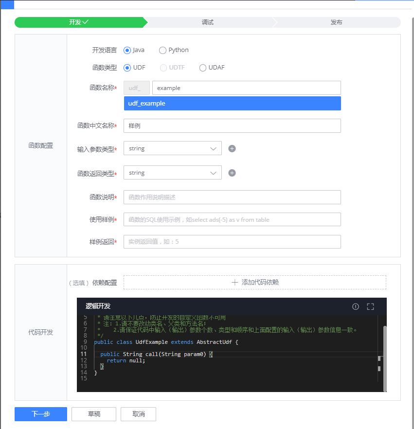
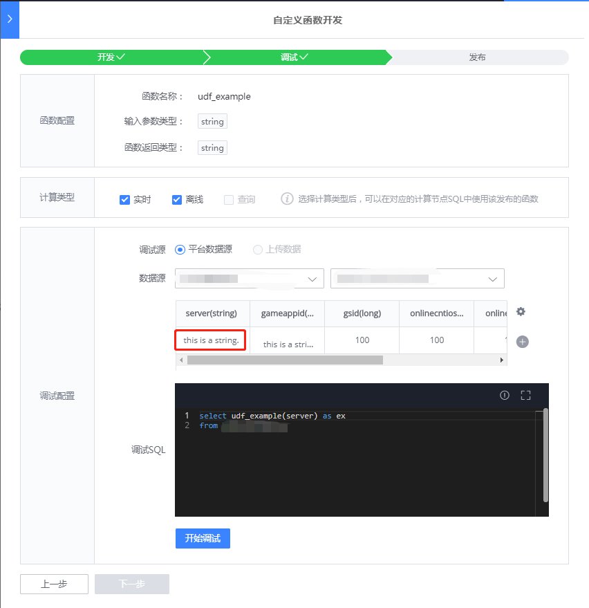
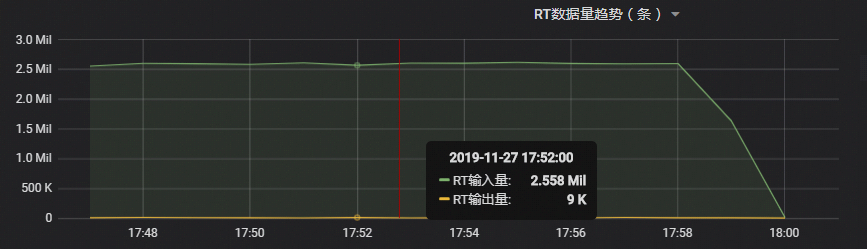

# 用户自定义函数（UDF）
平台数据开发提供了基于 SQL 的数据开发，在用户开发的过程中，经常会有自定义函数的需求。
为了提供用户自助开发自定义函数的能力，对用户屏蔽了计算引擎之间的差别，推出了用户自定义函数（UDF）。
支持用户一次开发，多处使用（实时计算、离线计算），支持多语言开发（Java、Python）。

## 基本概念

UDF(User-Defined Scalar Functions)：用户自定义标量函数，将零个、一个或者多个数量的值转换为一个新的值。

UDTF(User-Defined Table Functions)：用户自定义表函数， 将零个、一个或多个标量值做为输入参数，它返回的数据可以包含一列或多列、一行或多行。

UDAF(User-Defined Aggregate Functions)：用户自定义聚合函数，将一个表（一列或多列、一行或多行）聚合为标量值。

## 使用流程

### 开发、调试、发布自定义函数

- 进入自定义函数开发界面，选择下图其中一种方式进入
  
  

- 开发自定义函数，首先需要选择开发语言和函数类型，填入函数名称、函数中文名称及输入输出类型，
  然后会自动生成代码框架
  

- 你开发的函数，所有的用户都可以用，所以请认真填写函数说明和使用样例，如下图是一个 Java、UDF 的样例，功能是在输入参数前面添加一个固定字符串。
  假如你需要引入其他的包，可以配置依赖配置
  

- 开发好函数之后，需要进行调试才能发布。假如你的函数只需要在实时计算使用，计算类型只选实时就可以了。如果需要在实时、离线同时使用，则需要将实时、离线全部选中，然后选择平台中的数据源，红框里的内容你可以修改，以达到你的调试目的。
  

- 调试结束后，可以查看结果是否符合预期，如果符合预期，可以下一步进行发布
  

- 在发布页面，再次确认要发布的函数信息进行发布
  

- 发布后，可以在左侧自定义函数列表看到使用详情，也可以再次进行修改
  

- 发布之后，就可以在对应的计算节点中的 SQL 使用发布的自定义函数了，默认使用最新版本发布的函数

### 我的函数

我的函数参考用户中心/ [我的函数](../user-center/udf.md)

## 开发须知

自定义函数开发语法版本分别为 <font color="#dd0000">**Java 8**</font> 和 <font color="#dd0000">**Python 3.6.9**</font>

### UDF

- Java 开发需要继承类 AbstractUdf，需要实现 call 方法，SQL 中作用的字段即为 call 方法的输入参数，以下例子为实现字符串拼接

```java
/**
 * UDF(User-Defined Scalar Functions)：用户自定义标量函数，将零个、一个或者多个数量的值转换为一个新的值。
 */
public class UdfTestUdf extends AbstractUdf {
  
  /**
  * 数据执行方法
  * 
  * @param a 对应 sql中的第一个参数
  * @param b 对应 sql中的第二个参数
  * @return  计算后返回的值
  */
  public String call(String a, String b) {
    return  a + b;
  }
}
```

- Python，需要实现 call 方法，SQL 中作用的字段即为 call 方法的输入参数，以下例子为实现字符串拼接

```python
# -*- coding: utf-8 -*-
"""
UDF(User-Defined Scalar Functions)：用户自定义标量函数，将零个、一个或者多个数量的值转换为一个新的值。
"""
def call(a, b):
    """
    数据执行方法
    
    :param a: 对应sql中的第一个参数
    :param b: 对应sql中的第二个参数
    :return: 计算后返回的值
    """
    return a + b
```

### UDTF

- Java，需要实现 call 方法。以下例子为根据指定分隔符切分字符串，并输出两个字段，第一个字段为切分后的字符串，第二个字段为切分后字符串的长度

```java
/**
 * UDTF(User-Defined Table Functions)：用户自定义表函数， 将零个、一个或多个标量值做为输入参数，它返回的数据可以包含一列或多列、一行或多行。
 */
public class UdfTestUdtf extends AbstractUdtf {

  /**
  * 数据执行方法，最后用collect方法将计算结果数据收集起来
  * 
  * @param str 需要切分的字符串
  * @param separator 指定的分割符
  */
  public void call(String str, String separator) {
    for (String tmp : str.split(separator)) {
      Object[] objects = new Object[2];
      objects[0] = tmp;
      objects[1] = tmp.length();
      // 收集计算结果数据
      collect(objects);
    }
  }
}


```

- Python，call 方法为数据执行方法，get_result 方法获取结果。以下例子为根据指定分隔符切分字符串，并输出两个字段，第一个字段为切分后的字符串，第二个字段为切分后字符串的长度

```python
"""
UDTF(User-Defined Table Functions)：用户自定义表函数， 将零个、一个或多个标量值做为输入参数，它返回的数据可以包含一列或多列、一行或多行。
"""
# -*- coding: utf-8 -*-

# 用来收集结果数据
result = []

def call(str, separator):
    """
    数据执行方法，并收集数据到result
    
    :param str: 需要切分的字符串
    :param separator: 指定的分割符
    """
    global result
    del result[:]
    for tmp in str.split(separator):
        object = [tmp, len(tmp)]
        collect(object)

def collect(object):
    """
    收集计算结果到result
    """
    result.append(object)

def get_result():
    """
    :return: 获取计算后返回的结果
    """
    return result

```

- SQL 语法

UDTF 支持 cross join 和 left join，在使用 UDTF 时需要添加 lateral 和 table 关键字。以上述的 UDTF 为例（假设此 UDTF 函数名为 udf_test_udtf），下面是它的两种用法。

cross join: 左表的每一行数据都会关联上 UDTF 产出的每一行数据，如果 UDTF 不产生任何数据，那么这一行不会输出。

```sql
-- 函数udf_test_udtf作用于表table的sss字段，分隔符为'-'
select sss, a, b
from table_name, lateral table(udf_test_udtf(sss, '-')) as T(a, b)
```

left join: 左表的每一行数据都会关联上 UDTF 产出的每一行数据，如果 UDTF 不产出任何数据，那么这一行的 UDTF 的字段会用 null 值填充。

```sql
-- 函数udf_test_udtf作用于表table的sss字段，分隔符为'-'
select sss, a, b
from table_name left join lateral table(udf_test_udtf(sss, '-')) as T(a, b) on true
```

<font color="#dd0000">注：left join UDTF 语法后面必须接 on true 函数。left join 语法目前只支持离线计算</font>


### UDAF

- Java，下面示例的函数的功能为求平均值

```java
import java.util.HashMap;
import java.util.Map;
/**
 * UDAF(User-Defined Aggregate Functions)将一个表（一列或多列、一行或多行）聚合为标量值。
 */
public class UdfJavaUdaf extends AbstractUdaf<Map<String,Long>, Double> {

  /**
  * 创建一个计算累加器，分别有两个key， sum对总数进行累加，count进行计数
  *  
  * @return  返回一个map累加器
  */
  public Map<String,Long> createAccumulator() {
    return new HashMap<String, Long>() {
      {
        put("sum", 0L);
        put("count", 0L);
      }
    };
  }

  /**
  * 获取计算结果，sum/count
  *  
  * @param acc 计算累加器
  * @return  计算结果，即平均值
  */
  public Double getValue(Map<String,Long> acc) {
    if (0 == acc.get("count")) {
        return null;
    } else {
        return (double) acc.get("sum") / acc.get("count");
    }
  }

  /**
  * 当新数据到达后，需要计算在累加器中
  *  
  * @param acc 计算累加器
  * @param param0 需要求平均的字段，即sql中的函数的参数
  */
  public void accumulate(Map<String,Long> acc, long param0) {
      acc.put("sum", acc.get("sum") + param0);
      acc.put("count", acc.get("count") + 1);
  }

  /**
  * 因为是分布式计算框架，需要对不同的累加器进行合并计算
  * 
  * @param acc  一个计算累加器
  * @param a 另一个计算累加器
  */
  public void merge(Map<String,Long> acc, Map<String, Long> a) {
    acc.put("sum", acc.get("sum") + a.get("sum"));
    acc.put("count", acc.get("count") + a.get("count"));
  }

  /**
  * 重置计算累加器，当一个计算周期结束后，需要重置
  *  
  * @param acc 上一个计算周期的累加器
  */
  public void resetAccumulator(Map<String,Long> acc) {
    acc.put("sum", 0L);
    acc.put("count", 0L);
  }
}
```

- Python，下面示例的函数的功能为求平均值

```python
# -*- coding: utf-8 -*-
"""
UDAF(User-Defined Aggregate Functions)将一个表（一列或多列、一行或多行）聚合为标量值。
    1、convert_dict作用是将累加器转换为dict，"from funciton_name_util import convert_dict" 会根据模版自动生成
"""
from udf_udaf_util import convert_dict

def init():
    """
    创建一个计算累加器，分别有两个key， sum对总数进行累加，count进行计数
    请保证dict中所有key保持类型一致，所有value保持类型一致
    """
    return {"sum": 0, "count": 0}

@convert_dict
def get_value(accumulator):
    """
    获取计算结果，sum/count
    
    :param accumulator: 计算累加器
    :return: 计算后返回的值，即平均值
    """
    if accumulator.get("count") == 0:
        return None
    return accumulator.get("sum") / accumulator.get("count")

@convert_dict
def accumulate(accumulator, value):
    """
    当新数据到达后，需要计算在累加器中
    
    :param accumulator: 计算累加器
    :param value: 需要求平均的字段，即sql中的函数的参数
    :return: 返回累加器
    """
    accumulator["sum"] += value
    accumulator["count"] += 1
    return accumulator

@convert_dict
def merge(accumulator1, accumulator2):
    """
    因为是分布式计算框架，需要对不同的累加器进行合并计算，需要将accumulator2里的数据合并到accumulator1中去，并返回累加器
    
    :param accumulator1: 一个计算累加器
    :param accumulator2: 另一个计算累加器
    :return: 返回累加器
    """
    accumulator1["sum"] = accumulator1["sum"] + accumulator2["sum"]
    accumulator1["count"] = accumulator1["count"] + accumulator2["count"]
    return accumulator1

@convert_dict
def reset_accumulator(accumulator):
    """
    重置计算累加器后并返回，当一个计算周期结束后，需要重置
    
    :param accumulator: 上一个计算周期的累加器
    """
    accumulator["sum"] = 0
    accumulator["count"] = 0
    return accumulator
```

## 性能测试

实时计算具有一定的时效性，下面给出了以上示例中自定义函数的性能指标。因为业界计算框架是基于 Java 开发的，所以 Java 实现的自定义函数普遍比 Python 实现的性能要好一些。

以下任务运行资源分配均为 1 核 1G。

### UDF

按照以上示例中的 UDF 实现，Java 实现的 UDF 处理性能为 240 万/分钟，Python 实现的 UDF 处理性能为 16 万/分钟，性能图如下：

- 示例中 Java 实现的 UDF 处理性能


- 示例中 Python 实现的 UDF 处理性能


### UDTF

按照以上示例中的 UDTF 实现，Java 实现 UDTF 处理性能为 155 万/分钟，Python 实现的 UDTF 处理性能为 86 万/分钟

- 示例中 Java 实现的 UDTF 处理性能


- 示例中 Python 实现的 UDTF 处理性能


### UDAF

按照以上示例中的 UDAF 实现，Java 实现的 UDAF 处理性能为 250 万/分钟，Python 实现的 UDAF 处理性能为 12 万/分钟

- 示例中 Java 实现的 UDAF 处理性能



- 示例中 Python 实现的 UDAF 处理性能


<font color="#dd0000">注：以上性能指标仅供参考，具体的 UDF 处理性能和其实现逻辑有关系。</font>

## 注意事项

- 自定义函数重新发布后，需要重新保存使用此函数的 SQL 节点，并重启任务后才能生效
- 当选定函数类型后（UDF/UDTF/UDAF），并编写部分代码后，为保证代码不丢失，切换函数类型，代码框架不会再次自动刷新
- 如果需要增加第三方 Python 库请联系平台管理员
- 当前开发语言版本分别为 Java 8 和 Python 3.6.9
