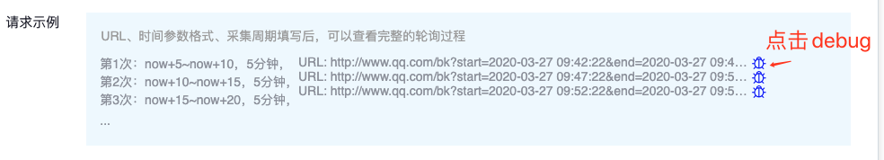
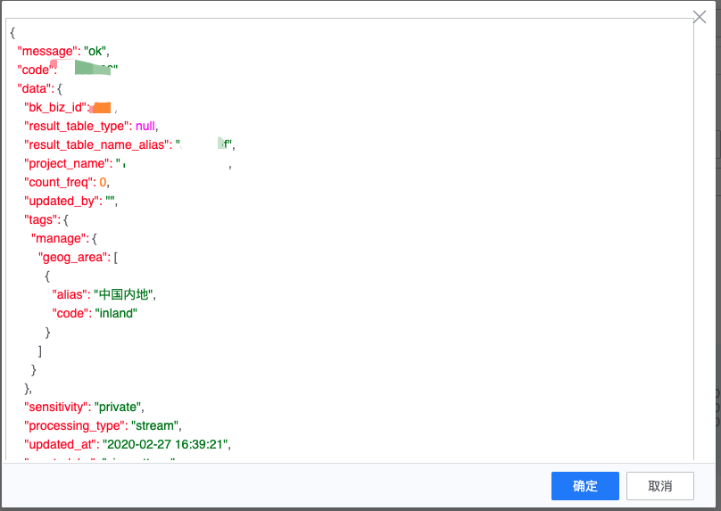
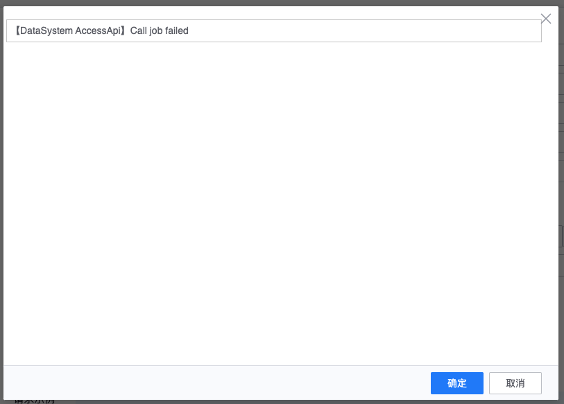

# HTTP 接入

## 简介

HTTP 采集采用 HTTP 协议采集数据.

## 采集原理

采集器部署在平台的服务器上, 远程访问 HTTP 的方式采集

每个固定周期\(用户配置\), 可按时间查询条件查询数据, 然后上报数据.

## 接入准备

因为使用远程拉取, 所以需要用户对拉取的机器进行授权

以下 IP 需要具有 HTTP 访问权限:

## 数据接入

### 数据信息

定义 了源数据的基础信息, 包含业务, 源数据名称等.数据源名称由用户自己定义, 在相同业务中不能重复

### 接入对象

当前仅支持 GET 访问方式.

支持按照时间字段来查询. 时间字段可以配置起始时间和结束时间.

字段名可以自定义, 默认为 start 和 end

每个接入对象定义了需要采集的 HTTP 配置

* URL
* 时间参数. 在 url 中填写
* 时间格式

每个数据源支持配置多项接入对象.

### 接入方式

采集方式只支持拉取

采集周期可按分, 时, 天配置

### 过滤条件

可选项. 支持按照字段过滤

### 请求示例

展示了三种查询的示例, 点击测试按钮可以测试数据采集情况

调试成功返回结果

调试失败返回结果示例

#### 接入界面示例如下

## 

