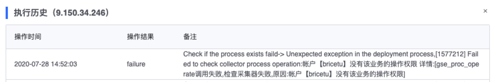

# Log 接入故障自助排查与常见问题解答

### 创建接入时提示权限异常 

业务的相关角色在平台上默认有接入和查询的权限，日志需要  业务运维人员 业务总监 等接入权限。权限相关详细信息：[我的权限](../../../auth-management/permission.md)

可以通过以下途径，到 TEA 系统中进行申请：

* 业务总监：可接入任意场景的业务数据，拥有业务数据的全部权限，包括审批授权
* 业务运维人员（包括运营规划）：可接入任意场景的业务数据，拥有业务数据的全部权限，包括审批授权
* 业务开发人员：可接入除《日志文件》、《脚本上报》、《TLOG》以外场景的业务数据，可查询业务数据
* 业务产品人员：可接入除《日志文件》、《脚本上报》、《TLOG》以外场景的业务数据，可查询业务数据
* 业务测试人员：可接入除《日志文件》、《脚本上报》、《TLOG》以外场景的业务数据，可查询业务数据
* 业务角色暂时无法在平台上直接申请，平台会定时从 蓝鲸配置平台 同步角色成员，目前仅同步运维人员、开发人员、产品人员和测试人员，同步延迟最大为 10 分钟。

除此之外，采集器的下发还需要 Job 平台的权限，若提示如图的错误，请到 Job 平台中完成相关权限申请。

### 创建接入后采集器为什么是异常状态的 

接入后若是显示失败，请按照以下自查手册进行自行故障排查：

#### 1.先点击界面上的刷新按钮，获取最新的采集器状态，初步排查采集器问题

采集器状态不是实时刷新的，用户需要手动刷新界面的按钮，获取最新的状态信息。

若是状态异常，则点击编辑按钮，重新对相同机器下发采集器，查看后续采集器状态。

#### 2.查看采集器配置是否包含 data_id ，并检查检查采集器的目录是否对应

后续的排查操作，需要到具体采集的机器上操作。首先检查采集器的配置中是否包含 data_id

    cat /data/MapleLeaf/bkdata/plugins/unifyTlogc/conf/unifyTlogc.json | python -m json.tool

目前不同环境不同版本的路径暂时不统一：

* IDC 内部版：/data/MapleLeaf/bkdata/plugins/unifyTlogc/conf/unifyTlogc.json
* 企业版：/usr/local/gse/plugins/etc/unifyTlogc.json

并在 /usr/local/gse/plugins/bin 目录下有相关采集器程序的软连接

#### 3.查看采集器进程是否存在

3.1 查看采集器进程

通过下面的命令行操作，查看具体到的采集器进程

若是不存在需要重新接入试下，重新接入如果还不行，可能重启任务的脚本存在问题，进入下一步 3.2 排查

若是有两个不同路径的 agent 进程，请联系平台助手解决
  
    ps -ef|grep -i unifytlogc

3.2 查看启动脚本问题

    [/usr/local/gse/plugins/bin]# cat restart.sh
    cd ${BASH_SOURCE%/*} 2>/dev/null
    ./stop.sh $@ && ./start.sh $@

若是如上述代码所示： stop.sh 和 start.sh 在同一行，请将两个脚本分开，这里 stop.sh 返回值不会 0，会导致 start.sh 不会执行，修改如下：
    
    cd ${BASH_SOURCE%/*} 2>/dev/null
    ./stop.sh $@
    ./start.sh $@
    
3.4 测试 agent 是否正常

使用如下命令，测试 GSE 功能是否正常，功能正常会显示如图信息。如显示 Failed ，请联系平台小助手或 GSE 相关团队。

    gsecmdline -D -d 0 -s test

#### 4.若是部署过程中出现 `Call job timeout`,则查看蓝鲸作业平台的作业执行历史，找传文件相关的作业

例如接入的记录如下，则查找如下名称的作业： API GSE PUSH FILE15******20667， 判断 job 执行是否有超时行为，并联系平台小助手或 GSE 相关团队

    INFO|2020-07-03 17:05:34|开始接入log数据
    INFO|2020-07-03 17:05:34|检查进程是否存在
    INFO|2020-07-03 17:05:55|下发配置
    ERROR|2020-07-03 17:06:57|部署过程出现非预期异常,Call job timeout
    故job平台上 17:05:55 左右应该有个作业才对

#### 5.若是以上问题无法解决，或自助排查问题遇到困难，请联系：平台助手
