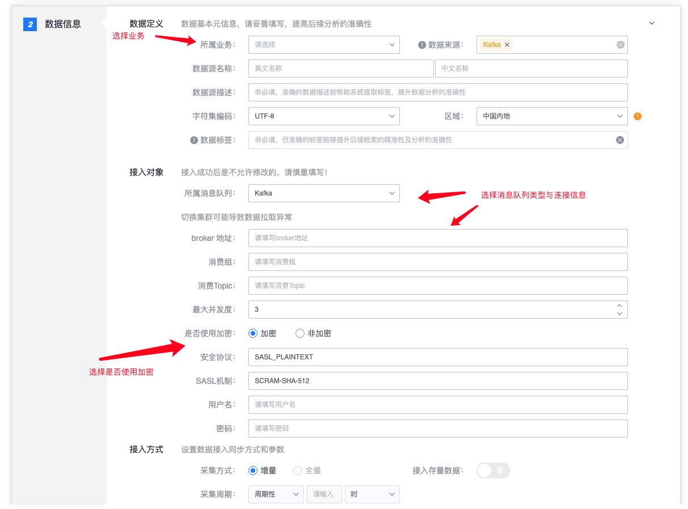

# 消息队列接入

## 简介

消息队列接入提供实时消息队列数据上报功能。能动态感知消息队列中的内容追加，支持实时采集新增数据上报到平台。目前仅支持 Kafka 消息队列。

## 数据接入

### 数据定义

定义了源数据的基础信息，包含业务，源数据名称等。数据源名称由用户自己定义，在相同业务中不能重复。

### 接入对象

每个接入对象定义了消息队列类型，消息队列的连接信息。目前仅支持 Kafka 消息队列。

* broker 地址：Kafka 的 broker 地址;
* 消费组: Kafka 消费者的消费组;
* 消费 Topic : 填写需要消费的 Kafka topic ;
* 最大并发数 : 选择使用多少个分区来处理原先消息队列中的数据;
* 是否使用加密: 是否对消息队列里的数据进行加密;

### 接入方式

采集器为实时采集，暂时不可配置。

#### 接入界面示例如下

