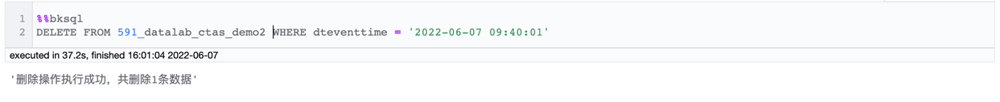

# DML(数据操作)语句
- [INSERT INTO](#insert-into)
- [INSERT OVERWRITE](#insert-overwrite)
- [DELETE](#delete)
- [UPDATE](#update)
- [MERGE INTO](#merge-into)

## `INSERT INTO`
- ### 语法说明
  将数据插入到结果表中，可以使用 `values` 或者 `select` 子查询来指定要插入的数据集。

- ### 语法格式
  ```mysql
  INSERT INTO table_name [ ( column_list ) ]
    { VALUES ( { value | NULL } [ , ... ] ) [ , ( ... ) ] | query }
  ```
  
- ### 参数说明
  - `table_name`：待插入数据的结果表名
  - `column_list`：字段列表
  - `query`：子查询语句

- ### 示例
  - 使用 `values` 指定数据集
  ```mysql
  INSERT INTO 591_datalab_ctas_demo2 VALUES ('2022-06-07')
  ```
  

  - 使用 `select` 子查询指定数据集
  ```mysql
  INSERT INTO 591_datalab_ctas_demo2 (dteventtime)
  SELECT dteventtime
  FROM 591_presto_marketing_clusterinfo.hdfs
  WHERE thedate >= 20220605
        AND thedate <= 20220607;
  ```
  
  
- ### 使用限制
  - 在 [Notebook](../notebook/bksql.md) 页面操作或通过或通过异步查询接口(`v3_queryengine_query_async`) 调用
  - 目标表和数据源表均为 `iceberg` 格式
  - 拥有目标表的插入权限，数据源表的查询权限

## `INSERT OVERWRITE`
- ### 语法说明
  清理结果表中的现有数据，再使用 `values `或者 `select` 子查询指定的结果集来进行插入

- ### 语法格式
  ```mysql
  INSERT OVERWRITE table_name [ ( column_list ) ]
    { VALUES ( { value | NULL } [ , ... ] ) [ , ( ... ) ] | query }
  ```
  
- ### 参数说明
  - `table_name`：待插入数据的结果表名
  - `column_list`：字段列表
  - `query`：子查询语句

- ### 示例
  - 使用 `values` 指定数据集
  ```mysql
  INSERT OVERWRITE INTO 591_datalab_ctas_demo2 (dteventtime) VALUES ('2022-06-05')
  ```
  

  - 使用 `select` 子查询指定数据集
  ```mysql
  INSERT OVERWRITE INTO 591_datalab_ctas_demo2 (dteventtime)
  SELECT dteventtime
  FROM 591_presto_marketing_clusterinfo.hdfs
  WHERE thedate >= 20220605
        AND thedate <= 20220607;
  ```
  

- ### 使用限制
  - 在 [Notebook](../notebook/bksql.md) 页面操作或通过或通过异步查询接口(`v3_queryengine_query_async`) 调用
  - 目标表和数据源表均为 `iceberg` 格式
  - 拥有目标表的插入权限，数据源表的查询权限

## `DELETE`
- ### 语法说明
  删除结果表中的数据。如果未指定 where 条件，则会清空结果表中所有数据

- ### 语法结构
  ```mysql
  DELETE FROM table_name [ WHERE condition ]
  ```
  
- ### 参数说明
  - `table_name`：待删除数据的结果表名
  - `WHERE condition`：where 条件

- ### 示例
  - where 表达式
  ```mysql
  DELETE FROM 591_datalab_ctas_demo2
  WHERE dteventtime = '2022-06-07 09:40:01'
  ```
  
  
  - where 子查询
  ```mysql
  DELETE FROM 591_datalab_ctas_demo2
  WHERE dteventtime IN (
      SELECT dteventtime
      FROM 591_presto_marketing_clusterinfo.hdfs
      WHERE thedate >= 20220605
          AND thedate <= 20220607
    )
  ```
  

- ### 使用限制
  - 在 [Notebook](../notebook/bksql.md) 页面操作或通过或通过异步查询接口(`v3_queryengine_query_async`) 调用
  - 目标表为 `iceberg` 格式
  - 拥有目标表的删除权限

## `UPDATE`
- ### 语法说明
  更新结果表中的数据。如果未指定 where 条件，则会更新结果表中所有数据

- ### 语法结构
  ```mysql
  UPDATE table_name SET col1_name = value1 [, col2_name = value2 ...] 
  [WHERE condition];
  ```
  
- ### 参数说明
  - `table_name`：待更新数据的结果表名
  - `col1_name、col2_name`：待更新行对应的列名
  - `value1、value2`：更新后的列值
  - `WHERE condition`：where 条件

- ### 示例
  - where 表达式
  ```mysql
  UPDATE 591_datalab_ctas_demo2
  SET dteventtime = '2022-06-01'
  WHERE dteventtime = '2022-06-05'
  ```
  
  
  - where 子查询
  ```mysql
  UPDATE 591_datalab_ctas_demo2
  SET dteventtime = '2022-06-01'
  WHERE dteventtime IN (
          SELECT dteventtime
          FROM 591_presto_marketing_clusterinfo.hdfs
          WHERE thedate >= 20220605
              AND thedate <= 20220607
    )
  ```
  

- ### 使用限制
  - 在 [Notebook](../notebook/bksql.md) 页面操作或通过或通过异步查询接口(`v3_queryengine_query_async`) 调用
  - 目标表为 `iceberg` 格式
  - 拥有目标表的更新权限

## `MERGE INTO`
- ### 语法说明
  根据与源表关联的结果，对目标表执行插入、更新或者删除操作

- ### 语法结构
  ```mysql
  MERGE INTO target_table AS <target_alias_name> USING <select|source_table> AS <source_alias_name>
  ON <boolean expression>
  WHEN MATCHED THEN { UPDATE SET <set_clause_list> | DELETE }
  WHEN NOT MATCHED THEN { INSERT VALUES <value_list> | INSERT *}
  ```
  
- ### 参数说明
  - `target_table`：目标表名称
  - `target_alias_name`：目标表别名
  - `select、source_table`：关联的源表或者子查询
  - `boolean expression`：关联条件
  - `set_clause_list`：更新列表
  - `value_list`：插入值列表

- ### 示例
  - 匹配则更新，不匹配则插入
  ```mysql
  merge into 591_datalab_ctas_demo2 as a 
  using(SELECT dteventtime FROM 591_presto_marketing_clusterinfo.hdfs WHERE thedate >= 20220605 AND thedate <= 20220607) b
  on (a.dteventtime=b.dteventtime)
  when matched then update set dteventtime='2022-01-01'
  when not matched then insert *
  ```
  
  
  - 匹配则删除，不匹配则插入
  ```mysql
  merge into 591_datalab_ctas_demo2 as a 
  using(SELECT dteventtime FROM 591_presto_marketing_clusterinfo.hdfs WHERE thedate >= 20220605 AND thedate <= 20220607) b
  on (a.dteventtime=b.dteventtime)
  when matched then delete
  when not matched then insert *
  ```
  

- ### 使用限制
  - 在 [Notebook](../notebook/bksql.md) 页面操作或通过或通过异步查询接口(`v3_queryengine_query_async`) 调用
  - 目标表和源表为 `iceberg` 格式
  - 拥有目标表的更新/删除权限，源表的查询权限
