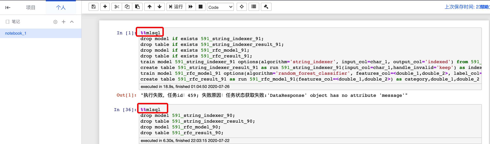

### [MLSQL 简介](#MLSQL简介)

### 基本语法

* [基本操作](#基本操作)
* [关键语法说明](#关键语法说明)
* [用法及示例](#用法及示例)
  * [show](#show语句)
  * [train](#train语句)
  * [run](#run语句)
  * [drop](#drop语句)
  * [truncate](#truncate语句)

### [使用说明](#使用说明)

### [算法参数说明](#算法参数说明)

## MLSQL 简介

MLSQL 致力于提供低门槛的机器学习开发和使用，允许用户以 SQL 的形式使用机器学习算法进行模型训练、预测等功能，并提供统一的自定义算法的开发。

## MLSQL 语法说明

### 基本操作

* train：使用算法进行模型的训练
* run：使用已有的模型或算法进行预测，其可用以两种场景：
  * create：将预测生成的结果写入新的表
  * insert：将预测生成的结果写入已存在的某张表
* show：显示当前用户已有模型，支持 like 进行模糊匹配
* drop：删除已经存在的表或是模型，支持 if exists；
* truncate：清空已有的某张表；

### 关键语法说明 

* 用户可以一次性提交多条语句（在数据探索笔记的单个 cell 内），同一个语句可以换行， 不同语句间使用分号分开；

* drop、truncate 语句可在单独 cell 内独立使用，如果需要与其它语句混合使用，需要放在其它语句的前面，如：

  ```sql
  drop table if exists 591_table_a;
  drop table if exists 591_table_b;
  train ...
  run ...
  ```

* 参数列表，train 中的 option 或 run 运行时的参数列表为 key=value 的格式，其中 value，可以是：

  * 常量：如，1，2， 或 'a'
  * 列名：如 column_1
  * 向量，格式为：<column_1,column_2, column_3>
  * 数组，格式为：[column_1, column_2, column_3]
  * 针对不同算法的不同参数，value 的格式会有差异，使用时请参考算法说明；

* 注释：

  * drop,show 及 trancate 语句前支持单行注释，以--为开头即可

    ```
    --删除指定模型
    drop model 591_model_name
    ```

    注：drop,show 及 truncate 语句前暂不支持/**/多条注释

  * 其它语句前可支持单条，多条，以及 sql 中间的注释

    ```
    /*
    预测
    */
    --使用已有算法
    create table 591_rfc_result_55 --生成指定表
    as run 591_rfc_model_55(
        features_col=<double_1,double_2>) as category,double_1,double_2 
    from 591_string_indexer_result_55;
    ```

* 其它限制：

  * 在同一个语句块内，暂不支持对同一张表 create，然后再 insert，如有需求，请分开语句块完成；


## 用法及示例

目前一期内，提供用户使用机器学习并操作模型及生成查询结果集的基本操作

### show 语句

显示模型信息

```       sql
# 显示当前用户生成的所有模型
show models
# 显示当前用户的名称中含有"pca"的模型
show models like '%pca%'
```

### train 语句

使用算法进行模型的训练

```
train model {模型名称} 
options(algorithm='{算法名称}', 
        {参数名称1}={参数值1}, 
        {参数名称2}={参数值2}) 
from {源表名称}
```

* 示例

  使用“线性回归（linear_regression）”进行模型训练，生成模型为 591_linear_r_model，输入参数为 features_col、label_col，训练的源数据来自表：591_column_change_result_3

```
train model 591_linear_r_model 
options(algorithm='linear_regression', 
        features_col=<feature_1, feature_2,feature_3,feature_4>, 
        label_col=lables) 
from 591_column_change_result_3
```

* 说明
  1. 参数（options）中，algorithm 为保留字，用于指定当前使用的算法名称

### run 语句

#### 用法一：使用已有的算法或模型进行特征训练或预测的过程

```
create table {目标表名称} as
run {已有模型或算法名称}(
        {参数名称1}={参数值1}, 
        {参数名称2}={参数值2}) as {目标列名} 
from {源表名称}
```

* 示例

  使用已经生成的模型 591_linear_r_model，进行预测过程，输入参数为 features_col，最终生成表为 591_linear_r_result，对应结果会写入列 category 中

  ```
  CREATE TABLE 591_linear_r_result as 
  run 591_linear_r_model(
      features_col=<feature_1,feature_2,feature_3,feature_4>) as category 
  FROM 591_column_change_result_3
  ```

* 说明：

  1. run 语句可以使用已经生成的模型，也可以使用部分无需模型直接使用的算法，如将索引转换为具体值 的 index_to_string 算法。
  2. run 的参数列表输入格式与 train 语句完全一致
  3. from 关键字后的内容，可以是表的名称，也可以是子查询：select column_a,column_b from {源表名称}的格式，目前暂不支持 WHERE 条件筛选

#### 用法二：使用 lateral 语法运行有多个输出的算法

```
create table {目标表名} as 
run {目标列名1},{目标列名2} from {源表名称}, lateral table({模型或算法名称}(
    {参数名称1}={参数值1}, 
    {参数名称2}={参数值2}
)) as T({目标列名1},{目标列名2})
```

* 示例

  ```plain
  create table 591_rfc_result_15 as 
  run column_a,column_b from 591_wenson_mock_mix_1,lateral  table(591_rfc_model_15(
      features_col=[double_1,double_2]
      )) as T(column_a,collumn_b)
  ```

* 说明
  
  1. lateral 语法仅适用于返回值有多列的算法或模型预测过程

#### 用法三：使用 insert 语句将结果写入已有表

```
insert into {目标表名}(目标列名) 
run {算法或模型名称}(
    {参数名称1}={参数值1}, 
    {参数名称2}={参数值2}
) as {结果列别名} from {源表名称}
```

* 示例

  ```
  insert into 591_ngram_compute_result_13(run_label) 
  run n_gram(
     input_col=[a,b,c,d,e]
  ) as run_label from 591_wenson_mock_string_1
  ```

* 说明

  insert 支持 into 与 overwrite 两种模式，即:insert into 或者 insert overwrite，两者语法一致。

### drop 语句

删除已经生成的查询结果集或模型

```
# 删除模型
drop model {模型名称}

# 删除查询结果集
drop table {结果集名称}
```

* 说明
  1. drop 语句支持 if exists 语法，即 drop model if exists {模型名称} 或 drop table if exists {结果集名称} ，这样可以规避在执行时模型或表不存在时报出异常

### truncate 语句

清空已经生成的查询结果集

```
truncate table {查询结果集名称}
```


### 使用说明

目前 MLSQL 有使用入口在：平台官网 -->数据探索-->笔记，具体如下：

* 打开平台官网

  .

* 进入数据探索：

  

* 点开左侧笔记，新建笔记或者进入已有笔记：

  

* 在某个 Cell 内，使用:%%mlsql 标记开头，即可编写并执行 mlsql 语句

* 注意：

  1. 一个 Cell 内可以写多条 mlsql 语句，不同 sql 之前用分号分开；
  2. drop、truncate 及 show 语句只能在 train 或 run 语句之前使用，用于清理数据等，而不能在这些语句中间混用（后续会逐渐放开）。

### 算法参数说明

说明：

1. 目前支持算法均来自 sparkmlib 算法；
2. 算法名称及其对应参数均以下划线式代替驼峰式命名，所以如下下述参数未覆盖完成，可直接参考官网相关说明。

* 特征转换
  * [tokenizer](#tokenizer)
  * [stop_words_remover](#stop_words_remover)
  * [n_gram](#n_gram)
  * [binarizer](#binarizer)
  * [pca](#pca)
  * [polynomial_expansion](#polynomial_expansion)
  * [dct](#dct)
  * [string_indexer](#string_indexer)
  * [index_to_string](#index_to_string)
  * [one_hot_encoder](#one_hot_encoder)
  * [vector_indexer](#vector_indexer)
  * [interaction](#interaction)
  * [normalizer](#normalizer)
  * [standard_scaler](#standard_scaler)
  * [min_max_scaler](#min_max_scaler)
  * [max_abs_scaler](#max_abs_scaler)
  * [bucketizer](#bucketizer)
  * [elementwise_product](#elementwise_product)
  * [vector_assembler](#vector_assembler)
  * [vector_size_hint](#vector_size_hint)
  * [quantile_discretizer](#quantile_discretizer)
  * [imputer](#imputer)

* 分类与回归
  * [logistic_regression](#logistic_regression)
  * [decision_tree_classifier](#decision_tree_classifier)
  * [random_forest_classifier](#random_forest_classifier)
  * [multilayer_perceptron_classifier](#multilayer_perceptron_classifier)
  * [naive_bayes](#naive_bayes)
  * [gbt_classifier](#gbt_classifier)
  * [linear_regression](#linear_regression)
  * [gbt_regressor](#gbt_regressor)
  * [random_forest_regressor](#random_forest_regressor)
  * [decision_tree_regressor](#decision_tree_regressor)
  * [aft_survival_regression](#aft_survival_regression)
  * [isotonic_regression](#isotonic_regression)
  * [generalized_linear_regression](#generalized_linear_regression)
  * [linear_svc](#linear_svc)
* 聚类
  * [k_means](#k_means)
  * [bisecting_k_means](#bisecting_k_means)
  * [gaussian_mixture](#gaussian_mixture)
  * [lda](#lda)

* 协同过滤
  * [als](#als)

#### 特征转换

特征转换是将原始数据转化成更好的表达问题本质的特征的过程，使得将这些特征运用到预测模型中能提高对不可见数据的模型预测精度。

* ## [tokenizer](http://spark.apache.org/docs/latest/ml-features.html#tokenizer)

  * 输入参数

    | 字段名    | 字段中文名 | 字段类型 | 字段描述          | 字段中文描述   | 默认值 |
    | --------- | ---------- | -------- | ----------------- | -------------- | ------ |
    | input_col | 特征列     | string   | column to process | 用于处理的列名 | 无     |

  * 输出参数
    
    | 字段名     | 字段中文名 | 字段类型 | 字段描述         | 字段中文描述 | 默认值 |
    | ---------- | ---------- | -------- | ---------------- | ------------ | ------ |
    | output_col | 输出列     | string   | column to output | 输出列名     | 无     |
  
* ## [stop_words_remover](http://spark.apache.org/docs/latest/ml-features.html#stopwordsremover)

  * 输入参数

    | 字段名     | 字段中文名 | 字段类型 | 字段描述          | 字段中文描述     | 默认值 |
    | ---------- | ---------- | -------- | ----------------- | ---------------- | ------ |
    | input_col  | 输入列     | string   | column to process | 输入列名         | 无     |
    | input_cols | 输入列     | string[] | colums to process | 输入列名（多个） | 无     |
    
  * 输出参数

    

    | 字段名      | 字段中文名 | 字段类型 | 字段描述         | 字段中文描述     | 默认值 |
    | ----------- | ---------- | -------- | ---------------- | ---------------- | ------ |
    | output_col  | 输出列名   | string   | column to output | 输出列名         | 无     |
    | output_cols | 输出列名   | string[] | colums to output | 输出列名（多个） | 无     |
  
  * 其它参数

    

    | 字段名         | 字段中文名 | 字段类型 | 字段描述              | 字段中文描述   | 默认值 |
    | -------------- | ---------- | -------- | --------------------- | -------------- | ------ |
    | case_sensitive | 大小写敏感 | boolean  | case sensitive or not | 大小写是否敏感 | 无     |
    | stop_words     | 分割词     | string[] | words to stop         | 用于分割的词组 | 无     |
  
* ## [n_gram](http://spark.apache.org/docs/latest/ml-features.html#n-gram)

  * 输入参数

    

    | 字段名    | 字段中文名 | 字段类型 | 字段描述          | 字段中文描述 | 默认值 |
    | --------- | ---------- | -------- | ----------------- | ------------ | ------ |
    | input_col | 输入列     | string   | column to process | 输入列名     | **无** |

  * 输出参数

    

    | 字段名     | 字段中文名 | 字段类型 | 字段描述         | 字段中文描述 | 默认值 |
    | ---------- | ---------- | -------- | ---------------- | ------------ | ------ |
    | output_col | 输出列名   | string   | column to output | 输出列名     | 无     |

  * 其它参数

    

    | 字段名 | 字段中文名 | 字段类型 | 字段描述                         | 字段中文描述           | 默认值 |
    | ------ | ---------- | -------- | -------------------------------- | ---------------------- | ------ |
    | n      | 分组长度   | int      | number elements per n-gram (>=1) | 每个分组最小的元素个数 | 2      |

* ## [binarizer](http://spark.apache.org/docs/latest/ml-features.html#binarizer)

  * 输入参数

    

    | 字段名     | 字段别名   | 字段中文名 | 字段类型 | 字段描述          | 字段中文描述     | 默认值 |
    | ---------- | ---------- | ---------- | -------- | ----------------- | ---------------- | ------ |
    | input_col  | input_col  | 输入列     | string   | column to process | 输入列名         | 无     |
    | input_cols | input_cols | 输入列     | string[] | colums to process | 输入列名（多个） | 无     |

  * 输出参数

    

    | 字段名      | 字段别名    | 字段中文名 | 字段类型 | 字段描述         | 字段中文描述     | 默认值 |
    | ----------- | ----------- | ---------- | -------- | ---------------- | ---------------- | ------ |
    | output_col  | output_col  | 输出列名   | string   | column to output | 输出列名         | 无     |
    | output_cols | output_cols | 输出列名   | string[] | colums to output | 输出列名（多个） | 无     |

  * 其它参数

    

    | 字段名     | 字段别名   | 字段中文名 | 字段类型 | 字段描述                                                     | 字段中文描述           | 默认值 |
    | ---------- | ---------- | ---------- | -------- | ------------------------------------------------------------ | ---------------------- | ------ |
    | threshold  | threshold  | 阈值       | double   | threshold used to binarize continuous features               | 用于分母的阈值         | 无     |
    | thresholds | thresholds | 阈值数组   | double[] | threshold used to binarize continuous features. This is for multiple columns input. | 用于为多个列分组的阈值 | 无     |

* ## [pca](http://spark.apache.org/docs/latest/ml-features.html#pca)

  * 输入参数

    

    | 字段名    | 字段别名  | 字段中文名 | 字段类型 | 字段描述          | 字段中文描述 | 默认值 |plain |
    | --------- | --------- | ---------- | -------- | ----------------- | ------------ | ------ | -------|
    | input_col | input_col | 输入列     | string   | column to process | 输入列名     | 无     |

  * 输出参数

    

    | 字段名     | 字段别名   | 字段中文名 | 字段类型 | 字段描述         | 字段中文描述 | 默认值 |
    | ---------- | ---------- | ---------- | -------- | ---------------- | ------------ | ------ |
    | output_col | output_col | 输出列名   | string   | column to output | 输出列名     | 无     |

  * 其它参数

    

    | 字段名 | 字段别名 | 字段中文名 | 字段类型 | 字段描述                                 | 字段中文描述     | 默认值 |
    | ------ | -------- | ---------- | -------- | ---------------------------------------- | ---------------- | ------ |
    | k      | k        | 主成分数目 | int      | the number of principal components (> 0) | 主成分的数目(>0) | 无     |

* ## [polynomial_expansion](http://spark.apache.org/docs/latest/ml-features.html#polynomialexpansion)

  * 输入参数

    

    | 字段名    | 字段别名  | 字段中文名 | 字段类型 | 字段描述          | 字段中文描述 | 默认值 |
    | --------- | --------- | ---------- | -------- | ----------------- | ------------ | ------ |
    | input_col | input_col | 输入列     | string   | column to process | 输入列名     | 无     |

  * 输出参数

    

    | 字段名     | 字段别名   | 字段中文名 | 字段类型 | 字段描述         | 字段中文描述 | 默认值 |
    | ---------- | ---------- | ---------- | -------- | ---------------- | ------------ | ------ |
    | output_col | output_col | 输出列名   | string   | column to output | 输出列名     | 无     |

  * 其它参数

    

    | 字段名 | 字段别名 | 字段中文名 | 字段类型 | 字段描述                               | 字段中文描述 | 默认值 |
    | ------ | -------- | ---------- | -------- | -------------------------------------- | ------------ | ------ |
    | degree | degree   | 扩展维度   | int      | the polynomial degree to expand (>= 1) | 扩展维度     | 无     |

* ## [dct](http://spark.apache.org/docs/latest/ml-features.html#discrete-cosine-transform-dct)(Discrete Cosine Transform)

  * 输入参数

    

    | 字段名    | 字段别名  | 字段中文名 | 字段类型 | 字段描述          | 字段中文描述 | 默认值 |
    | --------- | --------- | ---------- | -------- | ----------------- | ------------ | ------ |
    | input_col | input_col | 输入列     | string   | column to process | 输入列名     | 无     |

  * 输出参数

    

    | 字段名     | 字段别名   | 字段中文名 | 字段类型 | 字段描述         | 字段中文描述 | 默认值 |
    | ---------- | ---------- | ---------- | -------- | ---------------- | ------------ | ------ |
    | output_col | output_col | 输出列名   | string   | column to output | 输出列名     | 无     |

  * 其它参

    

    | 字段名  | 字段别名 | 字段中文名 | 字段类型 | 字段描述                               | 字段中文描述 | 默认值 |
    | ------- | -------- | ---------- | -------- | -------------------------------------- | ------------ | ------ |
    | inverse | inverse  | 是否逆序   | boolean  | Set transformer to perform inverse DCT | 是否逆序     | 无     |

* ## [string_indexer](http://spark.apache.org/docs/latest/ml-features.html#stringindexer)

  * 训练/预测输入

    

    | 字段名     | 字段别名   | 字段中文名 | 字段类型 | 字段描述          | 字段中文描述     | 默认值 |
    | ---------- | ---------- | ---------- | -------- | ----------------- | ---------------- | ------ |
    | input_col  | input_col  | 输入列     | string   | column to process | 输入列名         | 无     |
    | input_cols | input_cols | 输入列     | string[] | colums to process | 输入列名（多个） | 无     |

  * 预测输出

    

    | 字段名      | 字段别名    | 字段中文名 | 字段类型 | 字段描述         | 字段中文描述     | 默认值 |
    | ----------- | ----------- | ---------- | -------- | ---------------- | ---------------- | ------ |
    | output_col  | output_col  | 输出列名   | string   | column to output | 输出列名         | 无     |
    | output_cols | output_cols | 输出列名   | string[] | colums to output | 输出列名（多个） | 无     |

  * 训练参数

    

    | 字段名            | 字段别名          | 字段中文名   | 字段类型 | 字段描述                                                     | 字段中文描述                                                 | 默认值        |
    | ----------------- | ----------------- | ------------ | -------- | ------------------------------------------------------------ | ------------------------------------------------------------ | ------------- |
    | handle_invalid    | handle_invalid    | 处理无效数据 | string   | How to handle invalid data (unseen labels or NULL values),supported:skip、error或keep | 处理无效数据，可先择skip（跳过），error(报错)或keep(直接保留) | error         |
    | string_order_type | string_order_type | 排序选项     | string   | How to order labels of string column，supported:(frequencyDesc、frequencyAsc、alphabetDesc、alphabetAsc) | 如何对标签排序，可选：frequencyDesc、frequencyAsc、alphabetDesc、alphabetAsc | frequencyDesc |

    

  * 预测参数

    

    | 字段名         | 字段别名       | 字段中文名   | 字段类型 | 字段描述                                                     | 字段中文描述                                                 | 默认值 |
    | -------------- | -------------- | ------------ | -------- | ------------------------------------------------------------ | ------------------------------------------------------------ | ------ |
    | handle_invalid | handle_invalid | 处理无效数据 | string   | How to handle invalid data (unseen labels or NULL values),supported:skip、error或keep | 处理无效数据，可先择skip（跳过），error(报错)或keep(直接保留) | error  |

* ## [index_to_string](http://spark.apache.org/docs/latest/ml-features.html#indextostring)

  * 输入参数
    
    
    
    | 字段名    | 字段别名  | 字段中文名 | 字段类型 | 字段描述          | 字段中文描述 | 默认值 |
    | --------- | --------- | ---------- | -------- | ----------------- | ------------ | ------ |
    | input_col | input_col | 输入列     | string   | column to process | 输入列名     | 无     |
    
  * 输出参数

    

    | 字段名     | 字段别名   | 字段中文名 | 字段类型 | 字段描述         | 字段中文描述 | 默认值 |
    | ---------- | ---------- | ---------- | -------- | ---------------- | ------------ | ------ |
    | output_col | output_col | 输出列名   | string   | column to output | 输出列名     | 无     |

  * 其它参数

    

    | 字段名 | 字段别名 | 字段中文名 | 字段类型 | 字段描述                                                 | 字段中文描述           | 默认值          |
    | ------ | -------- | ---------- | -------- | -------------------------------------------------------- | ---------------------- | --------------- |
    | labels | labels   | 标签数组   | string[] | Optional array of labels specifying index-string mapping | 用于进行转换的标签数组 | input_col内的值 |

* ## [one_hot_encoder](http://spark.apache.org/docs/latest/ml-features.html#onehotencoder)

  * 训练/预测输入

    

    | 字段名     | 字段别名   | 字段中文名 | 字段类型 | 字段描述          | 字段中文描述     | 默认值 |
    | ---------- | ---------- | ---------- | -------- | ----------------- | ---------------- | ------ |
    | input_col  | input_col  | 输入列     | string   | column to process | 输入列名         | 无     |
    | input_cols | input_cols | 输入列     | string[] | colums to process | 输入列名（多个） | 无     |

  * 预测输出

    

    | 字段名      | 字段别名    | 字段中文名 | 字段类型 | 字段描述         | 字段中文描述     | 默认值 |
    | ----------- | ----------- | ---------- | -------- | ---------------- | ---------------- | ------ |
    | output_col  | output_col  | 输出列名   | string   | column to output | 输出列名         | 无     |
    | output_cols | output_cols | 输出列名   | string[] | colums to output | 输出列名（多个） | 无     |

  * 训练参数

    

    | 字段名         | 字段别名       | 字段中文名       | 字段类型 | 字段描述                                                     | 字段中文描述                                                 | 默认值 |
    | -------------- | -------------- | ---------------- | -------- | ------------------------------------------------------------ | ------------------------------------------------------------ | ------ |
    | handle_invalid | handle_invalid | 处理无效数据     | string   | How to handle invalid data (unseen labels or NULL values), supported:(skip、error或keep) | 处理无效数据，可先择skip（跳过），error(报错)或keep(直接保留) | error  |
    | drop_last      | drop_last      | 是否丢弃最后的类 | boolean  | whether to drop the last category                            | 是否丢弃最后的类                                             | true   |

  * 预测参数

    

    | 字段名         | 字段别名       | 字段中文名       | 字段类型 | 字段描述                                                     | 字段中文描述                                                 | 默认值 |
    | -------------- | -------------- | ---------------- | -------- | ------------------------------------------------------------ | ------------------------------------------------------------ | ------ |
    | handle_invalid | handle_invalid | 处理无效数据     | string   | How to handle invalid data (unseen labels or NULL values),supported:(skip、error or keep) | 处理无效数据，可先择skip（跳过），error(报错)或keep(直接保留) | error  |
    | drop_last      | drop_last      | 是否丢弃最后的类 | boolean  | whether to drop the last category                            | 是否丢弃最后的类                                             | true   |

* ## [vector_indexer](http://spark.apache.org/docs/latest/ml-features.html#vectorindexer)

  * 训练/预测输入

    

    | 字段名    | 字段别名  | 字段中文名 | 字段类型 | 字段描述          | 字段中文描述 | 默认值 |
    | --------- | --------- | ---------- | -------- | ----------------- | ------------ | ------ |
    | input_col | input_col | 输入列     | string   | column to process | 输入列名     | 无     |

  * 预测输出

    

    | 字段名     | 字段别名   | 字段中文名 | 字段类型 | 字段描述         | 字段中文描述 | 默认值 |
    | ---------- | ---------- | ---------- | -------- | ---------------- | ------------ | ------ |
    | output_col | output_col | 输出列名   | string   | column to output | 输出列名     | 无     |

  * 训练参数

    

    | 字段名         | 字段别名       | 字段中文名   | 字段类型 | 字段描述                                                     | 字段中文描述                                                 | 默认值 |
    | -------------- | -------------- | ------------ | -------- | ------------------------------------------------------------ | ------------------------------------------------------------ | ------ |
    | handle_invalid | handle_invalid | 处理无效数据 | string   | How to handle invalid data (unseen labels or NULL values), supported:skip、error or keep | 处理无效数据，可先择skip（跳过），error(报错)或keep(直接保留) | error  |
    | max_categories | max_categories | 最大类别     | int      | Threshold for the number of values a categorical feature can take (>= 2),If a feature is found to have > maxCategories values, then it is declared continuous." | 如果输入列的类别数大于此值，那就认为此列是连续型的           | 20     |

  * 预测参数

    无

* ## [interaction](http://spark.apache.org/docs/latest/ml-features.html#interaction)

  * 输入参数

    

    | 字段名     | 字段别名   | 字段中文名 | 字段类型 | 字段描述          | 字段中文描述     | 默认值 |
    | ---------- | ---------- | ---------- | -------- | ----------------- | ---------------- | ------ |
    | input_cols | input_cols | 输入列     | int[]    | colums to process | 输入列名（多个） | 无     |

  * 输出参数

    

    | 字段名     | 字段别名   | 字段中文名 | 字段类型 | 字段描述         | 字段中文描述 | 默认值 |
    | ---------- | ---------- | ---------- | -------- | ---------------- | ------------ | ------ |
    | output_col | output_col | 输出列名   | string   | column to output | 输出列名     | 无     |

* ## [normalizer](http://spark.apache.org/docs/latest/ml-features.html#normalizer)

  * 输入参数

    

    | 字段名    | 字段别名  | 字段中文名 | 字段类型 | 字段描述          | 字段中文描述 | 默认值 |
    | --------- | --------- | ---------- | -------- | ----------------- | ------------ | ------ |
    | input_col | input_col | 输入列     | string   | column to process | 输入列名     | 无     |

  * 输出参数

    

    | 字段名     | 字段别名   | 字段中文名 | 字段类型 | 字段描述         | 字段中文描述 | 默认值 |
    | ---------- | ---------- | ---------- | -------- | ---------------- | ------------ | ------ |
    | output_col | output_col | 输出列名   | string   | column to output | 输出列名     | 无     |

  * 其它参数

    

    | 字段名 | 字段别名 | 字段中文名 | 字段类型 | 字段描述         | 字段中文描述 | 默认值 |
    | ------ | -------- | ---------- | -------- | ---------------- | ------------ | ------ |
    | p      | p        | Norm值     | double   | the p norm value | Norm值       | 2.0    |

* ## [standard_scaler](http://spark.apache.org/docs/latest/ml-features.html#standardscaler)

  * 训练/预测输入

    

    | 字段名    | 字段别名  | 字段中文名 | 字段类型 | 字段描述          | 字段中文描述 | 默认值 |
    | --------- | --------- | ---------- | -------- | ----------------- | ------------ | ------ |
    | input_col | input_col | 输入列     | string   | column to process | 输入列名     | 无     |

  * 预测输出

    

    | 字段名     | 字段别名   | 字段中文名 | 字段类型 | 字段描述         | 字段中文描述 | 默认值 |
    | ---------- | ---------- | ---------- | -------- | ---------------- | ------------ | ------ |
    | output_col | output_col | 输出列名   | string   | column to output | 输出列名     | 无     |

  * 训练参数

    

    | 字段名    | 字段别名  | 字段中文名     | 字段类型 | 字段描述                                             | 字段中文描述   | 默认值 |
    | --------- | --------- | -------------- | -------- | ---------------------------------------------------- | -------------- | ------ |
    | with_std  | with_std  | 是否计算标准差 | boolean  | Whether to scale the data to unit standard deviation | 是否计算标准差 | true   |
    | with_mean | with_mean | 是否计算均值   | boolean  | Whether to center data with mean                     | 是否计算均值   | false  |

  * 预测参数

    无

* ## [min_max_scaler](http://spark.apache.org/docs/latest/ml-features.html#minmaxscaler)

  * 训练/预测输入

    

    | 字段名    | 字段别名  | 字段中文名 | 字段类型 | 字段描述           | 字段中文描述 | 默认值 |
    | --------- | --------- | ---------- | -------- | ------------------ | ------------ | ------ |
    | input_col | input_col | 输入列     | double[] | columns to process | 输入列名     | 无     |

  * 预测输出

    

    | 字段名     | 字段别名   | 字段中文名 | 字段类型 | 字段描述         | 字段中文描述 | 默认值 |
    | ---------- | ---------- | ---------- | -------- | ---------------- | ------------ | ------ |
    | output_col | output_col | 输出列名   | string   | column to output | 输出列名     | 无     |

  * 训练参数

    

    | 字段名 | 字段别名 | 字段中文名 | 字段类型 | 字段描述                                | 字段中文描述   | 默认值 |
    | ------ | -------- | ---------- | -------- | --------------------------------------- | -------------- | ------ |
    | min    | min      | 最小值     | double   | lower bound of the output feature range | 输出特征下限值 | 0.0    |
    | max    | max      | 最大值     | double   | upper bound of the output feature range | 输出特征上限值 | 1.0    |

  * 预测参数

    
    
    | 字段名 | 字段别名 | 字段中文名 | 字段类型 | 字段描述                                | 字段中文描述   | 默认值 |
    | ------ | -------- | ---------- | -------- | --------------------------------------- | -------------- | ------ |
    | min    | min      | 最小值     | double   | lower bound of the output feature range | 输出特征下限值 | 0.0    |
    | max    | max      | 最大值     | double   | upper bound of the output feature range | 输出特征上限值 | 1.0    |

* ## [max_abs_scaler](http://spark.apache.org/docs/latest/ml-features.html#maxabsscaler)

  * 训练/预测输入

    

    | 字段名    | 字段别名  | 字段中文名 | 字段类型 | 字段描述           | 字段中文描述 | 默认值 |
    | --------- | --------- | ---------- | -------- | ------------------ | ------------ | ------ |
    | input_col | input_col | 输入列     | double[] | columns to process | 输入列名     | 无     |

  * 预测输出

    

    | 字段名     | 字段别名   | 字段中文名 | 字段类型 | 字段描述         | 字段中文描述 | 默认值 |
    | ---------- | ---------- | ---------- | -------- | ---------------- | ------------ | ------ |
    | output_col | output_col | 输出列名   | string   | column to output | 输出列名     | 无     |

  * 训练参数

    * 无

  * 预测参数

    * 无

* ## [bucketizer](http://spark.apache.org/docs/latest/ml-features.html#bucketizer)

  * 输入参数

    

    | 字段名     | 字段别名   | 字段中文名 | 字段类型 | 字段描述          | 字段中文描述     | 默认值 |
    | ---------- | ---------- | ---------- | -------- | ----------------- | ---------------- | ------ |
    | input_col  | input_col  | 输入列     | double   | column to process | 输入列名         | 无     |
    | input_cols | input_cols | 输入列     | double[] | colums to process | 输入列名（多个） | 无     |

  * 输出参数

    

    | 字段名      | 字段别名    | 字段中文名 | 字段类型 | 字段描述         | 字段中文描述     | 默认值 |
    | ----------- | ----------- | ---------- | -------- | ---------------- | ---------------- | ------ |
    | output_col  | output_col  | 输出列名   | string   | column to output | 输出列名         | 无     |
    | output_cols | output_cols | 输出列名   | string[] | colums to output | 输出列名（多个） | 无     |

  * 其它参数

    

    | 字段名         | 字段别名       | 字段中文名   | 字段类型 | 字段描述                                                     | 字段中文描述                                                 | 默认值 |
    | -------------- | -------------- | ------------ | -------- | ------------------------------------------------------------ | ------------------------------------------------------------ | ------ |
    | handle_invalid | handle_invalid | 处理无效数据 | string   | How to handle invalid data (unseen labels or NULL values), supported:skip、error或keep | 处理无效数据，可先择skip（跳过），error(报错)或keep(直接保留) | error  |
    | splits         | splits         | 分割点       | double[] | Split points for mapping continuous features into buckets.With n+1 splits, there are n buckets. A bucket defined by splits x,y holds values in the range [x,y) except the last bucket, which also includes y. The splits should be of length >= 3 and strictly increasing. Values at -inf, inf must be explicitly provided to cover all Double values; otherwise, values outside the splits specified will be treated as errors." | 用于连续特征值映射为区间桶的分割点，n+1个分割点可产生n个桶   |        |
    | splits_array   | splits_array   | 分割点数组   | double[] | The array of split points for mapping continuous features into buckets for multiple columns. | 用于将多个连续特征值映射为区间桶的分割点，n+1个分割点可产生n个桶 |        |

* ## [elementwise_product](http://spark.apache.org/docs/latest/ml-features.html#elementwiseproduct)

  * 输入参数

    

    | 字段名    | 字段别名  | 字段中文名 | 字段类型 | 字段描述          | 字段中文描述 | 默认值 |
    | --------- | --------- | ---------- | -------- | ----------------- | ------------ | ------ |
    | input_col | input_col | 输入列     | double   | column to process | 输入列名     | 无     |

  * 输出参数

    

    | 字段名     | 字段别名   | 字段中文名 | 字段类型 | 字段描述         | 字段中文描述 | 默认值 |
    | ---------- | ---------- | ---------- | -------- | ---------------- | ------------ | ------ |
    | output_col | output_col | 输出列名   | string   | column to output | 输出列名     | 无     |

  * 其它参数

    

  | 字段名      | 字段别名    | 字段中文名 | 字段类型 | 字段描述                    | 字段中文描述   | 默认值 |
  | ----------- | ----------- | ---------- | -------- | --------------------------- | -------------- | ------ |
  | scaling_vec | scaling_vec | 扩展向量   | double<> | vector for hadamard product | 用于乘积的向量 |        |

* ## [vector_assembler](http://spark.apache.org/docs/latest/ml-features.html#vectorassembler)

  * 输入参数

    

    | 字段名     | 字段别名   | 字段中文名 | 字段类型 | 字段描述          | 字段中文描述     | 默认值 |
    | ---------- | ---------- | ---------- | -------- | ----------------- | ---------------- | ------ |
    | input_cols | input_cols | 输入列     | int[]    | colums to process | 输入列名（多个） | 无     |

  * 输出参数

    

    | 字段名      | 字段别名    | 字段中文名 | 字段类型 | 字段描述         | 字段中文描述     | 默认值 |
    | ----------- | ----------- | ---------- | -------- | ---------------- | ---------------- | ------ |
    | output_cols | output_cols | 输出列名   | string[] | colums to output | 输出列名（多个） | 无     |

  * 其它参数

    

    | 字段名         | 字段别名       | 字段中文名   | 字段类型 | 字段描述                                                     | 字段中文描述                                                 | 默认值 |
    | -------------- | -------------- | ------------ | -------- | ------------------------------------------------------------ | ------------------------------------------------------------ | ------ |
    | handle_invalid | handle_invalid | 处理无效数据 | string   | How to handle invalid data (unseen labels or NULL values), supported:skip, error or keep | 处理无效数据，可先择skip（跳过），error(报错)或keep(直接保留) | error  |

* ## [vector_size_hint](http://spark.apache.org/docs/latest/ml-features.html#vectorsizehint)

  * 输入参数

    

    | 字段名    | 字段别名  | 字段中文名 | 字段类型 | 字段描述          | 字段中文描述 | 默认值 |
    | --------- | --------- | ---------- | -------- | ----------------- | ------------ | ------ |
    | input_col | input_col | 输入列     | double<> | column to process | 输入列名     | 无     |

  * 输出参数

    * 无，此算法会直接变更 input_col，所以不含有 output_col 参数

  * 其它参数

    

    | 字段名         | 字段别名       | 字段中文名   | 字段类型 | 字段描述                                                     | 字段中文描述                                                 | 默认值 |
    | -------------- | -------------- | ------------ | -------- | ------------------------------------------------------------ | ------------------------------------------------------------ | ------ |
    | handle_invalid | handle_invalid | 处理无效数据 | string   | How to handle invalid data (unseen labels or NULL values), supported:skip, error or keep | 处理无效数据，可先择skip（跳过），error(报错)或keep(直接保留) | error  |
    | size           | size           | 过滤向量大小 | int      | Size of vectors in column.                                   | 输入列为向量，向量大小小于size时就会被过滤掉                 |        |

* ## [quantile_discretizer](http://spark.apache.org/docs/latest/ml-features.html#quantilediscretizer)

  * 输入参数

    

    | 字段名     | 字段别名   | 字段中文名 | 字段类型 | 字段描述          | 字段中文描述     | 默认值 |
    | ---------- | ---------- | ---------- | -------- | ----------------- | ---------------- | ------ |
    | input_col  | input_col  | 输入列     | double   | column to process | 输入列名         | 无     |
    | input_cols | input_cols | 输入列     | double[] | colums to process | 输入列名（多个） | 无     |

  * 输出参数

    

    | 字段名      | 字段别名    | 字段中文名 | 字段类型 | 字段描述         | 字段中文描述     | 默认值 |
    | ----------- | ----------- | ---------- | -------- | ---------------- | ---------------- | ------ |
    | output_col  | output_col  | 输出列名   | string   | column to output | 输出列名         | 无     |
    | output_cols | output_cols | 输出列名   | string[] | colums to output | 输出列名（多个） | 无     |

  * 其它参数

    

    | 字段名            | 字段别名          | 字段中文名   | 字段类型 | 字段描述                                                     | 字段中文描述                                                 | 默认值 |
    | ----------------- | ----------------- | ------------ | -------- | ------------------------------------------------------------ | ------------------------------------------------------------ | ------ |
    | handle_invalid    | handle_invalid    | 处理无效数据 | string   | How to handle invalid data (unseen labels or NULL values), supported:skip, error or keep | 处理无效数据，可先择skip（跳过），error(报错)或keep(直接保留) | error  |
    | num_buckets       | num_buckets       | 桶数目       | int      | number of buckets (quantiles, or categories) into which data points are grouped. Must be >= 2. | 桶数目                                                       |        |
    | num_buckets_array | num_buckets_array | 桶数目       | int[]    | Array of number of buckets  (quantiles, or categories) into which data points are grouped. This is for multiple  columns input. If transforming multiple columns and numBucketsArray is not set, but  numBuckets is set, then numBuckets will be applied across all columns. | 当输入为多列时，用于存储各列桶数目的数组                     |        |
    | relative_error    | relative_error    | 相对误差     | double   | the relative target precision for the approximate quantile algorithm. Must be in the range [0, 1] | 算法的相对目标精度                                           | 0.001  |

* ## [imputer](http://spark.apache.org/docs/latest/ml-features.html#imputer)

  * 输入参数

    

    | 字段名     | 字段别名   | 字段中文名 | 字段类型 | 字段描述          | 字段中文描述     | 默认值 |
    | ---------- | ---------- | ---------- | -------- | ----------------- | ---------------- | ------ |
    | input_col  | input_col  | 输入列     | double   | column to process | 输入列名         | 无     |
    | input_cols | input_cols | 输入列     | double[] | colums to process | 输入列名（多个） | 无     |

  * 输出参数

    

    | 字段名      | 字段别名    | 字段中文名 | 字段类型 | 字段描述         | 字段中文描述     | 默认值 |
    | ----------- | ----------- | ---------- | -------- | ---------------- | ---------------- | ------ |
    | output_col  | output_col  | 输出列名   | string   | column to output | 输出列名         | 无     |
    | output_cols | output_cols | 输出列名   | string[] | colums to output | 输出列名（多个） | 无     |

  * 其它参数

    

    | 字段名         | 字段别名       | 字段中文名     | 字段类型 | 字段描述                                                     | 字段中文描述                                                 | 默认值     |
    | -------------- | -------------- | -------------- | -------- | ------------------------------------------------------------ | ------------------------------------------------------------ | ---------- |
    | relative_error | relative_error | 相对误差       | double   | the relative target precision for the approximate quantile algorithm. Must be in the range [0, 1] | 算法的相对目标精度                                           | 0.001      |
    | missing_value  | missing_value  | 缺失值占位符   | double   | The placeholder for the missing values. All occurrences of missingValue will be imputed | 所有缺失值占位符将会被替换为指定值                           | Double.NaN |
    | strategy       | strategy       | 缺失值处理策略 | String   | strategy for imputation.If mean, then replace missing values using the mean value of the feature.If ${Imputer.median}, then replace missing values using the median value of the feature.supported:mean or median | 如果值为mean，则用均值替换缺失值，如果不medidan,则用中值替换缺失值 |            |

#### 分类与回归

* ## [logistic_regression](http://spark.apache.org/docs/latest/ml-classification-regression.html#logistic-regression)

  * 训练/预测输入

    

    | 字段名       | 字段别名     | 字段中文名 | 字段类型 | 字段描述                                                     | 字段中文描述                            | 默认值   |
    | ------------ | ------------ | ---------- | -------- | ------------------------------------------------------------ | --------------------------------------- | -------- |
    | features_col | features_col | 特征列     | double<> | features column name                                         | 特征列                                  | features |
    | label_col    | label_col    | 标签列     | double   | label column name                                            | 标签列                                  | label    |
    | weight_col   | weight_col   | 权重列     | double   | weight column name. If this is not set or empty, we treat all instance weights as 1.0 | 权重列，如果未指明则所有实例权重值为1.0 |          |

  * 预测输出

    

    | 字段名             | 字段别名           | 字段中文名 | 字段类型 | 字段描述                                       | 字段中文描述 | 默认值        |
    | ------------------ | ------------------ | ---------- | -------- | ---------------------------------------------- | ------------ | ------------- |
    | prediction_col     | prediction_col     | 预测列     | double   | prediction column name                         | 预测列       | prediction    |
    | raw_prediction_col | raw_prediction_col | 置信度     | double   | raw prediction (a.k.a. confidence) column name | 置信度       | rawPrediction |
    | probability_col    | probability_col    | 概率列     | double   | probability column name                        | 概率列       | probability   |

  * 训练参数

    

    | 字段名            | 字段别名          | 字段中文名       | 字段类型 | 字段描述                                                     | 字段中文描述                                                 | 默认值 |
    | ----------------- | ----------------- | ---------------- | -------- | ------------------------------------------------------------ | ------------------------------------------------------------ | ------ |
    | aggregation_depth | aggregation_depth | 聚合深度         | int      | suggested depth for treeAggregate (>= 2)                     | treeAggregate的深度值                                        | 2      |
    | block_size        | block_size        | 块大小           | int      | block size for stacking input data in matrices. Data is stacked within partitions. If block size is more than remaining data in a partition then it is adjusted to the size of this data. | 将输入数据整合为矩阵时的块大小                               |        |
    | elastic_net_param | elastic_net_param | elastic 混合参数 | double   | the ElasticNet mixing parameter, in range [0, 1]. For alpha = 0, the penalty is an L2 penalty. For alpha = 1, it is an L1 penalty | elastic混合参数，介于[0，1]之间                              |        |
    | family            | family            | 标签分布         | string   | The name of family which is a description of the label distribution to be used in the model.Supported options:auto, binomial, multinomial | 模型中使用的标签分方式，可选值有,auto, binomial, multinomial | auto   |
    | fit_intercept     | fit_intercept     | 是否拟合偏差项   | boolean  | whether to fit an intercept term                             | 是否拟合偏差项                                               | true   |
    | max_iter          | max_iter          | 迭代次数         | int      | maximum number of iterations (>= 0)                          | 最大迭代次数                                                 |        |
    | reg_param         | reg_param         | 正则项参数       | double   | regularization parameter (>= 0)                              | 正则项参数                                                   |        |
    | standardization   | standardization   | 是否标准化       | boolean  | whether to standardize the training features before fitting the model | 训练前是否对特征进行标准化                                   | true   |
    | threshold         | threshold         | 阈值             | double   | threshold in binary classification prediction, in range [0, 1] | 二分类时的阈值                                               |        |
    | thresholds        | thresholds        | 阈值数组         | double[] | Thresholds in multi-class classification to adjust the probability of predicting each class. Array must have length equal to the number of classes, with values > 0 excepting that at most one value may be 0. The class with largest value p/t is predicted, where p is the original probability of that class and t is the class's threshold | 多分类情况下用于调试预测概率的数组，长度必须与分类数目一致   |        |
    | tol               | tol               | 容忍度           | double   | the convergence tolerance for iterative algorithms (>= 0)    | 迭代算法的聚合容忍度                                         | 1E-6   |

  * 预测参数

  | 字段名     | 字段别名   | 字段中文名 | 字段类型 | 字段描述                                                     | 字段中文描述                                               | 默认值 |
  | ---------- | ---------- | ---------- | -------- | ------------------------------------------------------------ | ---------------------------------------------------------- | ------ |
  | threshold  | threshold  | 阈值       | double   | threshold in binary classification prediction, in range [0, 1] | 二分类时的阈值                                             |        |
  | thresholds | thresholds | 阈值数组   | double[] | Thresholds in multi-class classification to adjust the probability of predicting each class. Array must have length equal to the number of classes, with values > 0 excepting that at most one value may be 0. The class with largest value p/t is predicted, where p is the original probability of that class and t is the class's threshold | 多分类情况下用于调试预测概率的数组，长度必须与分类数目一致 |        |

* ## [decision_tree_classifier](http://spark.apache.org/docs/latest/ml-classification-regression.html#decision-tree-classifier)

  * 训练/预测输入

    

  | 字段名       | 字段别名     | 字段中文名 | 字段类型 | 字段描述                                                     | 字段中文描述                            | 默认值   |
  | ------------ | ------------ | ---------- | -------- | ------------------------------------------------------------ | --------------------------------------- | -------- |
  | features_col | features_col | 特征列     | double[] | features column name                                         | 特征列                                  | features |
  | label_col    | label_col    | 标签列     | double   | label column name                                            | 标签列                                  | label    |
  | weight_col   | weight_col   | 权重列     | double   | weight column name. If this is not set or empty, we treat all instance weights as 1.0 | 权重列，如果未指明则所有实例权重值为 1.0 |          |

  * 预测输出

  

  | 字段名             | 字段别名           | 字段中文名 | 字段类型 | 字段描述                                       | 字段中文描述 | 默认值        |
  | ------------------ | ------------------ | ---------- | -------- | ---------------------------------------------- | ------------ | ------------- |
  | prediction_col     | prediction_col     | 预测列     | double   | prediction column name                         | 预测列       | prediction    |
  | raw_prediction_col | raw_prediction_col | 置信度     | double   | raw prediction (a.k.a. confidence) column name | 置信度       | rawPrediction |
  | probability_col    | probability_col    | 概率列     | double   | probability column name                        | 概率列       | probability   |

  * 训练参数

    

    | 字段名                      | 字段别名                    | 字段中文名       | 字段类型 | 字段描述                                                     | 字段中文描述                                                 | 默认值           |
    | --------------------------- | --------------------------- | ---------------- | -------- | ------------------------------------------------------------ | ------------------------------------------------------------ | ---------------- |
    | cache_node_ids              | cache_node_ids              | 是否缓存节点Id   | boolean  | If false, the algorithm will pass trees to executors to match instances with nodes. If true, the algorithm will cache node IDs for each instance. Caching can speed up training of deeper  trees. | 如果设置 为false,则算法会将树结构传递至executor以匹配节点实例,如果值为true，算法级缓存每个实例的节点id，对于层次较深的情况，可以提高训练速度 | false            |
    | checkpoint_interval         | checkpoint_interval         | checkpoint间隔   | int      | set checkpoint interval (>= 1) or disable checkpoint (-1). E.g. 10 means that the cache will get checkpointed every 10 iterations. Note: this setting will be ignored if the checkpoint directory is not set in the SparkContext | 设置checkpoint生成的频率，值为-1则不生成checkpoint，如值为10表示每10次迭代生成一次checkpoint，如果checkpoint目录未设置，此参数会被忽略 | 10               |
    | impurity                    | impurity                    | 不纯度           | string   | Criterion used for  information gain calculation (case-insensitive). Supported options:entropy,gini | 用于计算信息增益的方式，可选entropy或是gini                  | gini             |
    | max_bins                    | max_bins                    | 离散化分桶数目   | int      | Max number of bins for discretizing continuous features.  Must be at least 2 and at least number of categories for any categorical feature. | 用于离散化连续特征的最大桶数目，如果特征有分类，其值至少为2  | 32               |
    | max_depth                   | max_depth                   | 最大深度         | int      | Maximum depth of the tree. (Nonnegative) E.g., depth 0 means 1 leaf node; depth 1 means 1 internal node + 2 leaf nodes. | 树的最大深度                                                 | 5                |
    | max_memory_in_MB            | max_memory_in_MB            | 分配内容大小     | int      | Maximum memory in MB allocated to histogram aggregation.     | 用于收集足够统计信息的内存量                                 | 256              |
    | min_info_gain               | min_info_gain               | 最小信息增益     | double   | Minimum information gain for a split to be considered at a tree node. | 拆分必须获得的最小信息增益，如果拆分获得的增益小于此值，则此次分支无效 | 0.0              |
    | min_instances_per_node      | min_instances_per_node      | 最小子节点数目   | int      | Minimum number of instances each child must have after split.  If a split causes the left or right child to have fewer than minInstancesPerNode, the split will be discarded as invalid. Must be at least 1. | 树内每个节点最小的子节点数目，如果某次分支导致左分支或右分支的子节点数目小于此值，则放弃此次分支，此值至少为1. | 1                |
    | min_weight_faction_per_node | min_weight_faction_per_node | 节点权重最小占比 | double   | Minimum fraction of the weighted sample count that each child must have after split. If a split causes the fraction of the total weight in the left or right child to be less than minWeightFractionPerNode, the split will be discarded as invalid. Should be in interval [0.0, 0.5) | 如果某次分支导致分支后的左分支或右分支的权重小于此值，此表示此分支无效，值应该介于[0.0, 0.5) | 0.0              |
    | seed                        | seed                        | 随机种子         | long     | random seed                                                  | 随机种子                                                     | 当前类的hashCode |
    | leaf_col                    | leaf_col                    |                  | string   | Leaf indices column name. Predicted leaf index of each instance in each tree by preorder |                                                              | ""               |
    | thresholds                  | thresholds                  | 阈值数组         | double[] | Thresholds in multi-class classification to adjust the probability of predicting each class. Array must have length equal to the number of classes, with values > 0 excepting that at most one value may be 0. The class with largest value p/t is predicted, where p is the original probability of that class and t is the class's threshold | 多分类情况下用于调试预测概率的数组，长度必须与分类数目一致   |                  |

  * 预测参数

| 字段名     | 字段别名   | 字段中文名 | 字段类型 | 字段描述                                                     | 字段中文描述                                               | 默认值 |
| ---------- | ---------- | ---------- | -------- | ------------------------------------------------------------ | ---------------------------------------------------------- | ------ |
| leaf_col   | leaf_col   |            | string   | Leaf indices column name. Predicted leaf index of each instance in each tree by preorder |                                                            | ""     |
| thresholds | thresholds | 阈值数组   | double[] | Thresholds in multi-class classification to adjust the probability of predicting each class. Array must have length equal to the number of classes, with values > 0 excepting that at most one value may be 0. The class with largest value p/t is predicted, where p is the original probability of that class and t is the class's threshold | 多分类情况下用于调试预测概率的数组，长度必须与分类数目一致 |        |

* ## [random_forest_classifier](http://spark.apache.org/docs/latest/ml-classification-regression.html#decision-tree-classifier)

  * 训练/预测输入

  

  | 字段名       | 字段别名     | 字段中文名 | 字段类型 | 字段描述                                                     | 字段中文描述                            | 默认值   |
  | ------------ | ------------ | ---------- | -------- | ------------------------------------------------------------ | --------------------------------------- | -------- |
  | features_col | features_col | 特征列     | double[] | features column name                                         | 特征列                                  | features |
  | label_col    | label_col    | 标签列     | double   | label column name                                            | 标签列                                  | label    |
  | weight_col   | weight_col   | 权重列     | double   | weight column name. If this is not set or empty, we treat all instance weights as 1.0 | 权重列，如果未指明则所有实例权重值为 1.0 |          |

  * 预测输出

    
  
    | 字段名             | 字段别名           | 字段中文名 | 字段类型 | 字段描述                                       | 字段中文描述 | 默认值        |
    | ------------------ | ------------------ | ---------- | -------- | ---------------------------------------------- | ------------ | ------------- |
    | prediction_col     | prediction_col     | 预测列     | double   | prediction column name                         | 预测列       | prediction    |
    | raw_prediction_col | raw_prediction_col | 置信度     | double   | raw prediction (a.k.a. confidence) column name | 置信度       | rawPrediction |
    | probability_col    | probability_col    | 概率列     | double   | probability column name                        | 概率列       | probability   |

  * 训练参数

    

  | 字段名                      | 字段别名                    | 字段中文名            | 字段类型 | 字段描述                                                     | 字段中文描述                                                 | 默认值           |
  | --------------------------- | --------------------------- | --------------------- | -------- | ------------------------------------------------------------ | ------------------------------------------------------------ | ---------------- |
  | boot_strap                  | boot_strap                  | 是否进行 Bootstrap 抽样 | boolean  | Whether bootstrap samples are used when building trees.      | 建立树的时候是否进行 bootstrap 抽样                            | true             |
  | cache_node_ids              | cache_node_ids              | 是否缓存节点 Id        | boolean  | If false, the algorithm will pass trees to executors to match instances with nodes. If true, the algorithm will cache node IDs for each instance. Caching can speed up training of deeper  trees. | 如果设置 为 false,则算法会将树结构传递至 executor 以匹配节点实例,如果值为 true，算法级缓存每个实例的节点 id，对于层次较深的情况，可以提高训练速度 | false            |
  | checkpoint_interval         | checkpoint_interval         | checkpoint 间隔        | int      | set checkpoint interval (>= 1) or disable checkpoint (-1). E.g. 10 means that the cache will get checkpointed every 10 iterations. Note: this setting will be ignored if the checkpoint directory is not set in the SparkContext | 设置 checkpoint 生成的频率，值为-1 则不生成 checkpoint，如值为 10 表示每 10 次迭代生成一次 checkpoint，如果 checkpoint 目录未设置，此参数会被忽略 | 10               |
  | features_subset_strategy    | features_subset_strategy    | 特征选择策略          | string   | The number of features to consider for splits at each tree node. Supported options:auto, all, onethird, sqrt, log2 | 每个树节点在进行分支时考虑的特征数目，可选值有：auto, all, onethird, sqrt, log2 | auto             |
  | impurity                    | impurity                    | 不纯度                | string   | Criterion used for  information gain calculation (case-insensitive). Supported options:entropy,gini | 用于计算信息增益的方式，可选 entropy 或是 gini                  | gini             |
  | max_bins                    | max_bins                    | 离散化分桶数目        | int      | Max number of bins for discretizing continuous features.  Must be at least 2 and at least number of categories for any categorical feature. | 用于离散化连续特征的最大桶数目，如果特征有分类，其值至少为 2  | 32               |
  | max_depth                   | max_depth                   | 最大深度              | int      | Maximum depth of the tree. (Nonnegative) E.g., depth 0 means 1 leaf node; depth 1 means 1 internal node + 2 leaf nodes. | 树的最大深度                                                 | 5                |
  | max_memory_in_MB            | max_memory_in_MB            | 分配内容大小          | int      | Maximum memory in MB allocated to histogram aggregation.     | 用于收集足够统计信息的内存量                                 | 256              |
  | min_info_gain               | min_info_gain               | 最小信息增益          | double   | Minimum information gain for a split to be considered at a tree node. | 拆分必须获得的最小信息增益，如果拆分获得的增益小于此值，则此次分支无效 | 0.0              |
  | min_instances_per_node      | min_instances_per_node      | 最小子节点数目        | int      | Minimum number of instances each child must have after split.  If a split causes the left or right child to have fewer than minInstancesPerNode, the split will be discarded as invalid. Must be at least 1. | 树内每个节点最小的子节点数目，如果某次分支导致左分支或右分支的子节点数目小于此值，则放弃此次分支，此值至少为 1. | 1                |
  | min_weight_faction_per_node | min_weight_faction_per_node | 节点权重最小占比      | double   | Minimum fraction of the weighted sample count that each child must have after split. If a split causes the fraction of the total weight in the left or right child to be less than minWeightFractionPerNode, the split will be discarded as invalid. Should be in interval [0.0, 0.5) | 如果某次分支导致分支后的左分支或右分支的权重小于此值，此表示此分支无效，值应该介于[0.0, 0.5) | 0.0              |
  | num_trees                   | num_trees                   | 子树数目              | int      | Number of trees to train (at least 1)                        | 子树数目                                                     | 20               |
  | subsampling_rate            | subsampling_rate            | 抽样占比              | double   | Fraction of the training data used for learning each decision tree, in range (0, 1]. | 训练每查决策树时使用的训练数据占比，介于(0,1]                | 1.0              |
  | seed                        | seed                        | 随机种子              | long     | random seed                                                  | 随机种子                                                     | 当前类的 hashCode |
  | leaf_col                    | leaf_col                    |                       | string   | Leaf indices column name. Predicted leaf index of each instance in each tree by preorder |                                                              | ""               |
  | thresholds                  | thresholds                  | 阈值数组              | double[] | Thresholds in multi-class classification to adjust the probability of predicting each class. Array must have length equal to the number of classes, with values > 0 excepting that at most one value may be 0. The class with largest value p/t is predicted, where p is the original probability of that class and t is the class's threshold | 多分类情况下用于调试预测概率的数组，长度必须与分类数目一致   |                  |

  * 预测参数

    

    | 字段名     | 字段别名   | 字段中文名 | 字段类型 | 字段描述                                                     | 字段中文描述                                               | 默认值 |
    | ---------- | ---------- | ---------- | -------- | ------------------------------------------------------------ | ---------------------------------------------------------- | ------ |
    | leaf_col   | leaf_col   |            | string   | Leaf indices column name. Predicted leaf index of each instance in each tree by preorder |                                                            | ""     |
    | thresholds | thresholds | 阈值数组   | double[] | Thresholds in multi-class classification to adjust the probability of predicting each class. Array must have length equal to the number of classes, with values > 0 excepting that at most one value may be 0. The class with largest value p/t is predicted, where p is the original probability of that class and t is the class's threshold | 多分类情况下用于调试预测概率的数组，长度必须与分类数目一致 |        |

* ## [multilayer_perceptron_classifier](http://spark.apache.org/docs/latest/ml-classification-regression.html#multilayer-perceptron-classifier)

  * 训练/预测输入

  

  | 字段名       | 字段别名     | 字段中文名 | 字段类型 | 字段描述             | 字段中文描述 | 默认值   |
  | ------------ | ------------ | ---------- | -------- | -------------------- | ------------ | -------- |
  | features_col | features_col | 特征列     | double[] | features column name | 特征列       | features |
  | label_col    | label_col    | 标签列     | double   | label column name    | 标签列       | label    |

  * 输出参数

  

  | 字段名             | 字段别名           | 字段中文名 | 字段类型 | 字段描述                                       | 字段中文描述 | 默认值        |
  | ------------------ | ------------------ | ---------- | -------- | ---------------------------------------------- | ------------ | ------------- |
  | prediction_col     | prediction_col     | 预测列     | double   | prediction column name                         | 预测列       | prediction    |
  | raw_prediction_col | raw_prediction_col | 置信度     | double   | raw prediction (a.k.a. confidence) column name | 置信度       | rawPrediction |
  | probability_col    | probability_col    | 概率列     | double   | probability column name                        | 概率列       | probability   |

  * 训练参数

    

  | 字段名     | 字段别名   | 字段中文名 | 字段类型 | 字段描述                                                     | 字段中文描述                                               | 默认值      |
  | ---------- | ---------- | ---------- | -------- | ------------------------------------------------------------ | ---------------------------------------------------------- | ----------- |
  | block_size | block_size | 块大小     | int      | block size for stacking input data in matrices. Data is stacked within partitions. If block size is more than remaining data in a partition then it is adjusted to the size of this data. | 将输入数据整合为矩阵时的块大小                             | 128         |
  | layers     | layers     | 层参数     | int[]    | Sizes of layers from input layer to output layer. E.g., Array(780, 100, 10) means 780 inputs, one hidden layer with 100 neurons and output layer of 10 neurons. | 输入到输出层的参数信息                                     |             |
  | max_iter   | max_iter   | 迭代次数   | int      | maximum number of iterations (>= 0)                          | 最大迭代次数                                               | 100         |
  | seed       | seed       | 随机种子   | long     | random seed                                                  | 随机种子                                                   | 当前类的 has |
  | solver     | solver     | 优化器     | string   | The solver algorithm for optimization. Supported options:gd，l-bfgs | 优化器，可选值有 gd，l-bfgs                                 | l-bfgs      |
  | step_size  | step_size  | 迭代步长   | double   | Step size to be used for each iteration of optimization (> 0) | 优化器每次迭代的步长                                       | 0.03        |
  | tol        | tol        | 容忍度     | double   | the convergence tolerance for iterative algorithms (>= 0)    | 迭代算法的聚合容忍度                                       | 1E-6        |
  | thresholds | thresholds | 阈值数组   | double[] | Thresholds in multi-class classification to adjust the probability of predicting each class. Array must have length equal to the number of classes, with values > 0 excepting that at most one value may be 0. The class with largest value p/t is predicted, where p is the original probability of that class and t is the class's threshold | 多分类情况下用于调试预测概率的数组，长度必须与分类数目一致 |             |

  * 预测参数

    

| 字段名     | 字段别名   | 字段中文名 | 字段类型 | 字段描述                                                     | 字段中文描述                                               | 默认值 |
| ---------- | ---------- | ---------- | -------- | ------------------------------------------------------------ | ---------------------------------------------------------- | ------ |
| thresholds | thresholds | 阈值数组   | double[] | Thresholds in multi-class classification to adjust the probability of predicting each class. Array must have length equal to the number of classes, with values > 0 excepting that at most one value may be 0. The class with largest value p/t is predicted, where p is the original probability of that class and t is the class's threshold | 多分类情况下用于调试预测概率的数组，长度必须与分类数目一致 |        |

* ## [naive_bayes](http://spark.apache.org/docs/latest/ml-classification-regression.html#naive-bayes)

  * 训练/预测输入

  

  | 字段名       | 字段别名     | 字段中文名 | 字段类型 | 字段描述                                                     | 字段中文描述                            | 默认值   |
  | ------------ | ------------ | ---------- | -------- | ------------------------------------------------------------ | --------------------------------------- | -------- |
  | features_col | features_col | 特征列     | double[] | features column name                                         | 特征列                                  | features |
  | label_col    | label_col    | 标签列     | double   | label column name                                            | 标签列                                  | label    |
  | weight_col   | weight_col   | 权重列     | double   | weight column name. If this is not set or empty, we treat all instance weights as 1.0 | 权重列，如果未指明则所有实例权重值为 1.0 |          |

  * 预测输出

    
  
    | 字段名             | 字段别名           | 字段中文名 | 字段类型 | 字段描述                                       | 字段中文描述 | 默认值        |
    | ------------------ | ------------------ | ---------- | -------- | ---------------------------------------------- | ------------ | ------------- |
    | prediction_col     | prediction_col     | 预测列     | double   | prediction column name                         | 预测列       | prediction    |
    | raw_prediction_col | raw_prediction_col | 置信度     | double   | raw prediction (a.k.a. confidence) column name | 置信度       | rawPrediction |
    | probability_col    | probability_col    | 概率列     | double   | probability column name                        | 概率列       | probability   |

  * 训练参数

    

    | 字段名     | 字段别名   | 字段中文名 | 字段类型 | 字段描述                                                     | 字段中文描述                                               | 默认值      |
    | ---------- | ---------- | ---------- | -------- | ------------------------------------------------------------ | ---------------------------------------------------------- | ----------- |
    | model_type | model_type | 模型类型   | string   | The model type  which is a string (case-sensitive). Supported options: multinomial (default), complement, bernoulli and gaussian. | 模型类型                                                   | multinomial |
    | smoothing  | smoothing  | 平滑参数   | double   | The smoothing parameter.                                     | 平滑参数                                                   |             |
    | thresholds | thresholds | 阈值数组   | double[] | Thresholds in multi-class classification to adjust the probability of predicting each class. Array must have length equal to the number of classes, with values > 0 excepting that at most one value may be 0. The class with largest value p/t is predicted, where p is the original probability of that class and t is the class's threshold | 多分类情况下用于调试预测概率的数组，长度必须与分类数目一致 |             |

  * 预测参数

    

  | 字段名     | 字段别名   | 字段中文名 | 字段类型 | 字段描述                                                     | 字段中文描述                                     | 默认值 |
  | ---------- | ---------- | ---------- | -------- | ------------------------------------------------------------ | ------------------------------------------------ | ------ |
  | thresholds | thresholds | 阈值数组   | double[] | Thresholds in multi-class classification to adjust the probability of predicting each class. Array must have length equal to the number of classes, with values > 0 excepting that at most one value may be 0. The class with largest value p/t is predicted, where p is the original probability of that class and t is the class's threshold | 多分类情况下用于调试预测概率的数组，长度必须与分 |        |

* ## [gbt_classifier](http://spark.apache.org/docs/latest/ml-classification-regression.html#gradient-boosted-tree-classifier)

  * 训练/预测输入

  

  | 字段名       | 字段别名     | 字段中文名 | 字段类型 | 字段描述                                                     | 字段中文描述                            | 默认值   |
  | ------------ | ------------ | ---------- | -------- | ------------------------------------------------------------ | --------------------------------------- | -------- |
  | features_col | features_col | 特征列     | double[] | features column name                                         | 特征列                                  | features |
  | label_col    | label_col    | 标签列     | double   | label column name                                            | 标签列                                  | label    |
  | weight_col   | weight_col   | 权重列     | double   | weight column name. If this is not set or empty, we treat all instance weights as 1.0 | 权重列，如果未指明则所有实例权重值为 1.0 |          |

  * 预测输出

    
  
    | 字段名             | 字段别名           | 字段中文名 | 字段类型 | 字段描述                                       | 字段中文描述 | 默认值        |
    | ------------------ | ------------------ | ---------- | -------- | ---------------------------------------------- | ------------ | ------------- |
    | prediction_col     | prediction_col     | 预测列     | double   | prediction column name                         | 预测列       | prediction    |
    | raw_prediction_col | raw_prediction_col | 置信度     | double   | raw prediction (a.k.a. confidence) column name | 置信度       | rawPrediction |
    | probability_col    | probability_col    | 概率列     | double   | probability column name                        | 概率列       | probability   |

  * 训练参数

    

  | 字段名                      | 字段别名                    | 字段中文名       | 字段类型 | 字段描述                                                     | 字段中文描述                                                 | 默认值           |
  | --------------------------- | --------------------------- | ---------------- | -------- | ------------------------------------------------------------ | ------------------------------------------------------------ | ---------------- |
  | cache_node_ids              | cache_node_ids              | 是否缓存节点 Id   | boolean  | If false, the algorithm will pass trees to executors to match instances with nodes. If true, the algorithm will cache node IDs for each instance. Caching can speed up training of deeper  trees. | 如果设置 为 false,则算法会将树结构传递至 executor 以匹配节点实例,如果值为 true，算法级缓存每个实例的节点 id，对于层次较深的情况，可以提高训练速度 | false            |
  | checkpoint_interval         | checkpoint_interval         | checkpoint 间隔   | int      | set checkpoint interval (>= 1) or disable checkpoint (-1). E.g. 10 means that the cache will get checkpointed every 10 iterations. Note: this setting will be ignored if the checkpoint directory is not set in the SparkContext | 设置 checkpoint 生成的频率，值为-1 则不生成 checkpoint，如值为 10 表示每 10 次迭代生成一次 checkpoint，如果 checkpoint 目录未设置，此参数会被忽略 | 10               |
  | features_subset_strategy    | features_subset_strategy    | 特征选择策略     | string   | The number of features to consider for splits at each tree node. Supported options:auto, all, onethird, sqrt, log2 | 每个树节点在进行分支时考虑的特征数目，可选值有：auto, all, onethird, sqrt, log2 | auto             |
  | impurity                    | impurity                    | 不纯度           | string   | Criterion used for  information gain calculation (case-insensitive). Supported options:entropy,gini | 用于计算信息增益的方式，可选 entropy 或是 gini                  | gini             |
  | loss_type                   | loss_type                   | 损失函数         | string   | Loss function which GBT tries to minimize (case-insensitive). Supported options:logistic | 损失函数                                                     | logistic         |
  | max_bins                    | max_bins                    | 离散化分桶数目   | int      | Max number of bins for discretizing continuous features.  Must be at least 2 and at least number of categories for any categorical feature. | 用于离散化连续特征的最大桶数目，如果特征有分类，其值至少为 2  | 32               |
  | max_depth                   | max_depth                   | 最大深度         | int      | Maximum depth of the tree. (Nonnegative) E.g., depth 0 means 1 leaf node; depth 1 means 1 internal node + 2 leaf nodes. | 树的最大深度                                                 | 5                |
  | max_memory_in_MB            | max_memory_in_MB            | 分配内容大小     | int      | Maximum memory in MB allocated to histogram aggregation.     | 用于收集足够统计信息的内存量                                 | 256              |
  | min_info_gain               | min_info_gain               | 最小信息增益     | double   | Minimum information gain for a split to be considered at a tree node. | 拆分必须获得的最小信息增益，如果拆分获得的增益小于此值，则此次分支无效 | 0.0              |
  | min_instances_per_node      | min_instances_per_node      | 最小子节点数目   | int      | Minimum number of instances each child must have after split.  If a split causes the left or right child to have fewer than minInstancesPerNode, the split will be discarded as invalid. Must be at least 1. | 树内每个节点最小的子节点数目，如果某次分支导致左分支或右分支的子节点数目小于此值，则放弃此次分支，此值至少为 1. | 1                |
  | min_weight_faction_per_node | min_weight_faction_per_node | 节点权重最小占比 | double   | Minimum fraction of the weighted sample count that each child must have after split. If a split causes the fraction of the total weight in the left or right child to be less than minWeightFractionPerNode, the split will be discarded as invalid. Should be in interval [0.0, 0.5) | 如果某次分支导致分支后的左分支或右分支的权重小于此值，此表示此分支无效，值应该介于[0.0, 0.5) | 0.0              |
  | step_size                   | step_size                   | 步长             | double   | Step size (a.k.a. learning rate) in interval (0, 1] for shrinking the contribution of each estimator. | 学习率                                                       | 0.1              |
  | max_iter                    | max_iter                    | 迭代次数         | int      | maximum number of iterations (>= 0)                          | 最大迭代次数                                                 | 10               |
  | subsampling_rate            | subsampling_rate            | 抽样占比         | double   | Fraction of the training data used for learning each decision tree, in range (0, 1]. | 训练每查决策树时使用的训练数据占比，介于(0,1]                | 1.0              |
  | seed                        | seed                        | 随机种子         | long     | random seed                                                  | 随机种子                                                     | 当前类的 hashCode |
  | leaf_col                    | leaf_col                    |                  | string   | Leaf indices column name. Predicted leaf index of each instance in each tree by preorder |                                                              | ""               |
  | thresholds                  | thresholds                  | 阈值数组         | double[] | Thresholds in multi-class classification to adjust the probability of predicting each class. Array must have length equal to the number of classes, with values > 0 excepting that at most one value may be 0. The class with largest value p/t is predicted, where p is the original probability of that class and t is the class's threshold | 多分类情况下用于调试预测概率的数组，长度必须与分类数目一致   |                  |
  | validation_indicator_col    | validation_indicator_col    | 标记列           | string   | name of the column that indicates whether each row is for training or for validation. False indicates training; true indicates validation. | 指定列来表明当前行是用于 training 还是 validation,值为 False 表示 training，true 为 validation |                  |

  * 预测参数

    

  | 字段名     | 字段别名   | 字段中文名 | 字段类型 | 字段描述                                                     | 字段中文描述                                     | 默认值 |
  | ---------- | ---------- | ---------- | -------- | ------------------------------------------------------------ | ------------------------------------------------ | ------ |
  | leaf_col   | leaf_col   |            | string   | Leaf indices column name. Predicted leaf index of each instance in each tree by preorder |                                                  | ""     |
  | thresholds | thresholds | 阈值数组   | double[] | Thresholds in multi-class classification to adjust the probability of predicting each class. Array must have length equal to the number of classes, with values > 0 excepting that at most one value may be 0. The class with largest value p/t is predicted, where p is the original probability of that class and t is the class's threshold | 多分类情况下用于调试预测概率的数组，长度必须与分 |        |

* ## [linear_regression](http://spark.apache.org/docs/latest/ml-classification-regression.html#linear-regression)

  * 训练/预测输入

  

  | 字段名       | 字段别名     | 字段中文名 | 字段类型 | 字段描述                                                     | 字段中文描述                            | 默认值   |
  | ------------ | ------------ | ---------- | -------- | ------------------------------------------------------------ | --------------------------------------- | -------- |
  | features_col | features_col | 特征列     | double[] | features column name                                         | 特征列                                  | features |
  | label_col    | label_col    | 标签列     | double   | label column name                                            | 标签列                                  | label    |
  | weight_col   | weight_col   | 权重列     | double   | weight column name. If this is not set or empty, we treat all instance weights as 1.0 | 权重列，如果未指明则所有实例权重值为 1.0 |          |

  * 预测输出

    

  | 字段名         | 字段别名       | 字段中文名 | 字段类型 | 字段描述               | 字段中文描述 | 默认值     |
  | -------------- | -------------- | ---------- | -------- | ---------------------- | ------------ | ---------- |
  | prediction_col | prediction_col | 预测列     | double   | prediction column name | 预测列       | prediction |

  * 训练参数

    

    | 字段名            | 字段别名          | 字段中文名       | 字段类型 | 字段描述                                                     | 字段中文描述                       | 默认值       |
    | ----------------- | ----------------- | ---------------- | -------- | ------------------------------------------------------------ | ---------------------------------- | ------------ |
    | aggregation_depth | aggregation_depth | 聚合深度         | int      | suggested depth for treeAggregate (>= 2)                     | treeAggregate的深度值              |              |
    | elastic_net_param | elastic_net_param | elastic 混合参数 | double   | the ElasticNet mixing parameter, in range [0, 1]. For alpha = 0, the penalty is an L2 penalty. For alpha = 1, it is an L1 penalty | elastic混合参数，介于[0，1]之间    |              |
    | epsilon           | epsilon           | epsilon          | double   | The shape parameter to control the amount of robustness. Must be > 1.0. | 用于控制健壮性的参数               | 1.35         |
    | fit_intercept     | fit_intercept     | 是否拟合偏差项   | boolean  | whether to fit an intercept term                             | 是否拟合偏差项                     | true         |
    | loss              | loss              | 损失函数         | string   | he loss function to be optimized. Supported options:squaredError,huber | 损失函数                           | squaredError |
    | max_iter          | max_iter          | 迭代次数         | int      | maximum number of iterations (>= 0)                          | 最大迭代次数                       | 10           |
    | reg_param         | reg_param         | 正则项参数       | double   | regularization parameter (>= 0)                              | 正则项参数                         | 0.0          |
    | solver            | solver            | 优化器           | string   | The solver algorithm for optimization. Supported options:auto,normal,l-bfgs | 优化器，可选值有auto,normal,l-bfgs | l-bfgs       |
    | standardization   | standardization   | 是否标准化       | boolean  | whether to standardize the training features before fitting the model | 训练前是否对特征进行标准化         | True         |
    | tol               | tol               | 容忍度           | double   | the convergence tolerance for iterative algorithms (>= 0)    | 迭代算法的聚合容忍度               | 1E-6         |

  * 预测参数

    无

* ## [gbt_regressor](http://spark.apache.org/docs/latest/ml-classification-regression.html#gradient-boosted-tree-regression)

  * 训练/预测输入

  

  | 字段名       | 字段别名     | 字段中文名 | 字段类型 | 字段描述                                                     | 字段中文描述                            | 默认值   |
  | ------------ | ------------ | ---------- | -------- | ------------------------------------------------------------ | --------------------------------------- | -------- |
  | features_col | features_col | 特征列     | double[] | features column name                                         | 特征列                                  | features |
  | label_col    | label_col    | 标签列     | double   | label column name                                            | 标签列                                  | label    |
  | weight_col   | weight_col   | 权重列     | double   | weight column name. If this is not set or empty, we treat all instance weights as 1.0 | 权重列，如果未指明则所有实例权重值为 1.0 |          |

  * 预测输出

    

  | 字段名         | 字段别名       | 字段中文名 | 字段类型 | 字段描述               | 字段中文描述 | 默认值     |
  | -------------- | -------------- | ---------- | -------- | ---------------------- | ------------ | ---------- |
  | prediction_col | prediction_col | 预测列     | double   | prediction column name | 预测列       | prediction |

  * 训练参数

    

    | 字段名                      | 字段别名                    | 字段中文名       | 字段类型 | 字段描述                                                     | 字段中文描述                                                 | 默认值           |
    | --------------------------- | --------------------------- | ---------------- | -------- | ------------------------------------------------------------ | ------------------------------------------------------------ | ---------------- |
    | cache_node_ids              | cache_node_ids              | 是否缓存节点Id   | boolean  | If false, the algorithm will pass trees to executors to match instances with nodes. If true, the algorithm will cache node IDs for each instance. Caching can speed up training of deeper  trees. | 如果设置 为false,则算法会将树结构传递至executor以匹配节点实例,如果值为true，算法级缓存每个实例的节点id，对于层次较深的情况，可以提高训练速度 | false            |
    | checkpoint_interval         | checkpoint_interval         | checkpoint间隔   | int      | set checkpoint interval (>= 1) or disable checkpoint (-1). E.g. 10 means that the cache will get checkpointed every 10 iterations. Note: this setting will be ignored if the checkpoint directory is not set in the SparkContext | 设置checkpoint生成的频率，值为-1则不生成checkpoint，如值为10表示每10次迭代生成一次checkpoint，如果checkpoint目录未设置，此参数会被忽略 | 10               |
    | features_subset_strategy    | features_subset_strategy    | 特征选择策略     | string   | The number of features to consider for splits at each tree node. Supported options:auto, all, onethird, sqrt, log2 | 每个树节点在进行分支时考虑的特征数目，可选值有：auto, all, onethird, sqrt, log2 | auto             |
    | impurity                    | impurity                    | 不纯度           | string   | Criterion used for  information gain calculation (case-insensitive). Supported options:entropy,gini | 用于计算信息增益的方式，可选entropy或是gini                  | gini             |
    | loss_type                   | loss_type                   | 损失函数         | string   | Loss function which GBT tries to minimize (case-insensitive). Supported options:logistic | 损失函数                                                     | logistic         |
    | max_bins                    | max_bins                    | 离散化分桶数目   | int      | Max number of bins for discretizing continuous features.  Must be at least 2 and at least number of categories for any categorical feature. | 用于离散化连续特征的最大桶数目，如果特征有分类，其值至少为2  | 32               |
    | max_depth                   | max_depth                   | 最大深度         | int      | Maximum depth of the tree. (Nonnegative) E.g., depth 0 means 1 leaf node; depth 1 means 1 internal node + 2 leaf nodes. | 树的最大深度                                                 | 5                |
    | max_memory_in_MB            | max_memory_in_MB            | 分配内容大小     | int      | Maximum memory in MB allocated to histogram aggregation.     | 用于收集足够统计信息的内存量                                 | 256              |
    | min_info_gain               | min_info_gain               | 最小信息增益     | double   | Minimum information gain for a split to be considered at a tree node. | 拆分必须获得的最小信息增益，如果拆分获得的增益小于此值，则此次分支无效 | 0.0              |
    | min_instances_per_node      | min_instances_per_node      | 最小子节点数目   | int      | Minimum number of instances each child must have after split.  If a split causes the left or right child to have fewer than minInstancesPerNode, the split will be discarded as invalid. Must be at least 1. | 树内每个节点最小的子节点数目，如果某次分支导致左分支或右分支的子节点数目小于此值，则放弃此次分支，此值至少为1. | 1                |
    | min_weight_faction_per_node | min_weight_faction_per_node | 节点权重最小占比 | double   | Minimum fraction of the weighted sample count that each child must have after split. If a split causes the fraction of the total weight in the left or right child to be less than minWeightFractionPerNode, the split will be discarded as invalid. Should be in interval [0.0, 0.5) | 如果某次分支导致分支后的左分支或右分支的权重小于此值，此表示此分支无效，值应该介于[0.0, 0.5) | 0.0              |
    | step_size                   | step_size                   | 步长             | double   | Step size (a.k.a. learning rate) in interval (0, 1] for shrinking the contribution of each estimator. | 学习率                                                       | 0.1              |
    | max_iter                    | max_iter                    | 迭代次数         | int      | maximum number of iterations (>= 0)                          | 最大迭代次数                                                 | 10               |
    | subsampling_rate            | subsampling_rate            | 抽样占比         | double   | Fraction of the training data used for learning each decision tree, in range (0, 1]. | 训练每查决策树时使用的训练数据占比，介于(0,1]                | 1.0              |
    | seed                        | seed                        | 随机种子         | long     | random seed                                                  | 随机种子                                                     | 当前类的hashCode |
    | leaf_col                    | leaf_col                    |                  | string   | Leaf indices column name. Predicted leaf index of each instance in each tree by preorder |                                                              | ""               |
    | validation_indicator_col    | validation_indicator_col    | 标记列           | string   | name of the column that indicates whether each row is for training or for validation. False indicates training; true indicates validation. | 指定列来表明当前行是用于training还是validation,值为False表示training，true为validation |                  |

  * 预测参数

    

  | 字段名   | 字段别名 | 字段中文名 | 字段类型 | 字段描述                                                     | 字段中文描述 | 默认值 |
  | -------- | -------- | ---------- | -------- | ------------------------------------------------------------ | ------------ | ------ |
  | leaf_col | leaf_col |            | string   | Leaf indices column name. Predicted leaf index of each instance in each tree by preorder |              | ""     |

* ## [random_forest_regressor](http://spark.apache.org/docs/latest/ml-classification-regression.html#random-forest-regression)

  * 训练/预测输入

  

  | 字段名       | 字段别名     | 字段中文名 | 字段类型 | 字段描述             | 字段中文描述 | 默认值   |
  | ------------ | ------------ | ---------- | -------- | -------------------- | ------------ | -------- |
  | features_col | features_col | 特征列     | double[] | features column name | 特征列       | features |
  | label_col    | label_col    | 标签列     | double   | label column name    | 标签列       | label    |

  * 预测输出

    

  | 字段名         | 字段别名       | 字段中文名 | 字段类型 | 字段描述               | 字段中文描述 | 默认值     |
  | -------------- | -------------- | ---------- | -------- | ---------------------- | ------------ | ---------- |
  | prediction_col | prediction_col | 预测列     | double   | prediction column name | 预测列       | prediction |

  

  * 训练参数

  

  | 字段名                   | 字段别名                 | 字段中文名     | 字段类型 | 字段描述                                                     | 字段中文描述                                                 | 默认值           |
  | ------------------------ | ------------------------ | -------------- | -------- | ------------------------------------------------------------ | ------------------------------------------------------------ | ---------------- |
  | cache_node_ids           | cache_node_ids           | 是否缓存节点 Id | boolean  | If false, the algorithm will pass trees to executors to match instances with nodes. If true, the algorithm will cache node IDs for each instance. Caching can speed up training of deeper  trees. | 如果设置 为 false,则算法会将树结构传递至 executor 以匹配节点实例,如果值为 true，算法级缓存每个实例的节点 id，对于层次较深的情况，可以提高训练速度 | false            |
  | checkpoint_interval      | checkpoint_interval      | checkpoint 间隔 | int      | set checkpoint interval (>= 1) or disable checkpoint (-1). E.g. 10 means that the cache will get checkpointed every 10 iterations. Note: this setting will be ignored if the checkpoint directory is not set in the SparkContext | 设置 checkpoint 生成的频率，值为-1 则不生成 checkpoint，如值为 10 表示每 10 次迭代生成一次 checkpoint，如果 checkpoint 目录未设置，此参数会被忽略 | 10               |
  | features_subset_strategy | features_subset_strategy | 特征选择策略   | string   | The number of features to consider for splits at each tree node. Supported options:auto, all, onethird, sqrt, log2 | 每个树节点在进行分支时考虑的特征数目，可选值有：auto, all, onethird, sqrt, log2 | auto             |
  | impurity                 | impurity                 | 不纯度         | string   | Criterion used for  information gain calculation (case-insensitive). Supported options:entropy,gini | 用于计算信息增益的方式，可选 entropy 或是 gini                  | gini             |
  | max_bins                 | max_bins                 | 离散化分桶数目 | int      | Max number of bins for discretizing continuous features.  Must be at least 2 and at least number of categories for any categorical feature. | 用于离散化连续特征的最大桶数目，如果特征有分类，其值至少为 2  | 32               |
  | max_depth                | max_depth                | 最大深度       | int      | Maximum depth of the tree. (Nonnegative) E.g., depth 0 means 1 leaf node; depth 1 means 1 internal node + 2 leaf nodes. | 树的最大深度                                                 | 5                |
  | max_memory_in_MB         | max_memory_in_MB         | 分配内容大小   | int      | Maximum memory in MB allocated to histogram aggregation.     | 用于收集足够统计信息的内存量                                 | 256              |
  | min_info_gain            | min_info_gain            | 最小信息增益   | double   | Minimum information gain for a split to be considered at a tree node. | 拆分必须获得的最小信息增益，如果拆分获得的增益小于此值，则此次分支无效 | 0.0              |
  | min_instances_per_node   | min_instances_per_node   | 最小子节点数目 | int      | Minimum number of instances each child must have after split.  If a split causes the left or right child to have fewer than minInstancesPerNode, the split will be discarded as invalid. Must be at least 1. | 树内每个节点最小的子节点数目，如果某次分支导致左分支或右分支的子节点数目小于此值，则放弃此次分支，此值至少为 1. | 1                |
  | num_trees                | num_trees                | 子树数目       | int      | Number of trees to train (at least 1)                        | 子树数目                                                     | 20               |
  | subsampling_rate         | subsampling_rate         | 抽样占比       | double   | Fraction of the training data used for learning each decision tree, in range (0, 1]. | 训练每查决策树时使用的训练数据占比，介于(0,1]                | 1.0              |
  | seed                     | seed                     | 随机种子       | long     | random seed                                                  | 随机种子                                                     | 当前类的 hashCode |
  | leaf_col                 | leaf_col                 |                | string   | Leaf indices column name. Predicted leaf index of each instance in each tree by preorder |                                                              | ""               |
  | thresholds               | thresholds               | 阈值数组       | double[] | Thresholds in multi-class classification to adjust the probability of predicting each class. Array must have length equal to the number of classes, with values > 0 excepting that at most one value may be 0. The class with largest value p/t is predicted, where p is the original probability of that class and t is the class's threshold | 多分类情况下用于调试预测概率的数组，长度必须与分类数目一致   |                  |

  

  * 预测参数

  | 字段名   | 字段别名 | 字段中文名 | 字段类型 | 字段描述                                                     | 字段中文描述 | 默认值 |
  | -------- | -------- | ---------- | -------- | ------------------------------------------------------------ | ------------ | ------ |
  | leaf_col | leaf_col |            | string   | Leaf indices column name. Predicted leaf index of each instance in each tree by preorder |              | ""     |

* ## [decision_tree_regressor](http://spark.apache.org/docs/latest/ml-classification-regression.html#decision-tree-regression)

  * 训练/预测输入

    

  | 字段名       | 字段别名     | 字段中文名 | 字段类型 | 字段描述                                                     | 字段中文描述                            | 默认值   |
  | ------------ | ------------ | ---------- | -------- | ------------------------------------------------------------ | --------------------------------------- | -------- |
  | features_col | features_col | 特征列     | double[] | features column name                                         | 特征列                                  | features |
  | label_col    | label_col    | 标签列     | double   | label column name                                            | 标签列                                  | label    |
  | weight_col   | weight_col   | 权重列     | double   | weight column name. If this is not set or empty, we treat all instance weights as 1.0 | 权重列，如果未指明则所有实例权重值为 1.0 |          |

  * 预测输出

  

  | 字段名         | 字段别名       | 字段中文名 | 字段类型 | 字段描述               | 字段中文描述 | 默认值     |
  | -------------- | -------------- | ---------- | -------- | ---------------------- | ------------ | ---------- |
  | prediction_col | prediction_col | 预测列     | double   | prediction column name | 预测列       | prediction |

  * 训练参数

    

    | 字段名                      | 字段别名                    | 字段中文名       | 字段类型 | 字段描述                                                     | 字段中文描述                                                 | 默认值           |
    | --------------------------- | --------------------------- | ---------------- | -------- | ------------------------------------------------------------ | ------------------------------------------------------------ | ---------------- |
    | cache_node_ids              | cache_node_ids              | 是否缓存节点Id   | boolean  | If false, the algorithm will pass trees to executors to match instances with nodes. If true, the algorithm will cache node IDs for each instance. Caching can speed up training of deeper  trees. | 如果设置 为false,则算法会将树结构传递至executor以匹配节点实例,如果值为true，算法级缓存每个实例的节点id，对于层次较深的情况，可以提高训练速度 | false            |
    | checkpoint_interval         | checkpoint_interval         | checkpoint间隔   | int      | set checkpoint interval (>= 1) or disable checkpoint (-1). E.g. 10 means that the cache will get checkpointed every 10 iterations. Note: this setting will be ignored if the checkpoint directory is not set in the SparkContext | 设置checkpoint生成的频率，值为-1则不生成checkpoint，如值为10表示每10次迭代生成一次checkpoint，如果checkpoint目录未设置，此参数会被忽略 | 10               |
    | impurity                    | impurity                    | 不纯度           | string   | Criterion used for  information gain calculation (case-insensitive). Supported options:entropy,gini | 用于计算信息增益的方式，可选entropy或是gini                  | gini             |
    | max_bins                    | max_bins                    | 离散化分桶数目   | int      | Max number of bins for discretizing continuous features.  Must be at least 2 and at least number of categories for any categorical feature. | 用于离散化连续特征的最大桶数目，如果特征有分类，其值至少为2  | 32               |
    | max_depth                   | max_depth                   | 最大深度         | int      | Maximum depth of the tree. (Nonnegative) E.g., depth 0 means 1 leaf node; depth 1 means 1 internal node + 2 leaf nodes. | 树的最大深度                                                 | 5                |
    | max_memory_in_MB            | max_memory_in_MB            | 分配内容大小     | int      | Maximum memory in MB allocated to histogram aggregation.     | 用于收集足够统计信息的内存量                                 | 256              |
    | min_info_gain               | min_info_gain               | 最小信息增益     | double   | Minimum information gain for a split to be considered at a tree node. | 拆分必须获得的最小信息增益，如果拆分获得的增益小于此值，则此次分支无效 | 0.0              |
    | min_instances_per_node      | min_instances_per_node      | 最小子节点数目   | int      | Minimum number of instances each child must have after split.  If a split causes the left or right child to have fewer than minInstancesPerNode, the split will be discarded as invalid. Must be at least 1. | 树内每个节点最小的子节点数目，如果某次分支导致左分支或右分支的子节点数目小于此值，则放弃此次分支，此值至少为1. | 1                |
    | min_weight_faction_per_node | min_weight_faction_per_node | 节点权重最小占比 | double   | Minimum fraction of the weighted sample count that each child must have after split. If a split causes the fraction of the total weight in the left or right child to be less than minWeightFractionPerNode, the split will be discarded as invalid. Should be in interval [0.0, 0.5) | 如果某次分支导致分支后的左分支或右分支的权重小于此值，此表示此分支无效，值应该介于[0.0, 0.5) | 0.0              |
    | seed                        | seed                        | 随机种子         | long     | random seed                                                  | 随机种子                                                     | 当前类的hashCode |
    | leaf_col                    | leaf_col                    |                  | string   | Leaf indices column name. Predicted leaf index of each instance in each tree by preorder |                                                              | ""               |
    | variance_col                | variance_col                | 方差列           | Double   | Column name for the biased sample variance of prediction     | 存储预测样本方差偏差值的列名                                 |                  |

  * 预测参数

    无

* ## [aft_survival_regression](http://spark.apache.org/docs/latest/ml-classification-regression.html#survival-regression)

  * 训练/预测输入

    

  | 字段名       | 字段别名     | 字段中文名 | 字段类型 | 字段描述                                                     | 字段中文描述                   | 默认值   |
  | ------------ | ------------ | ---------- | -------- | ------------------------------------------------------------ | ------------------------------ | -------- |
  | features_col | features_col | 特征列     | double[] | features column name                                         | 特征列                         | features |
  | label_col    | label_col    | 标签列     | double   | label column name                                            | 标签列                         | label    |
  | censor_col   | censor_col   | Censor 列   |          | censor column name,The value of this column could be 0 or 1. If the value is 1, it means the event has occurred i.e. uncensored; otherwise censored | Censor 列名，此列的值应该为 0 或 1 | censor   |

  * 预测输出

    

    | 字段名         | 字段别名       | 字段中文名 | 字段类型 | 字段描述               | 字段中文描述 | 默认值     |
    | -------------- | -------------- | ---------- | -------- | ---------------------- | ------------ | ---------- |
    | prediction_col | prediction_col | 预测列     | double   | prediction column name | 预测列       | prediction |
    | quantiles_col  | quantiles_col  | 分位点列名 | double   | quantiles column name  | 分位点列名   |            |

  * 训练参数

    

    | 字段名            | 字段别名          | 字段中文名     | 字段类型 | 字段描述                                                  | 字段中文描述          | 默认值 |
    | ----------------- | ----------------- | -------------- | -------- | --------------------------------------------------------- | --------------------- | ------ |
    | aggregation_depth | aggregation_depth | 聚合深度       | int      | suggested depth for treeAggregate (>= 2)                  | treeAggregate的深度值 | 2      |
    | fit_intercept     | fit_intercept     | 是否拟合偏差项 | boolean  | whether to fit an intercept term                          | 是否拟合偏差项        | true   |
    | max_iter          | max_iter          | 迭代次数       | int      | maximum number of iterations (>= 0)                       | 最大迭代次数          |        |
    | tol               | tol               | 容忍度         | double   | the convergence tolerance for iterative algorithms (>= 0) | 迭代算法的聚合容忍度  | 1E-6   |

  * 预测参数

    

    | 字段名                 | 字段别名               | 字段中文名             | 字段类型 | 字段描述                                                     | 字段中文描述           | 默认值                                              |
    | ---------------------- | ---------------------- | ---------------------- | -------- | ------------------------------------------------------------ | ---------------------- | --------------------------------------------------- |
    | quantile_probabilities | quantile_probabilities | quantile_probabilities | double[] | quantile probabilities array,Values of the quantile probabilities array should be in the range (0, 1) and the array should be non-empty. | quantile_probabilities | [0.01, 0.05, 0.1, 0.25, 0.5, 0.75, 0.9, 0.95, 0.99] |

* ## [isotonic_regression](http://spark.apache.org/docs/latest/ml-classification-regression.html#isotonic-regression)

  * 训练/预测输入

    

  | 字段名       | 字段别名     | 字段中文名 | 字段类型 | 字段描述                                                     | 字段中文描述                            | 默认值   |
  | ------------ | ------------ | ---------- | -------- | ------------------------------------------------------------ | --------------------------------------- | -------- |
  | features_col | features_col | 特征列     | double[] | features column name                                         | 特征列                                  | features |
  | label_col    | label_col    | 标签列     | double   | label column name                                            | 标签列                                  | label    |
  | weight_col   | weight_col   | 权重列     | double   | weight column name. If this is not set or empty, we treat all instance weights as 1.0 | 权重列，如果未指明则所有实例权重值为 1.0 |          |

  * 预测输出

  

  | 字段名         | 字段别名       | 字段中文名 | 字段类型 | 字段描述               | 字段中文描述 | 默认值     |
  | -------------- | -------------- | ---------- | -------- | ---------------------- | ------------ | ---------- |
  | prediction_col | prediction_col | 预测列     | double   | prediction column name | 预测列       | prediction |

  * 训练参数

    

    | 字段名        | 字段别名      | 字段中文名       | 字段类型 | 字段描述                                                     | 字段中文描述     | 默认值 |
    | ------------- | ------------- | ---------------- | -------- | ------------------------------------------------------------ | ---------------- | ------ |
    | feature_index | feature_index | 特征索引         | Int      | The index of the feature if featuresCol is a vector column, no effect otherwise (>= 0) | 特征索引         | 0      |
    | isotonic      | isotonic      | 输出序列是否递增 | boolean  | whether the output sequence should be isotonic/increasing (true) or antitonic/decreasing (false) | 输出序列是否递增 |        |

  * 预测参数

    

    | 字段名        | 字段别名      | 字段中文名 | 字段类型 | 字段描述                                                     | 字段中文描述 | 默认值 |
    | ------------- | ------------- | ---------- | -------- | ------------------------------------------------------------ | ------------ | ------ |
    | feature_index | feature_index | 特征索引   | Int      | The index of the feature if featuresCol is a vector column, no effect otherwise (>= 0) | 特征索引     | 0      |

* ## [generalized_linear_regression](http://spark.apache.org/docs/latest/ml-classification-regression.html#generalized-linear-regression)

  * 训练/预测输入

    

  | 字段名       | 字段别名     | 字段中文名 | 字段类型 | 字段描述                                                     | 字段中文描述                            | 默认值   |
  | ------------ | ------------ | ---------- | -------- | ------------------------------------------------------------ | --------------------------------------- | -------- |
  | features_col | features_col | 特征列     | double[] | features column name                                         | 特征列                                  | features |
  | label_col    | label_col    | 标签列     | double   | label column name                                            | 标签列                                  | label    |
  | weight_col   | weight_col   | 权重列     | double   | weight column name. If this is not set or empty, we treat all instance weights as 1.0 | 权重列，如果未指明则所有实例权重值为 1.0 |          |
  | offset_col   | offset_col   | offset 列名 | string   | The offset column name. If this is not set or empty, we treat all instance offsets as 0.0 | offset 列名                              |          |

  * 预测输出

  

  | 字段名              | 字段别名            | 字段中文名   | 字段类型 | 字段描述                                                     | 字段中文描述                       | 默认值     |
  | ------------------- | ------------------- | ------------ | -------- | ------------------------------------------------------------ | ---------------------------------- | ---------- |
  | prediction_col      | prediction_col      | 预测列       | double   | prediction column name                                       | 预测列                             | prediction |
  | link_prediction_col | link_prediction_col | link 预测列名 | string   | link prediction (linear predictor) column name.Default is not set, which means we do not output link prediction. | link 预测列名，默认不输出 link 预测值 |            |

  * 训练参数

    

    | 字段名            | 字段别名          | 字段中文名     | 字段类型 | 字段描述                                                     | 字段中文描述                                                 | 默认值   |
    | ----------------- | ----------------- | -------------- | -------- | ------------------------------------------------------------ | ------------------------------------------------------------ | -------- |
    | aggregation_depth | aggregation_depth | 聚合深度       | int      | suggested depth for treeAggregate (>= 2)                     | treeAggregate的深度值                                        | 2        |
    | family            | family            | 误差分布       | string   | The name of family which is a description of the error distribution to be used in the model. Supported options:gaussian,binomial,binomial,gamma,tweedie | 模型中使用的误差分布方式，可选值有gaussian,binomial,binomial,gamma,tweedie | gaussian |
    | link              | link              | 关系函数       | string   | The name of link function which provides the relationship between the linear predictor and the mean of the distribution function. Supported options: "identity", "log", "inverse", "logit", "probit", "cloglog" and "sqrt".Only used when family is not tweedie | 关系函数，用以描述线性预测器与均值分布的关系，可选值有"identity", "log", "inverse", "logit", "probit", "cloglog" and "sqrt",仅在family的值不为tweedie时可用 |          |
    | link_power        | link_power        | link函数索引   | double   | The index in the power link function. Only applicable to the Tweedie family. | Tweedie族的power link函数中的索引。                          |          |
    | fit_intercept     | fit_intercept     | 是否拟合偏差项 | boolean  | whether to fit an intercept term                             | 是否拟合偏差项                                               | true     |
    | max_iter          | max_iter          | 迭代次数       | int      | maximum number of iterations (>= 0)                          | 最大迭代次数                                                 | 25       |
    | reg_param         | reg_param         | 正则项参数     | double   | regularization parameter (>= 0)                              | 正则项参数                                                   |          |
    | solver            | solver            | 优化器         | string   | The solver algorithm for optimization. Supported options:irls | 优化器，可选值有irls                                         | irls     |
    | tol               | tol               | 容忍度         | double   | the convergence tolerance for iterative algorithms (>= 0)，Smaller value will lead to higher accuracy with the cost of more iterations. | 迭代算法的聚合容忍度                                         | 1E-6     |
    | variance_power    | variance_power    | variance_power | double   | The power in the variance function of the Tweedie distribution which characterizes the relationship between the variance and mean of the distribution. Only applicable to the Tweedie family. Supported values: 0 and [1, Inf). | Tweedie分布的方差函数中的幂，它表征了分布的方差与均值之间的关系。只适用于Tweedie族。支持的值是0和[1，∞)。默认值是0。 | 0.0      |

  * 预测参数

    无

* ## [linear_svc](http://spark.apache.org/docs/latest/ml-classification-regression.html#linear-support-vector-machine)

  

  * 训练/预测输入

  

  | 字段名       | 字段别名     | 字段中文名 | 字段类型 | 字段描述                                                     | 字段中文描述                            | 默认值   |
  | ------------ | ------------ | ---------- | -------- | ------------------------------------------------------------ | --------------------------------------- | -------- |
  | features_col | features_col | 特征列     | double[] | features column name                                         | 特征列                                  | features |
  | label_col    | label_col    | 标签列     | double   | label column name                                            | 标签列                                  | label    |
  | weight_col   | weight_col   | 权重列     | double   | weight column name. If this is not set or empty, we treat all instance weights as 1.0 | 权重列，如果未指明则所有实例权重值为 1.0 |          |

  * 预测输出

    

  | 字段名             | 字段别名           | 字段中文名 | 字段类型 | 字段描述               | 字段中文描述 | 默认值        |
  | ------------------ | ------------------ | ---------- | -------- | ---------------------- | ------------ | ------------- |
  | prediction_col     | prediction_col     | 预测列     | double   | prediction column name | 预测列       | prediction    |
  | raw_prediction_col | raw_prediction_col | 置信度     | double   | label column name      | 置信度列     | rawPrediction |

  * 训练参数

    

    | 字段名            | 字段别名          | 字段中文名     | 字段类型 | 字段描述                                                     | 字段中文描述                   | 默认值 |
    | ----------------- | ----------------- | -------------- | -------- | ------------------------------------------------------------ | ------------------------------ | ------ |
    | aggregation_depth | aggregation_depth | 聚合深度       | int      | suggested depth for treeAggregate (>= 2)                     | treeAggregate的深度值          | 2      |
    | block_size        | block_size        | 块大小         | int      | block size for stacking input data in matrices. Data is stacked within partitions. If block size is more than remaining data in a partition then it is adjusted to the size of this data. | 将输入数据整合为矩阵时的块大小 | 1      |
    | fit_intercept     | fit_intercept     | 是否拟合偏差项 | boolean  | whether to fit an intercept term                             | 是否拟合偏差项                 | true   |
    | max_iter          | max_iter          | 迭代次数       | int      | maximum number of iterations (>= 0)                          | 最大迭代次数                   |        |
    | reg_param         | reg_param         | 正则项参数     | double   | regularization parameter (>= 0)                              | 正则项参数                     | 0.0    |
    | standardization   | standardization   | 是否标准化     | boolean  | whether to standardize the training features before fitting the model | 训练前是否对特征进行标准化     | true   |
    | threshold         | threshold         | 阈值           | double   | threshold in binary classification prediction, in range [0, 1] | 二分类时的阈值                 |        |
    | tol               | tol               | 容忍度         | double   | the convergence tolerance for iterative algorithms (>= 0)    | 迭代算法的聚合容忍度           | 1E-6   |

  * 预测参数

    | 字段名    | 字段别名  | 字段中文名 | 字段类型 | 字段描述                                                     | 字段中文描述   | 默认值 |
    | --------- | --------- | ---------- | -------- | ------------------------------------------------------------ | -------------- | ------ |
    | threshold | threshold | 阈值       | double   | threshold in binary classification prediction, in range [0, 1] | 二分类时的阈值 |        |

### 聚类

* ## [k_means](http://spark.apache.org/docs/latest/ml-clustering.html#k-means)

  * 训练/预测输入

    

  | 字段名       | 字段别名     | 字段中文名 | 字段类型 | 字段描述                                                     | 字段中文描述                            | 默认值   |
  | ------------ | ------------ | ---------- | -------- | ------------------------------------------------------------ | --------------------------------------- | -------- |
  | features_col | features_col | 特征列     | double[] | features column name                                         | 特征列                                  | features |
  | weight_col   | weight_col   | 权重列     | double   | weight column name. If this is not set or empty, we treat all instance weights as 1.0 | 权重列，如果未指明则所有实例权重值为 1.0 |          |

  * 预测输出

  

  | 字段名         | 字段别名       | 字段中文名 | 字段类型 | 字段描述               | 字段中文描述 | 默认值     |
  | -------------- | -------------- | ---------- | -------- | ---------------------- | ------------ | ---------- |
  | prediction_col | prediction_col | 预测列     | double   | prediction column name | 预测列       | prediction |

  * 训练参数
    
    
    
    | 字段名           | 字段别名         | 字段中文名 | 字段类型 | 字段描述                                                     | 字段中文描述                       | 默认值           |
    | ---------------- | ---------------- | ---------- | -------- | ------------------------------------------------------------ | ---------------------------------- | ---------------- |
    | distance_measure | distance_measure | 距离函数   | string   | the distance measure. Supported options: 'euclidean' and 'cosine' | 距离函数，可选值有 euclidean,cosine | euclidean        |
    | init_steps       | init_steps       | 初始步长   | int      | Param for the number of steps for the k-means\|\| initialization mode | 初始步长                           | 2                |
    | init_mode        | init_mode        | 初始化模式 | string   | Param for the initialization algorithm. This can be either "random" to choose random points as  initial cluster centers,Supported options: 'random' and 'k-means | 算法初始化方式                     | k-means\|\|      |
    | k                | k                | 聚类个数   | int      | The number of clusters to create (k). Must be &gt; 1. Note that it is possible for fewer than  k clusters to be returned, for example, if there are fewer than k distinct points to cluster. | 要返回的聚类个数                   |                  |
    | max_iter         | max_iter         | 迭代次数   | int      | maximum number of iterations (>= 0)                          | 最大迭代次数                       |                  |
    | seed             | seed             | 随机种子   | long     | random seed                                                  | 随机种子                           | 当前类的 hashCode |
    | tol              | tol              | 容忍度     | double   | the convergence tolerance for iterative algorithms (>= 0)    | 迭代算法的聚合容忍度               | 1E-6             |
    
  * 预测参数

    无

* ## [bisecting_k_means](http://spark.apache.org/docs/latest/ml-clustering.html#bisecting-k-means)

  * 训练/预测输入

    

  | 字段名       | 字段别名     | 字段中文名 | 字段类型 | 字段描述                                                     | 字段中文描述                            | 默认值   |
  | ------------ | ------------ | ---------- | -------- | ------------------------------------------------------------ | --------------------------------------- | -------- |
  | features_col | features_col | 特征列     | double[] | features column name                                         | 特征列                                  | features |
  | weight_col   | weight_col   | 权重列     | double   | weight column name. If this is not set or empty, we treat all instance weights as 1.0 | 权重列，如果未指明则所有实例权重值为 1.0 |          |

  * 预测输出

  

  | 字段名         | 字段别名       | 字段中文名 | 字段类型 | 字段描述               | 字段中文描述 | 默认值     |
  | -------------- | -------------- | ---------- | -------- | ---------------------- | ------------ | ---------- |
  | prediction_col | prediction_col | 预测列     | double   | prediction column name | 预测列       | prediction |

  * 训练参数

    

    | 字段名                     | 字段别名                   | 字段中文名   | 字段类型 | 字段描述                                                     | 字段中文描述                                               | 默认值           |
    | -------------------------- | -------------------------- | ------------ | -------- | ------------------------------------------------------------ | ---------------------------------------------------------- | ---------------- |
    | distance_measure           | distance_measure           | 距离函数     | string   | the distance measure. Supported options: 'euclidean' and 'cosine' | 距离函数，可选值有euclidean,cosine                         | euclidean        |
    | k                          | k                          | 聚类个数     | int      | The number of clusters to create (k). Must be &gt; 1. Note that it is possible for fewer than  k clusters to be returned, for example, if there are fewer than k distinct points to cluster. | 要返回的聚类个数                                           |                  |
    | max_iter                   | max_iter                   | 迭代次数     | int      | maximum number of iterations (>= 0)                          | 最大迭代次数                                               |                  |
    | seed                       | seed                       | 随机种子     | long     | random seed                                                  | 随机种子                                                   | 当前类的hashCode |
    | min_divisible_cluster_size | min_divisible_cluster_size | 最小聚类大小 | double   | The minimum number of points (if >= 1.0) or the minimum proportion of points (if < 1.0) of a divisible cluster. | 一个聚类内最小的点个数（值大于1时）或是点的占比（值小于1） | 1.0              |

* ## [gaussian_mixture](http://spark.apache.org/docs/latest/ml-clustering.html#gaussian-mixture-model-gmm)

  * 训练/预测输入

  

  | 字段名       | 字段别名     | 字段中文名 | 字段类型 | 字段描述                                                     | 字段中文描述                            | 默认值   |
  | ------------ | ------------ | ---------- | -------- | ------------------------------------------------------------ | --------------------------------------- | -------- |
  | features_col | features_col | 特征列     | double[] | features column name                                         | 特征列                                  | features |
  | weight_col   | weight_col   | 权重列     | double   | weight column name. If this is not set or empty, we treat all instance weights as 1.0 | 权重列，如果未指明则所有实例权重值为 1.0 |          |

  * 预测输出

    

  | 字段名          | 字段别名        | 字段中文名 | 字段类型 | 字段描述                                                     | 字段中文描述     | 默认值      |
  | --------------- | --------------- | ---------- | -------- | ------------------------------------------------------------ | ---------------- | ----------- |
  | prediction_col  | prediction_col  | 预测列     | double   | prediction column name                                       | 输出结果列       | prediction  |
  | probability_col | probability_col | 预测概率列 | double   | Column name for predicted class conditional probabilities. Note: Not all models output well-calibrated probability estimates! These probabilities should be treated as confidences, not precise probabilities | 输出概率所在的列 | probability |

  * 训练参数

    

    | 字段名            | 字段别名          | 字段中文名 | 字段类型 | 字段描述                                                     | 字段中文描述          | 默认值           |
    | ----------------- | ----------------- | ---------- | -------- | ------------------------------------------------------------ | --------------------- | ---------------- |
    | aggregation_depth | aggregation_depth | 聚合深度   | int      | suggested depth for treeAggregate (>= 2)                     | treeAggregate的深度值 | 2                |
    | k                 | k                 | 聚类个数   | int      | The number of clusters to create (k). Must be &gt; 1. Note that it is possible for fewer than  k clusters to be returned, for example, if there are fewer than k distinct points to cluster. | 要返回的聚类个数      |                  |
    | max_iter          | max_iter          | 迭代次数   | int      | maximum number of iterations (>= 0)                          | 最大迭代次数          |                  |
    | seed              | seed              | 随机种子   | long     | random seed                                                  | 随机种子              | 当前类的hashCode |
    | tol               | tol               | 容忍度     | double   | the convergence tolerance for iterative algorithms (>= 0)    | 迭代算法的聚合容忍度  | 1E-6             |

* ## [lda](http://spark.apache.org/docs/latest/ml-clustering.html#latent-dirichlet-allocation-lda)

  * 训练/预测输入

  

  | 字段名       | 字段别名     | 字段中文名 | 字段类型 | 字段描述             | 字段中文描述 | 默认值   |
  | ------------ | ------------ | ---------- | -------- | -------------------- | ------------ | -------- |
  | features_col | features_col | 特征列     | double[] | features column name | 特征列       | features |

  * 预测输出

  

  | 字段名                 | 字段别名               | 字段中文名 | 字段类型 | 字段描述                                                     | 字段中文描述                                                 | 默认值            |
  | ---------------------- | ---------------------- | ---------- | -------- | ------------------------------------------------------------ | ------------------------------------------------------------ | ----------------- |
  | topic_distribution_col | topic_distribution_col | 主题分布列 | string   | Output column with estimates of the topic mixture distribution for each document (often called \"theta" in the literature).  Returns a vector of zeros for an empty document. | 输出每个文档的主题混合分布，如果是空文档，返回值全部为 0 的向量 | topicDistribution |

  * 训练参数

    

    | 字段名                     | 字段别名                   | 字段中文名           | 字段类型 | 字段描述                                                     | 字段中文描述                                                 | 默认值           |
    | -------------------------- | -------------------------- | -------------------- | -------- | ------------------------------------------------------------ | ------------------------------------------------------------ | ---------------- |
    | checkpoint_interval        | checkpoint_interval        | checkpoint间隔       | int      | set checkpoint interval (>= 1) or disable checkpoint (-1). E.g. 10 means that the cache will get checkpointed every 10 iterations. Note: this setting will be ignored if the checkpoint directory is not set in the SparkContext | 设置checkpoint生成的频率，值为-1则不生成checkpoint，如值为10表示每10次迭代生成一次checkpoint，如果checkpoint目录未设置，此参数会被忽略 | 10               |
    | doc_concentration          | doc_concentration          | 文章分布超参         | double   | Concentration parameter (commonly named \"alpha\") for the prior placed on documents' distributions over topics (\"theta\"). | 文章分布的超参数(Dirichlet分布的参数)，必需>1.0              |                  |
    | optimize_doc_concentration | optimize_doc_concentration | 是否优化文章分布超参 | boolean  | (For online optimizer only, currently) Indicates whether the docConcentration (Dirichlet parameter for document-topic distribution) will be optimized during training. | 仅用于optimizer=online的情况下，表示在训练过程中是否对doc_concentration参数进行优化 |                  |
    | optimizer                  | optimizer                  | 优化器               | string   | Optimizer or inference  algorithm used to estimate the LDA model. Supported: "online", "em" | 用于评估LDA模型的优化器                                      | online           |
    | topic_concentration        | topic_concentration        | 主题分布超参         | double   | Max number of bins for discretizing continuous features.  Must be at least 2 and at least number of categories for any categorical feature. | 主题分布的超参数(Dirichlet分布的参数)，必需>1.0              |                  |
    | k                          | k                          | 聚类个数             | int      | The number of clusters to create (k). Must be &gt; 1. Note that it is possible for fewer than  k clusters to be returned, for example, if there are fewer than k distinct points to cluster. | 要返回的聚类个数                                             | ****             |
    | keep_last_checkpoint       | keep_last_checkpoint       | 分配内容大小         | boolean  | (For EM optimizer) If using checkpointing, this indicates whether to keep the last checkpoint. If false, then the checkpoint will be deleted. Deleting the checkpoint can cause failures if a data partition is lost, so set this bit with care. | 是否需要保留最新的checkpoint，如果值为false，checkpoint会被删除，删除后在数据分区丢失后会产生异常 | true             |
    | learning_decay             | learning_decay             | 学习率衰减           | double   | (For online optimizer) Learning rate, set as an exponential decay rate. This should be between (0.5, 1.0] to guarantee asymptotic convergence. | 仅应用于optimizer=online的时候，保证训练过程的渐近收敛，值介于（0.5，1] | 0.51             |
    | learning_offset            | learning_offset            | learning_offset      | double   | (For online optimizer A (positive) learning parameter that downweights early iterations. Larger values make early iterations count less. | 仅应用于optimizer=online的时候，可以降低早期迭代的权重，此值越大早期迭代权重会越小 | 1024             |
    | seed                       | seed                       | 随机种子             | long     | random seed                                                  | 随机种子                                                     | 当前类的hashCode |
    | subsampling_rate           | subsampling_rate           | 抽样占比             | double   | Fraction of the corpus to be sampled and used in each iteration of mini-batch gradient descent, in range (0, 1]. | 一次迭代时物料抽样的占比，介于(0,1]                          | 0.05             |
    | leaf_col                   | leaf_col                   |                      | string   | Leaf indices column name. Predicted leaf index of each instance in each tree by preorder |                                                              | ""               |

  * 预测参数

  | 字段名 | 字段别名 | 字段中文名 | 字段类型 | 字段描述    | 字段中文描述 | 默认值           |
  | ------ | -------- | ---------- | -------- | ----------- | ------------ | ---------------- |
  | seed   | seed     | 随机种子   | long     | random seed | 随机种子     | 当前类的 hashCode |

### 协同过滤

* ## [als](http://spark.apache.org/docs/latest/ml-collaborative-filtering.html)

  * 训练/预测输入

    

    | 字段名     | 字段别名   | 字段中文名 | 字段类型 | 字段描述                                                     | 字段中文描述 | 默认值 |
    | ---------- | ---------- | ---------- | -------- | ------------------------------------------------------------ | ------------ | ------ |
    | user_col   | user_col   | 用户列     | string   | column name for user ids. Ids must be within the integer value range. | 用户ID列     | user   |
    | item_col   | item_col   | 商品列     | string   | column name for item ids. Ids must be within the integer value range. | 商品ID列     | item   |
    | rating_col | rating_col | 评价列     | string   | column name for ratings                                      | 评价列       | rating |

  * 预测输出

  

  | 字段名         | 字段别名       | 字段中文名 | 字段类型 | 字段描述               | 字段中文描述 | 默认值     |
  | -------------- | -------------- | ---------- | -------- | ---------------------- | ------------ | ---------- |
  | prediction_col | prediction_col | 预测列     | double   | prediction column name | 输出结果列   | prediction |

  * 训练参数

    

    | 字段名                     | 字段别名                   | 字段中文名        | 字段类型 | 字段描述                                                     | 字段中文描述                                                 | 默认值           |
    | -------------------------- | -------------------------- | ----------------- | -------- | ------------------------------------------------------------ | ------------------------------------------------------------ | ---------------- |
    | alpha                      | alpha                      | alpha             | double   | alpha for implicit preference                                | alpha                                                        | 1.0              |
    | checkpoint_interval        | checkpoint_interval        | checkpoint间隔    | int      | set checkpoint interval (>= 1) or disable checkpoint (-1). E.g. 10 means that the cache will get checkpointed every 10 iterations. Note: this setting will be ignored if the checkpoint directory is not set in the SparkContext | 设置checkpoint生成的频率，值为-1则不生成checkpoint，如值为10表示每10次迭代生成一次checkpoint，如果checkpoint目录未设置，此参数会被忽略 | 10               |
    | cold_start_strategy        | cold_start_strategy        | 冷启动策略        | string   | strategy for dealing with unknown or new users/items at prediction time. This may be  useful in cross-validation or production scenarios, for handling user/item ids the model has not seen in the training data. Supported values:nan,drop | 未知或新用户，新商品的处理策略                               | nan              |
    | final_storage_level        | final_storage_level        | 存储等级          | string   | StorageLevel for ALS model factors.Supported values:NONE,DISK_ONLY,DISK_ONLY_2,MEMORY_ONLY,MEMORY_ONLY_2,MEMORY_ONLY_SER,MEMORY_ONLY_SER_2,MEMORY_AND_DISK,MEMORY_AND_DISK_2,MEMORY_AND_DISK_SER,MEMORY_AND_DISK_SER_2,OFF_HEAP | 模型存储等级                                                 | MEMORY_AND_DISK  |
    | intermediate_storage_level | intermediate_storage_level | 中间结果存储等级  | string   | StorageLevel for intermediate datasets. Supported values:DISK_ONLY,DISK_ONLY_2,MEMORY_ONLY,MEMORY_ONLY_2,MEMORY_ONLY_SER,MEMORY_ONLY_SER_2,MEMORY_AND_DISK,MEMORY_AND_DISK_2,MEMORY_AND_DISK_SER,MEMORY_AND_DISK_SER_2,OFF_HEAP | 中间结果存储等级                                             | MEMORY_AND_DISK  |
    | implicit_prefs             | implicit_prefs             | 是否应用隐性偏好  | Boolean  | whether to use implicit preference                           | 是否应用隐性偏好                                             | false            |
    | max_iter                   | max_iter                   | 迭代次数          | int      | maximum number of iterations (>= 0)                          | 最大迭代次数                                                 |                  |
    | nonnegtive                 | nonnegtive                 | 是否应用非负限制  | boolean  | whether to use nonnegative constraint for least squares      | 对最小二乘法是否应用非负限制                                 | false            |
    | num_item_blocks            | num_item_blocks            | 商品block数       | int      | number of item blocks                                        | 商品block数                                                  | 10               |
    | num_user_blocks            | num_user_blocks            | 用户block数       | int      | number of user blocks                                        | 用户block数                                                  | 10               |
    | num_blocks                 | num_blocks                 | 用户及商品block数 | int      | number of user blocks and item blocks                        | 同时设计用户与商品block数                                    |                  |
    | rank                       | rank                       | rank              | int      | rank of the factorization                                    | rank                                                         | 10               |
    | reg_param                  | reg_param                  | 正则项参数        | double   | regularization parameter (>= 0)                              | 正则项参数                                                   | 0.1              |
    | seed                       | seed                       | 随机种子          | long     | random seed                                                  | 随机种子                                                     | 当前类的hashCode |
    | block_size                 | block_size                 | 块大小            | int      | block size for stacking input data in matrices. Data is stacked within partitions. If block size is more than remaining data in a partition then it is adjusted to the size of this data. | 将输入数据整合为矩阵时的块大小                               |                  |

### 使用示例


