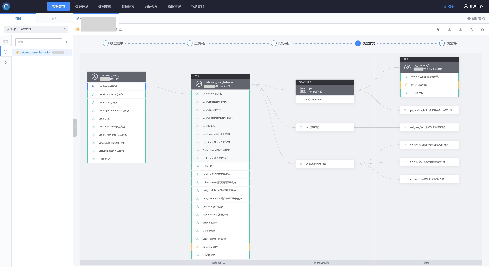

## 数据模型是什么
参照维度建模的方法论，提供步骤流程式的数据仓库建设工具，无需理解方法论本身即可输出规范、无歧义的明细数据表、指标统计口径、指标。通过数据模型设计、应用一站式服务，方便业务快速低成本构建规范的数据仓库。

> 以下是 DMBOK 2.0 中对数据建模和数据模型的定义。
> - 数据建模：发现、分析和确定数据需求的过程，然后采用数据模型的精确形式表示和传递这些数据需求；
> - 数据模型：描述组织已经理解或未来需要的数据，通过标准化的符号快速领会其内容；

- 数据模型设计流程：步骤流程式地设计规范的明细数据表、指标统计口径、指标。

- 数据模型应用流程：数据模型实例化后，输出明细数据表、指标。

> 注：数据模型在 [平台架构图](../../../README.md) 中，属于中间服务层的全链路资产管理。

## 用户是谁
- 平台项目的数据开发：构建一个通用的数据模型，可以应用到多款同类型的业务
- 单个业务的数据开发
    - 场景 1：通过数据模型构建业务的指标体系，通过工具规范数据开发过程
    - 场景 2：直接应用平台中公开的数据模型

## 为什么要有数据模型设计
业务在构建数据仓库时容易出现以下痛点：
- 字段含义相同，但字段名称因人而异，叫法不一
- 指标名称相同，但指标统计口径不一致
- 没有统一、规范的维度表，很难集成一致性维度
- 没有统一的数据仓库分层建设，对 ODS（数据接入层）、DWD（明细数据层）等底层数据重复建设
- 数据开发规范强依赖开发同学的个人习惯，比如指标命名规范、SQL 代码规范

导致在数据开发或应用时遇到如下问题：
- 消费某张表存在大量的沟通和问题排查成本
- 通用算法模型被应用到多业务时，由于各业务数据开发者的习惯不同，导致无法批量应用
- 难以沉淀领域的数据模型、数据标准

## 术语解释
- 事实表：描述业务活动的细节，如：登录流水、道具流水表、充值流水表、商品销售表等
- 维度表：描述客观世界中的实体，反映观察事物的角度。在维度建模中，用于扩展事实表数据模型中的维度，如：将登录流水表中的用户字段，扩展为（用户的性别、年龄等字段），IP 地址库、用户表、商户表、渠道表、苹果硬件信息表都是维度表。
- 指标统计口径：指标的计算口径，例如每笔订单的金额是 price 字段，则销售额的指标统计口径为：`sum(price)`
- 指标：基于指标统计口径，结合聚合字段（如渠道）、过滤条件（如国内）、统计周期（每日）计算而成的统计指标，如`国内每日分渠道道具销售额`

## 使用数据模型前后的差异
- 使用前：使用 Dataflow 自定义开发统计指标的表，属于面向表的开发
- 使用后：使用数据模型步骤流程式完成数据建模，在 Dataflow 中完成数据模型应用，属于面向指标的开发

参照 [数据模型快速入门](./quickstart.md)，开始数据模型设计。
