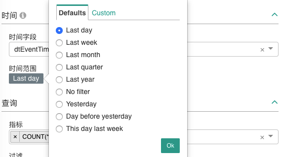
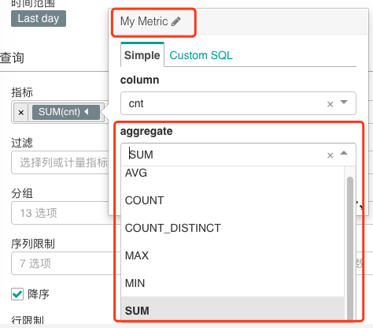
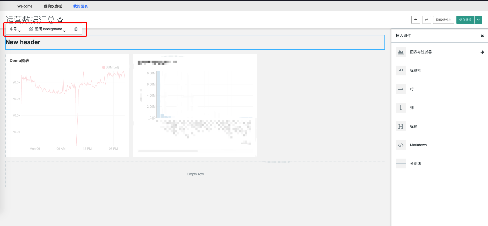

## 如何快速构建仪表板

### 数据集准备
可参考 [10 分钟玩转大数据开发](../../quick-start/dataflow.md) 的流程创建 **可查询** 的结果表

### 创建仪表板
在`我的仪表板`标签页中，点击右上角的`+`按钮跳转到`仪表板创建页面`

创建仪表板需要填写如下表单

完成表单填写后点击`保存`便创建了一个空白的仪表板，并返回`我的仪表板`的管理页面

### 创建图表
在`我的图表`标签页中，点击右上角的`+`按钮跳转到`图表创建页面`

创建图表需要选择图表所在的`项目` **（项目需要跟图表最终展示的仪表板一致）** 、所用的`数据集`和`可视化类型`（构建图表过程中可以修改）
如果数据集不在所选项目中，需要在平台该项目下申请所用数据集的权限，参考 [数据开发创建项目，项目中怎么看不到数据](../auth-management/data.md)

点击`创建新图表`会跳转到图表的编辑页面

### 编辑图表
不同图表类型的编辑页面基本都不一样，但基本都包括`数据源&图表类型选择`、`选择时间范围`、`构建查询`、`可视化属性调整`、`可视化面板`这五个功能区域，一些特殊的图表还会包含`高级分析`、`注释层`等高级功能以供用户构建更具表达含义的图表

下面将以线图为例介绍如何编辑图表：

#### 选择时间范围
编辑图表的第一步，首先需要选择图表的 **时间范围** ，对于平台的结果表，一般以 **`dtEventTime`** 作为`时间字段`

`时间粒度`一般用于描述时间轴上的间隔，这里选择 **`minute`** 则线图每分钟会有一个点

`时间范围`默认提供多个常用的动态时间范围，用户也可以在 **`Custom`** 面板自定义时间范围

#### 构建查询
不同图表构建查询的表单会有差异，对于线图来说，`指标`是必选项，`过滤`、`分组`、`序列限制`、`排序`和`行限制`都是可选的

`指标`编辑框默认会生成 **`count(*)`** 的指标，如果用户不需要，可以点击 **`x`** 进行删除

然后选择自己关注的字段作为指标，选择后会出现详细的指标编辑框

在指标编辑框中，用户可以修改指标的名称，对于简单的表达式，只需要再选择需要的聚合函数即可

对于无法通过选择构建的表达式，用户可以切换到 **`Custom SQL`** 标签页中自定义指标的表达式

样例中我们选择对 **`metric1`** 指标进行 **`sum`** 的聚合，选择完成后点击 **`Save`** 进行确定

查询构建过程中，可以随时点击 **`运行查询`** 查看可视化效果，以确认跟自己预期要表达的信息是否一致

对于其他可选功能，用户可以通过把鼠标移到对应区域查看功能描述，如果仍有不明白的地方，可联系平台助手或查看 [Superset 官方文档](https://superset.incubator.apache.org/usertutorial.html#line-chart)

#### 可视化属性调整
构建完查询后，用户可以在`可视化属性`面板中对右侧的可视化图表进行调整，对于线图来说，一般常用到的主要有以下几个功能：
* 调整可视化图表的 **配色方案**
* 选择展示或隐藏图表的 **图例**
* 线图中 **线条的样式**
* X 轴的 **单位** 或 **格式**
* X 轴的 **标签（标题）**
* Y 轴的 **单位** 或 **格式**
* Y 轴的 **标签（标题）**

#### 保存图表到仪表板中
最后一步，就是保存编辑完成的图表，如果图表没有保存就离开页面，图表会保持为编辑前的状态， **中间的任何改动都不会生效** ，如果是第一次编辑图表（创建过程中）没有保存，则图表不会被创建。

保存的时候，除了配置图表的标题之外，用户也可以在保存框中选择 **把图表添加到现有的仪表板中** ，也
可以 **添加到新的仪表板** ，自动创建的仪表板会以当前结果表的 **项目 ID** 作为仪表板的项目， **目前图表只能保存到与其项目相同的仪表板中**

对于下面两个选项，用户都可以`保存并转到仪表板`，点击后会跳转到仪表板的详情页

### 查看仪表板
在仪表板详情页面，用户可以`收藏仪表板`和切换到`编辑模式`对仪表板进行编排和布局，仪表板中的图表默认会用缓存的数据来展示图表，如果需要使用最新的数据，用户可以点击图表右上角的菜单进行刷新，也可以点击`编辑仪表板`右侧的功能菜单中的`强制刷新仪表板`来刷新所有图表

### 编辑仪表板
在仪表板详情页中点击`编辑仪表板`后会切换到仪表板的编辑模式，在编辑模式下，主要功能有：`调整图表的大小`，`插入其他组件`和`调整各组件的布局和属性`

#### 调整图表的大小
在左侧图表中，把鼠标移到图表的`右下角`，会出现一个`箭头`且鼠标也会变成箭头，这时候就可以通过拖动来改变图表的大小

#### 插入其他组件
在右侧`组件栏`中，用户可以把需要的仪表板组件 **拖进** 仪表板的布局框中

#### 调整各组件的布局和属性
仪表板中的图表和`Markdown`必须在`行`与`列`中放置，用户可以随意添加`行`与`列`来对仪表板的区域进行布局，然后就可以随意调整各个图表在仪表板中的位置，组件和图表新拖进来时需要出现`蓝色`的`对齐线`才能生效

各个组件点击后可以调整其属性，比如`背景是否透明`、`字体大小`等等，也可以点击`删除`按钮删除该组件

#### 保存修改
编辑完仪表板后可以点击右上角`保存修改`，如果需要把编辑后的仪表板`另存为`，可以点击`保存修改`右侧的下拉菜单来获取更多其他操作

### 结语

按照以上流程操作下来，一个简单的仪表板便构建出来了。诚然，包括`编辑图表`、`编辑仪表板`等功能在内，都有很多更高级的功能去辅助用户更好地描述自己要表达的内容， **但是要记住一点，我们使用 Superset 的最终目的并不是要去构建一个如何复杂、如何丰富、如何功能强大的图表和仪表板，而是希望通过这个工具来更直观地、更具洞察力地去辅助我们解决特定业务场景下的问题**

更多详细功能，请参考[Superset 官方文档](https://superset.incubator.apache.org)
