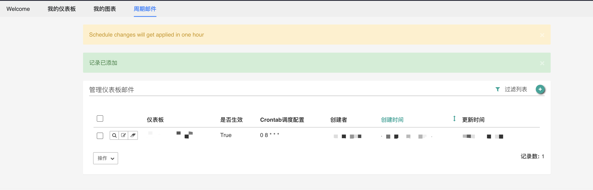

## 如何配置发送报表邮件

### 简介

在数据视图模块的 Superset BI 中， 可选择仪表板创建定时邮件规则向指定用户自动发送报表邮件。

### 创建仪表板邮件配置

在数据视图 Superset 模块主界面下，进入**周期邮件** tab，点击 右上角的绿色 + 号。

即可进入新建调度配置的页面如下：

#### 表单字段填写说明

##### 仪表板

选择要发送的仪表板，当前一个定时邮件配置中仅支持发送一个仪表板。可使用仪表板 id 或名称进行搜索。

##### 接收人

使用**用户名**指定邮件接收人，可指定多个接收人。

##### 是否生效

是否生效此定时报表邮件配置。

##### crontab 调度配置

通过 unix crontab 格式配置定时调度的时间周期。在常用配置中可看到示例其为空格分开的 5 列，使用数值或 * 号占位符填充。

- 第 1 列分钟 0～59
- 第 2 列小时 0～23（0 表示子夜）
- 第 3 列日 1～31
- 第 4 列月 1～12
- 第 5 列星期 0～7（0 和 7 表示星期天）

详情可参考 crontab 帮助文档：https://linuxtools-rst.readthedocs.io/zh_CN/latest/tool/crontab.html

##### 发送测试邮件

推荐勾选，可在编辑保存后即发送测试邮件，预览邮件效果。

##### 测试邮件接收人

在此处可指定单独的测试邮件接收人，配置后测试邮件将不会发给全部正式接收人。

在创建成功后会跳转回配置列表，配置将在一小时内开始启动生效。

###  管理仪表板邮件配置

在 **仪表板邮件配置列表** 页中，可对已有的配置进行管理。可点击 **过滤列表** ，通过 *仪表板名称* 及 *是否生效* 进行搜索筛选。

##### 查看配置详情

在列表页点击显示图标，即可进入详情页查看当前的定时邮件配置状态。

##### 修改编辑配置

点击**编辑**图标，即可进入配置编辑页，此页面结构与配置创建页一致，按照同样方式填写保存。

##### 删除配置

可直接点击列表中的**删除**图标删除单个配置。也可以勾选多个配置，然后在 **操作** 下拉列表中选择删除，即可进行批量删除。
