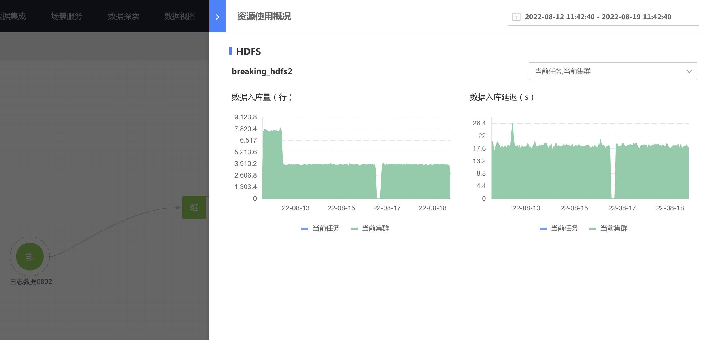

# 申请和使用资源

除公开资源外，在项目中使用资源前需先申请后，方可使用。

> 资源管理用户使用流程图详见 [资源管理介绍页](./readme.md)

## 申请资源
在资源管理的 【可申请的资源】的 TAB 中，选择 **需要资源的项目** ，然后勾选申请的资源，提交申请即可。

> 建议申请前按资源类型、所属业务、创建人等条件过滤资源

提交申请后，资源管理员会审批，在最后一列也可以进入到对应的工单和资源管理员沟通。

## 使用资源
审批通过后，可以在项目中使用该资源。

资源使用后，可查看资源使用情况。

同时也可以进入资源详情页，查看资源详情。

