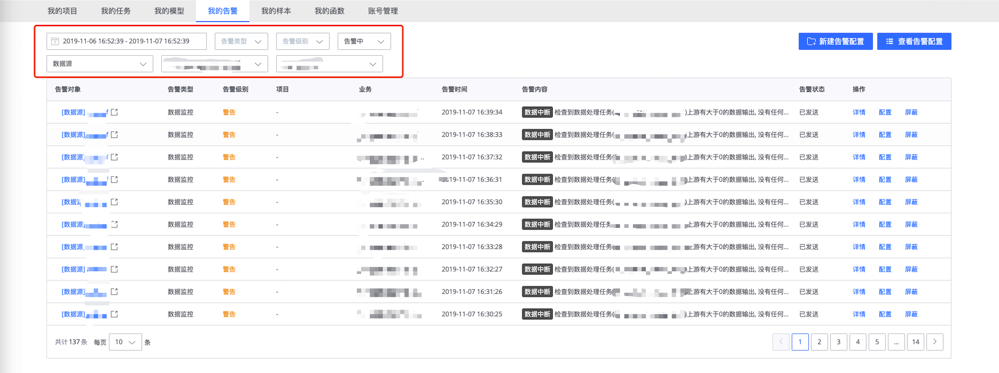
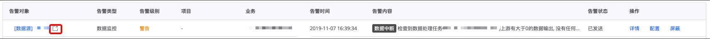
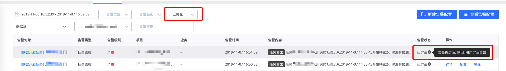
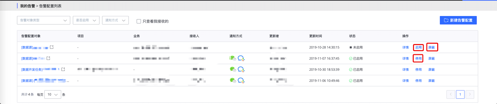
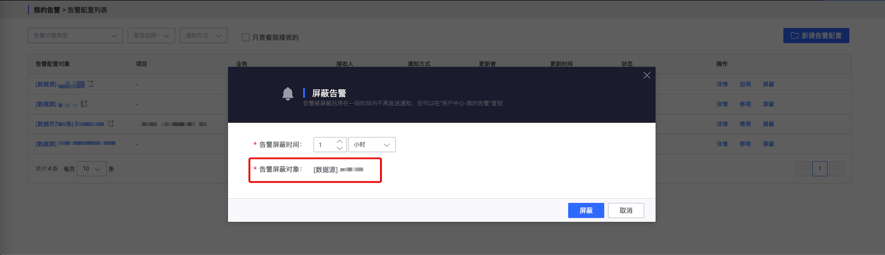

# 我的告警

我的告警展示的是我接收到的来自平台的所有告警，这些告警主要来源于用户在 **`数据集成`** 和 **`数据开发`** 中配置的监控策略，用于发现数据源、数据开发任务存在的异常情况；同时，我的告警也是用户集中管理个人所有告警策略的入口，用户可以通过点击`查看告警策略`以进入`告警策略列表页`来对所有数据源和数据开发任务的告警策略进行配置

## 告警列表

我的告警默认按时间倒序展示最近一天的所有告警，用户可以在列表中查看告警的主要信息，也可以通过列表中的操作栏来`查看告警详情`，`配置告警策略`或`屏蔽告警`

### 快速筛选告警

用户可以操作顶部的筛选栏，按`时间范围`、`告警类型`、`告警级别`、`告警状态`对告警列表进行筛选，用户也可以通过`告警对象类型`、`项目`或`业务`、`数据开发任务`或`数据源`的级联筛选框来针对性地查看某个数据开发任务、数据源的所有告警

### 告警列表的操作

- 1、查看告警详情

    

- 2、跳转到告警对象详情页

    

- 3、跳转以配置告警策略

    

- 4、屏蔽告警

    被屏蔽的告警将不再通知用户，但可以在当前页面`告警状态`筛选框选择`已屏蔽`来进行查看
    
    

## 告警详情

用户可以在告警详情中查看告警的详细情况，也可以查看当前`告警策略`并快速跳转到`告警配置页面`进行修改，右侧面板则可以查看告警相关的`数据质量指标`及`影响任务`

### 告警基本信息

- 告警对象：触发该告警的数据源或数据开发任务
- 告警时间：触发告警时的时间
- 告警类型：
  - 数据监控：检测数据流的流转情况，包括`数据源无数据`、`数据波动`、`数据时间延迟`、`处理时间延迟`、`数据中断`
  - 任务监控：检测任务的运行情况
- 告警级别：
  - 严重：发生了一定会影响用户数据的故障，需要立即处理
  - 警告：监控指标达到了告警条件，可能发生了故障，也可能是业务原因，需要用户关注
- 告警状态：
  - 已发送：该告警已通知用户
  - 准备发送：告警产生后尚未通知用户的状态（防止告警频繁通知骚扰用户）
  - 已屏蔽：告警因为用户屏蔽，平台变更等原因被屏蔽
  - 已收敛：告警因没有达到用户配置的触发阈值或距离上一次告警时间过近而被收敛的状态
- 告警通知情况：按不同接收人展示每个用户接收告警的时间及各种通知方式的通知情况

### 告警配置
提供触发该告警时的策略及相关策略的说明，方便用户对照右侧图表了解告警时的情况

### 数据质量指标
展示告警触发时数据流的情况，展示的图表因不同的告警策略而不同，比如：对于`数据源无数据`告警，则会展示当前告警对象触发告警时，前后 6 小时的数据量

### 影响任务
展示当前数据源或数据开发任务关联的其他任务，以帮助用户确定当前告警对象的异常会导致哪些任务受到影响，列表中会展示“受影响”任务的`项目名称`、`任务名称`、`负责人`、`创建日期`，对于有权限的用户，也可以点击`详情`跳转到该任务的详情页

### 数据流恢复
对于部分告警，平台会提供告警产生的可能原因及排查步骤，以帮助用户快速定位及解决异常问题

## 告警配置列表

告警配置列表主要以列表的方式展示数据源及数据开发任务所配置的告警情况，默认只展示我接收的告警配置，用户也可以查看所有已配置且有权限的告警策略，对于没有配置的告警对象，用户可以点击右上角`新建告警配置`来创建新的告警配置

### 快速筛选告警配置

用户可以操作顶部的筛选栏，通过`告警对象类型`、`项目`或`业务`、`数据开发任务`或`数据源`的级联筛选框来针对性地查看某个数据开发任务、数据源的告警配置，也可以按`是否启用`、`通知方式`对告警配置列表进行筛选，用户反选`只查看我接收的`则可以查看所有已配置且有权限的告警策略

### 告警配置列表操作

用户可以通过列表右侧的操作栏对告警配置进行`启用`、`停用`和`屏蔽`等操作

在告警配置页面进行屏蔽时，将屏蔽当前告警配置的所有策略

## 新建(修改)告警配置

用户可以在当前页面创建新的告警配置，创建告警配置前，用户需通过`告警对象类型`、`项目`或`业务`、`数据开发任务`或`数据源`的级联筛选框选择配置的告警对象，对于已经有告警配置的数据源或数据开发任务，只能对原有的配置进行修改

### 配置告警策略

用户可以在`告警策略`栏目启用告警策略，启用后就可以对每个具体的策略进行配置

- 数据源无数据：持续一段时间内，数据源没有任何数据产生（这里的数据源包含“数据集成”的数据源和“数据开发”任务中的数据源）
- 数据波动：数据量相对上一周期相同时刻波动超过阈值
- 数据时间延迟：持续一段时间内，数据时间相对于本地时间延迟超过阈值
- 处理时间延迟：持续一段时间内，处理时间延迟超过阈值
- 数据中断：任务在执行过程中被中断或无法跟踪任务执行情况
- 任务执行异常：任务在执行过程中发生异常

### 配置收敛策略

用户可以在`收敛策略`栏目配置具体的收敛规则

- 触发条件：解决瞬时抖动导致的告警泛滥
- 告警收敛：解决因持续满足触发条件导致的告警泛滥

### 配置告警通知

用户可以在`告警通知`栏目配置告警的通知方式和接收人，接收人只允许选择对该数据源或数据开发任务有权限的人

