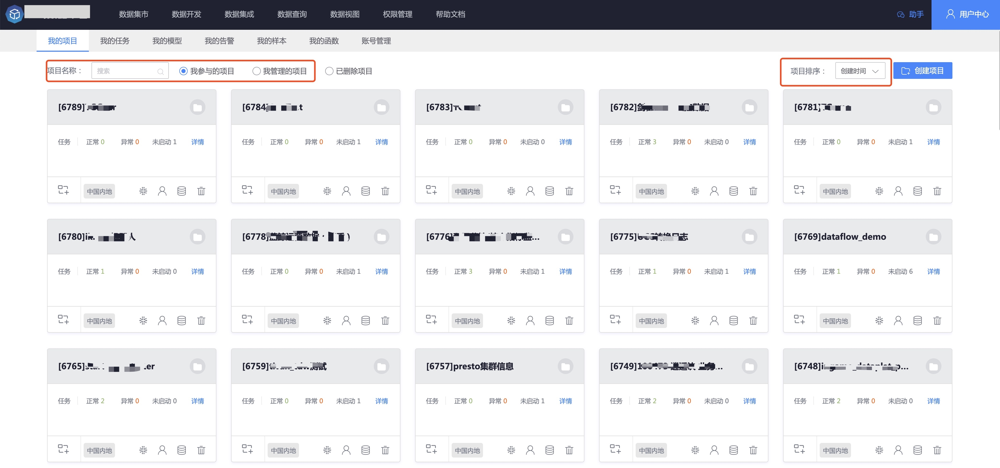

## 我的项目

在平台中，项目是一组资源（业务数据、开发任务、ModelFlow 模型）的集合，项目之间相互隔离。

**一个业务团队** 可以根据用途创建 **一至多个项目**，例如 用户体验、运营数据 项目，同时 **多个团队**也可以共同维护 **一个项目**，例如 基础性能公共项目。

## 项目总览

我的项目默认拉取 **我参与**的所有项目，用户可以对自己参与的项目进行查看、编辑、删除，可以新建项目。

## 创建项目

在我的项目中，右上侧可以看到创建项目按钮，点击按钮创建项目。
 
 

## 查找项目

用户可以通过项目名称、我参与的项目、我管理的项目、已删除的项目这些条件对项目进行过滤查找，以便快速定位找到自己需要的项目。

## 管理项目

**我参与的项目** 默认拉取 **当前用户有权限** 的项目列表，我创建的项目展示的是当前用户为创建者的项目。

我参与的项目与我创建的项目展示了项目 ID，项目名称，任务运行情况统计，任务详情快速入口，同时每个项目还提供了其他快速管理入口：

> 编辑项目：编辑当前项目信息

> 创建任务：在当前项目下面创建一个新的任务

> 管理模型：当前项目下面的模型管理

> 成员管理：管理当前项目的成员

> 业务数据：当前项目所需业务数据申请

> 删除项目：将当前项目标记为已删除，可恢复操作

### 编辑项目

 鼠标选中需要编辑的项目，点击编辑按钮。

在系统弹出页面中修改项目名称、项目描述，编辑完毕点击保存完成编辑。

### 创建任务

在当前项目中可以快速创建 **数据开发任务**，点击项目左下方创建任务按钮。

    

### 管理模型
  
在当前项目鼠标放到管理模型按钮，提示管理模型，点击管理模型系统跳转到管理模型界面。

### 成员管理
    
在当前项目管理模型后面就是 **成员管理** 模块，点击成员管理，弹出成员管理界面。

> 当前用户为项目管理员，可以对项目成员进行添加、移除。

> 非项目管理员用户只能查看项目成员信息，不能对项目成员进行编辑操作。

### 业务数据
  
业务数据入口在成员管理后面，业务数据可以 **申请当前项目需要使用的数据**，点击业务数据按钮，系统弹出业务数据申请界面。

> 业务列表：选择数据所属业务，此处会显示所选择业务中目前已申请、申请中、被驳回的业务数据个数。

> 数据类型：实时数据源、离线数据源、实时关联数据源、离线数据源等。

> 结果数据表：需要申请使用的 **结果数据表**，支持多选。
               

    
## 删除项目

> 删除当前项目：标记项目为已删除，移动到已删除项目模块，可在已删除项目模块恢复。

点击已删除项目，进入已删除项目管理界面。

在这里可以看到已经标记为已删除状态的项目，可以对这些项目进行编辑、恢复（撤销删除）、彻底删除（暂未开放，后续版本启用）。

