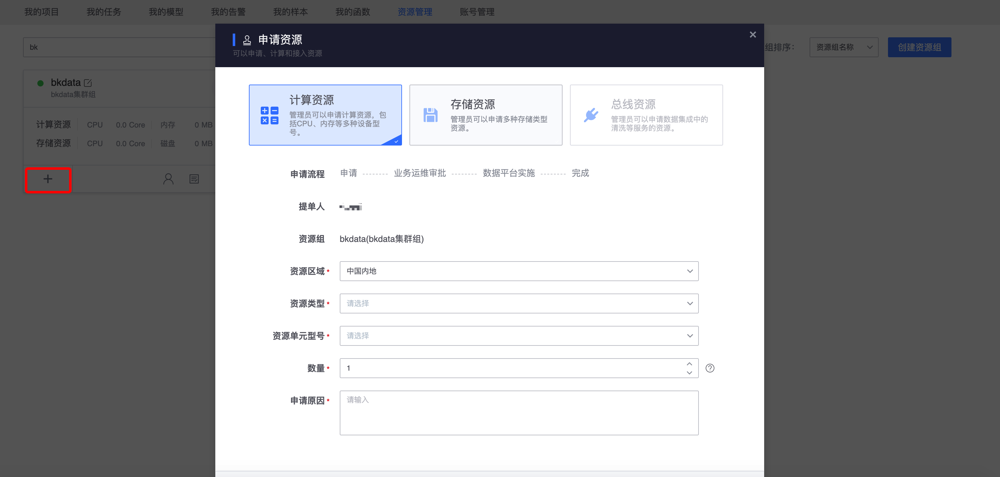

## 资源管理

​        在平台中，用户开发的各种任务（数据集成、数据开发、数据查询等）都需要使用资源（资源是 CPU、内存、网络、磁盘等统称）。

​       **资源管理** 在平台中为用户提供 **申请资源**、**管理资源组的授权**、以及提供 **资源使用分析** 等资源全周期管理。

### 资源组

**资源组** 是平台中资源分配管理的逻辑资源池，一个 **资源组** 包括多个 **计算资源**，**存储资源**。

资源组的结构如下所示：

#### 资源组分类

资源组主要分为：私有和公开两类。

##### 1、私有资源组

​        用户创建的资源组，都属于这类资源组。项目、任务需要使用该资源，**需要资源组进行授权**。

##### 2、公开资源组

​        平台提供的资源组，在平台中所有的项目、任务共享使用的资源，用户无需授权申请。

#### 公开资源组和私有资源组区别

|            默认资源组            |           私有资源组           |            区别            |
| :------------------------------: | :----------------------------: | :------------------------: |
|    计算资源和其他项目共享使用    |    可以申请专属独立计算资源    |  **是否需要专属计算资源**  |
|    存储资源和其他项目共享使用    |    可以申请专属独立存储资源    | **是否需要专属的存储资源** |
| 数据存储周期最大时间平台统一管理 | 数据存储周期最大时间可以自定义 | **是否需要自定义存储周期** |

## 资源组总览

资源管理默认拉取 **我管理** 的所有资源组，用户可以对自己参与的资源组进行查看、编辑、删除，可以新建资源组。

## 创建资源组

在资源管理中，右上侧可以看到创建资源组按钮，点击按钮创建资源组。

**所属业务：** 资源的成本核算所属。

**资源组创建流程：** 申请 -> 运维运维审批 -> 平台审批。

## 查找资源组

​        用户可以通过资源组名称、资源组 ID、我管理的资源组、全部资源组这些条件对资源组进行过滤查找，以便快速定位找到自己需要的资源组。

## 管理资源组

**我管理的资源组**  默认拉取 **当前用户是资源组管理员** 的资源组列表。

我管理的资源组展示了资源组 ID，资源组名称，计算资源统计，存储资源统计，同时每个资源组还提供了其他快速管理入口：

> 编辑资源组：编辑当前资源组信息

> 申请资源：在当前资源组下面申请计算资源、存储资源等

> 成员管理：管理当前资源组的管理员

> 授权列表：当前资源组授权使用的项目、dataId 等

> 删除资源组：未审批通过的资源组可以删除，生效中的资源组不能删除

## 编辑资源组

鼠标选中需要编辑的资源组，点击编辑按钮。

在系统弹出页面中修改资源组名称、资源组描述，编辑完毕点击保存完成编辑。

## 申请资源

刚创建的资源组是没有任何计算资源和存储资源的。

## 成员管理

## 授权列表

用户可以查看资源组已经授权的项目、dataId 等

## 项目申请使用资源组资源

平台中的项目，申请到资源组授权之后，才可以使用资源组的资源。注意：公开资源组无需申请。

**项目申请使用资源组资源流程**

鼠标选中资源组按钮，点击。

选择需要申请的资源组。

