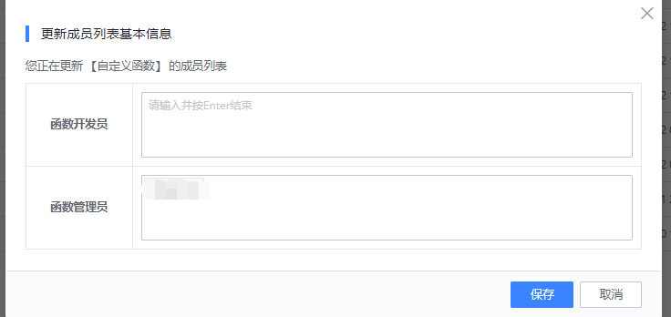

## 我的函数

我的函数展示用户自定义函数（UDF），并提供 UDF 的编写入口和一些基本的管理操作。

## 函数列表

可以看到用户是函数管理员或开发员的函数。主要展示函数名、中文名、最新版本、创建人、更新时间等信息。同时包含函数编辑、权限管理、使用详情、查看发布日志和删除函数

## 基本操作

### 权限管理

权限管理，函数权限分为函数管理员和开发员，管理员和开发员都可以进行修改函数内容，只有管理员可以进行函数的权限修改

### 使用详情 
可以看到当前函数在哪些项目和任务及节点使用，通过节点颜色看出节点的运行状态，同时展示出节点使用函数的哪个版本，也单击节点跳转到节点所在的任务

### 发布日志
日志，展示函数的发布历史内容

### 删除函数
删除，只能删除没有在 DataFlow 中使用的函数，或者在开发中的函数
