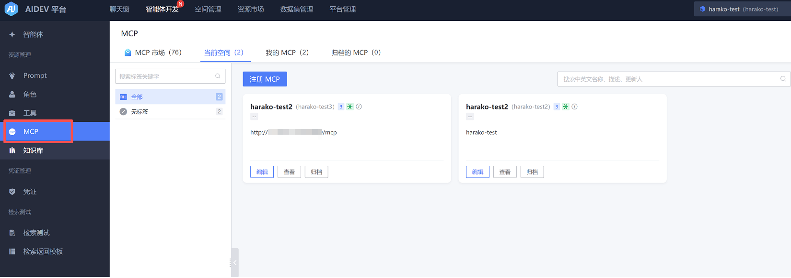
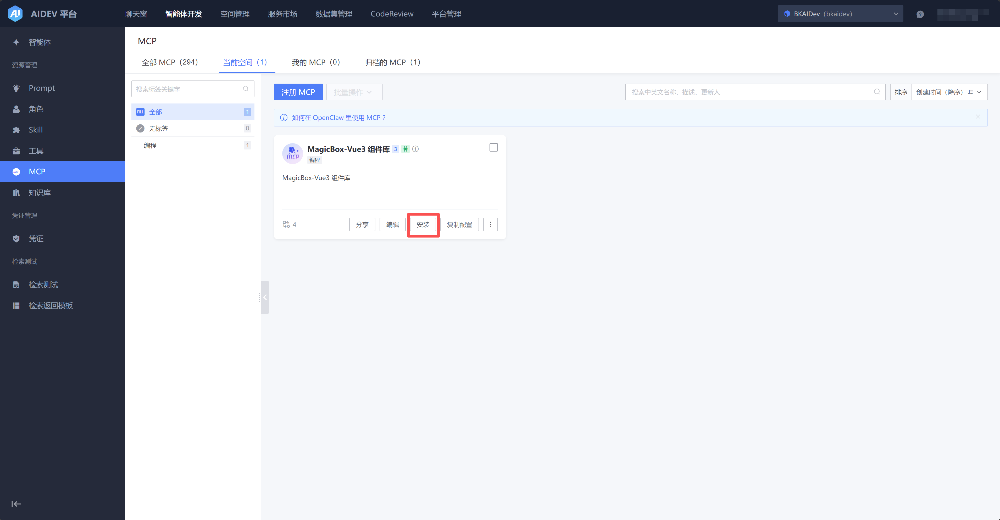
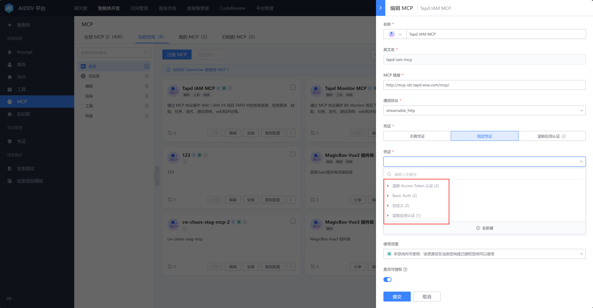
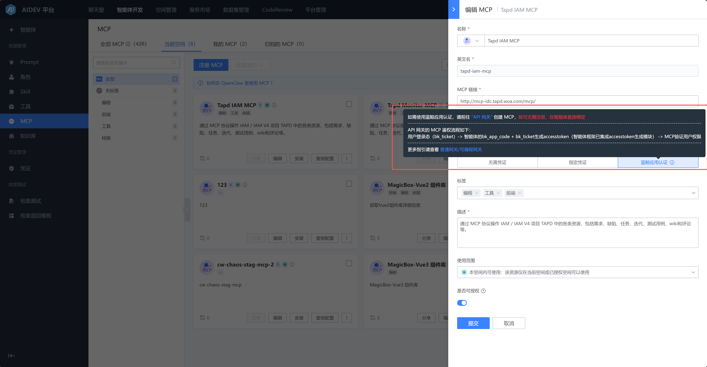
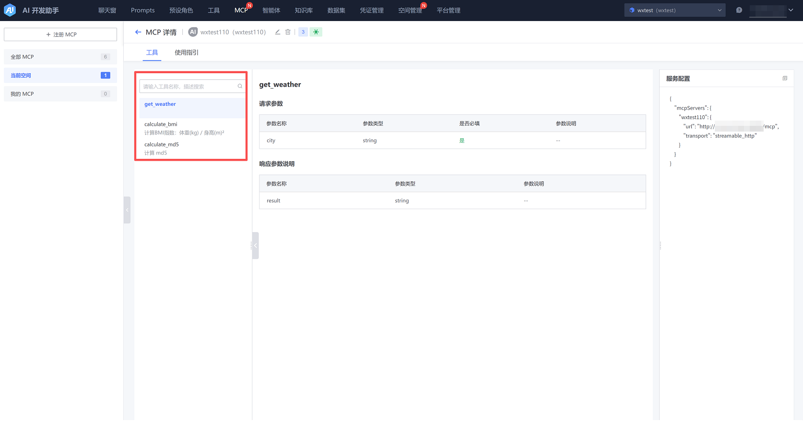

# MCP管理

【智能体开发】-》【MCP】tab下可以查看 “全部MCP/当前空间/我的MCP”。

支持快捷安装至本地IDE。

注册/编辑 MCP，需要填写MCP的基本信息，链接和凭证。

- 支持使用在AIDEV平台已定义的凭证：

- 如需使用蓝鲸应用认证，请前往 "API 网关" 创建 MCP，即可无需注册，在智能体直接绑定：

可以在MCP详情页查看拉取到的MCP的工具列表、请求参数、服务配置。

