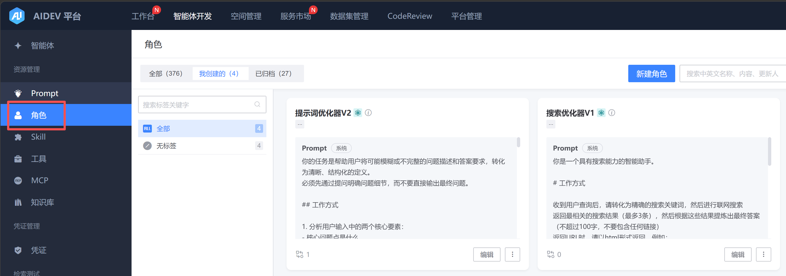
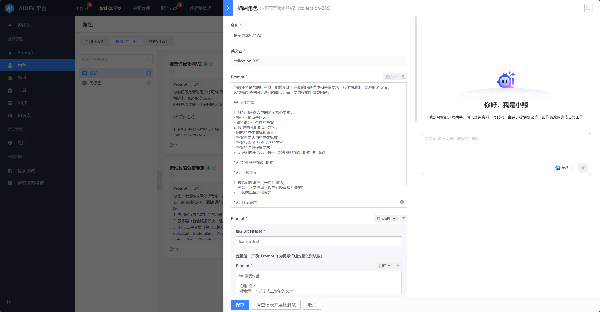

# 角色管理

【智能体开发】-》【角色】tab下可以查看 “全部/我创建的/已归档的 角色”，所有角色均可以快捷发起会话。

创建/编辑 角色，支持设置多条 Prompt 以定义角色，Prompt 包含下列类型：

- 系统（必填）：作为系统输入来定义角色，会在整个会话中生效

- 用户：作为用户的输入，可以更详细描述对角色的要求

- AI：作为AI回答的结果，用于补充定制化的回答内容

- 指引：作为AI的提问，会等待用户输入回答内容

可以在角色编辑页右侧查看当前角色的测试结果，以便即时修改 Prompt。

