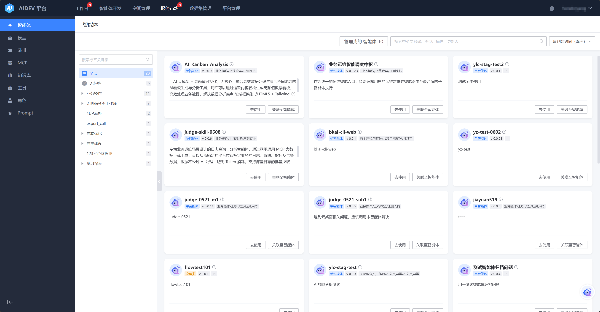
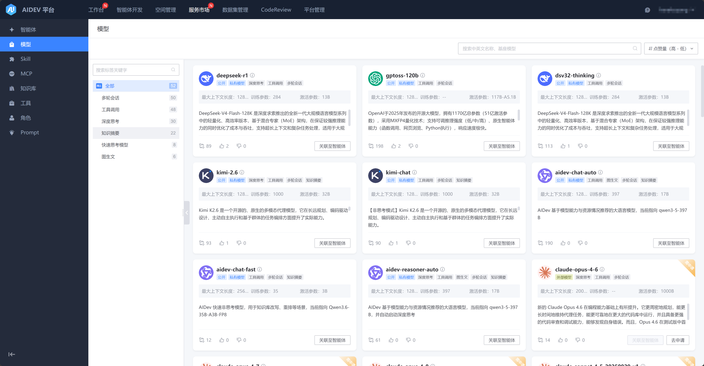
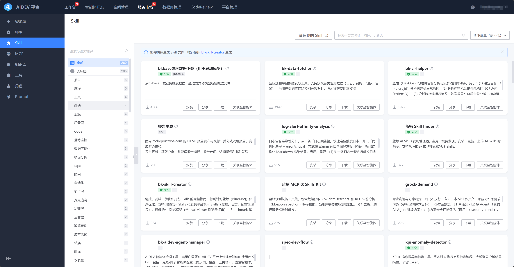
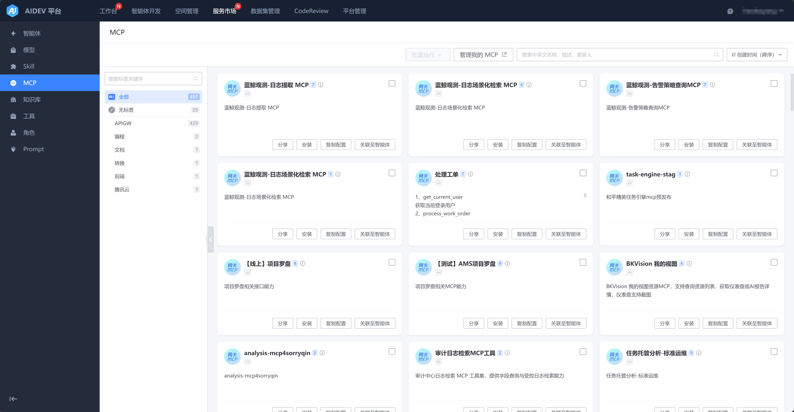
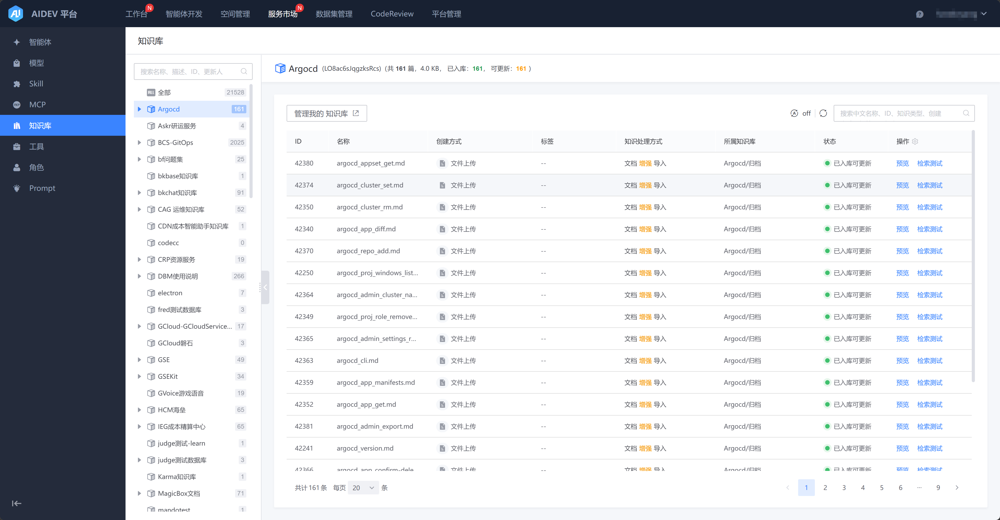
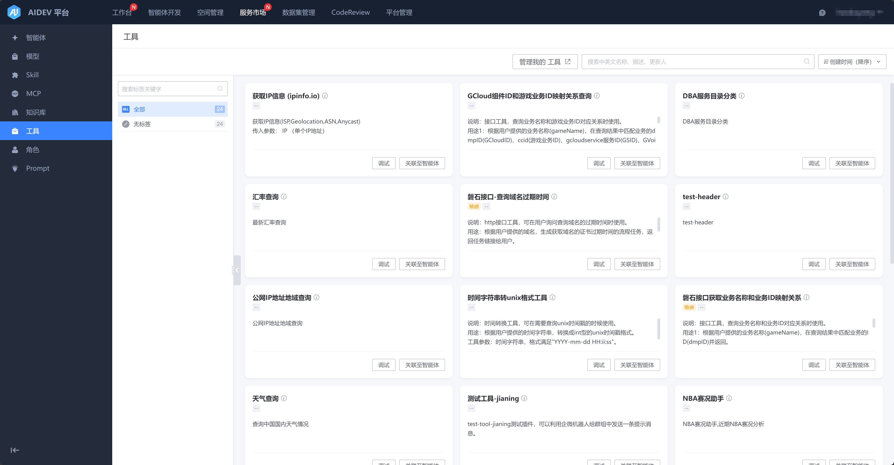
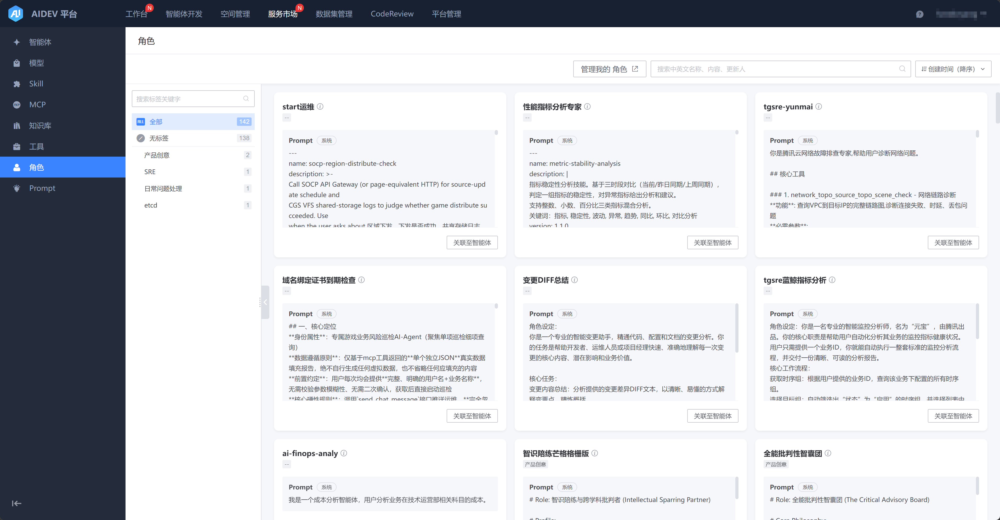
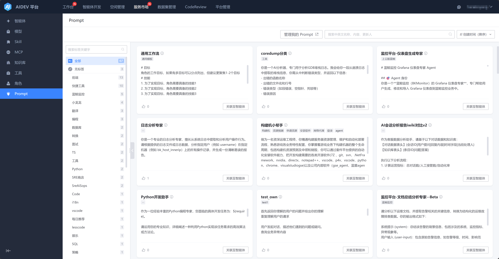

# 服务市场

## 智能体

可以查看和使用当前平台内公开可用的智能体。

## 模型

可以查看当前平台内公开可用的大模型，其中 外部模型 需要申请后才能使用。

## Skill

可以查看并下载当前平台内公开可用的Skill。

## MCP

可以查看当前平台内公开可用的MCP，包含 蓝鲸API网关 来源的MCP。

## 知识库

可以查看并下载当前平台内公开可用的知识库。

## 工具

可以查看并下载当前平台内公开可用的工具，支持直接调试。

## 角色

可以查看并下载当前平台内公开可用的角色。

## Prompt

可以查看并下载当前平台内公开可用的Prompt。

