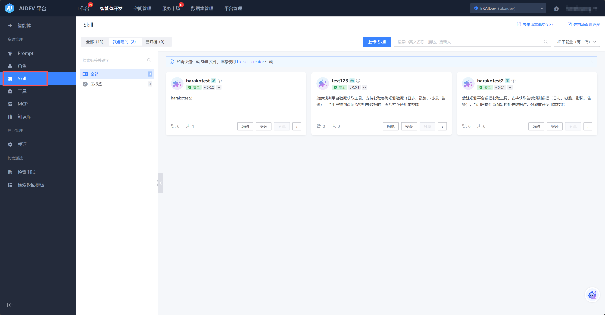
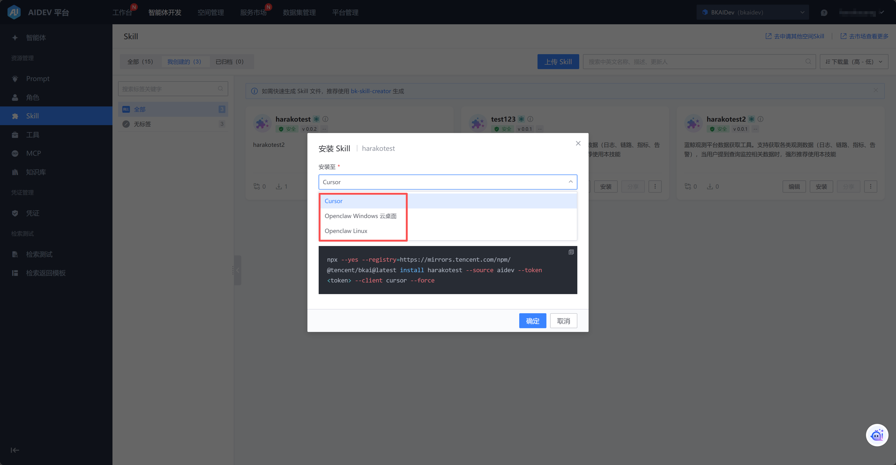
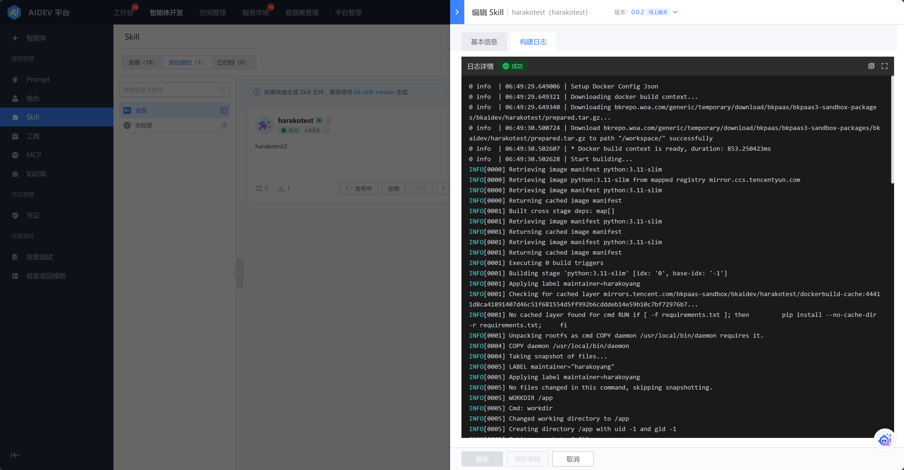
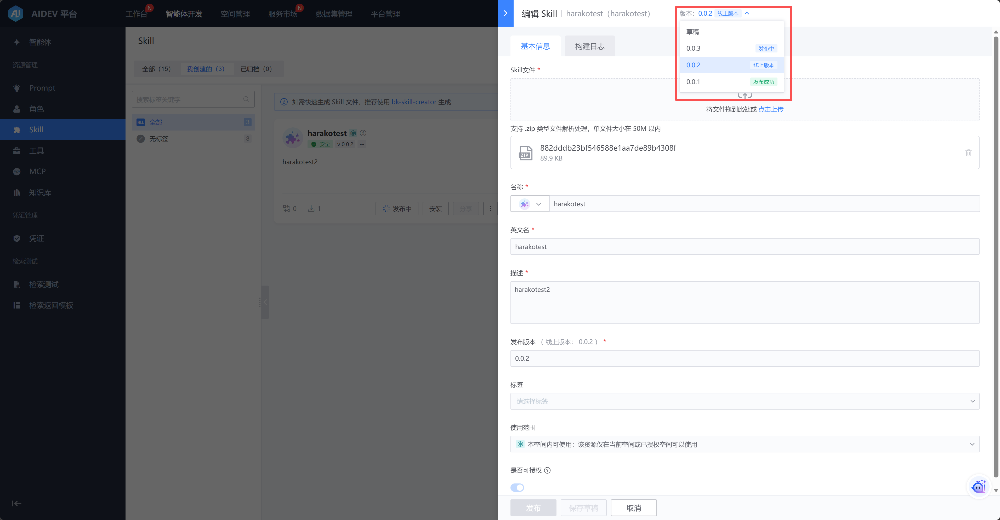

# Skill管理

【智能体开发】-》【Skill】tab下可以查看 “全部/我创建的/已归档的 Skill”，所有Skill均可以下载至本地，以供IDE中使用。

支持三种快捷安装方式：

- 安装至本地IDE

- 安装至OpenClaw的Windows云桌面实例

- 对话方式安装至OpenClaw

创建Skill只需将技能文件打包为zip上传即可，注意根目录必须包含skill.md文件。

发布中和发布后，支持查看skill的打包过程。

Skill支持版本管理，可以回滚至任意已发布版本。

