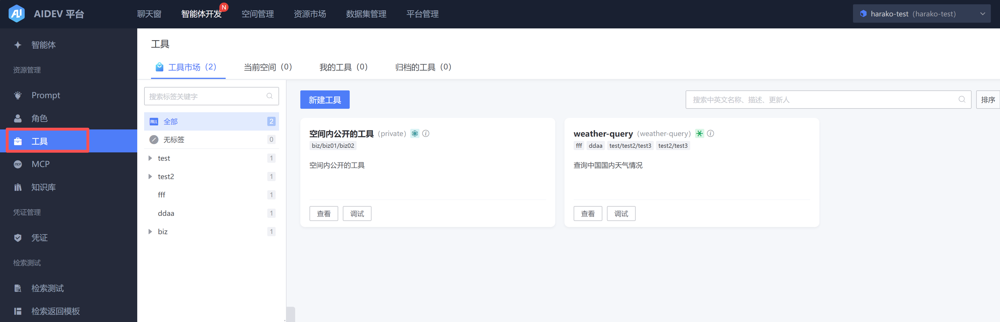
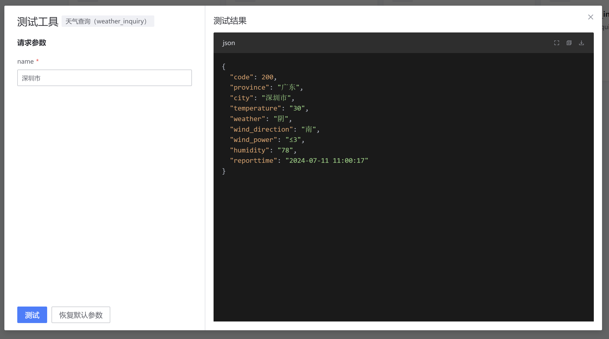
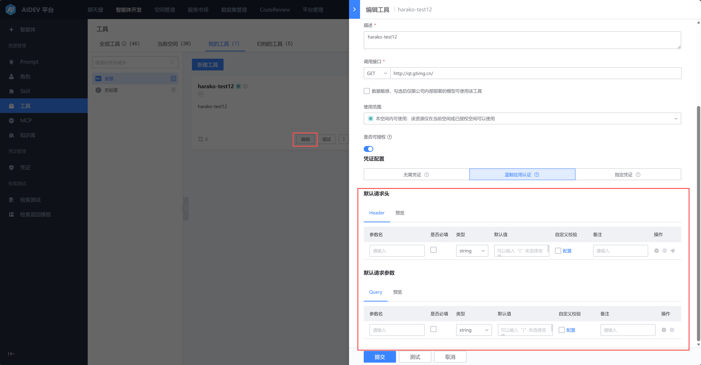
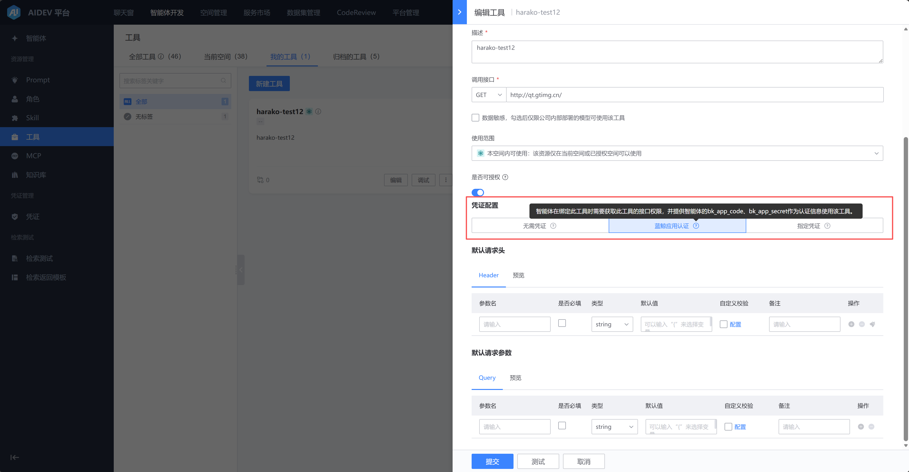

# 工具管理

【智能体开发】-》【工具】tab下可以查看 “全部工具/当前空间/我的工具”，并可以进行调试。

创建/编辑 工具，需要填写工具的基本信息、凭证、调用接口和请求参数。

支持下列凭证：

- 蓝鲸应用认证：智能体在绑定此工具时需要获取此工具的接口权限，并提供智能体的bk_app_code、bk_app_secret作为认证信息使用该工具。

- 使用自己在凭证管理中添加的凭证：

