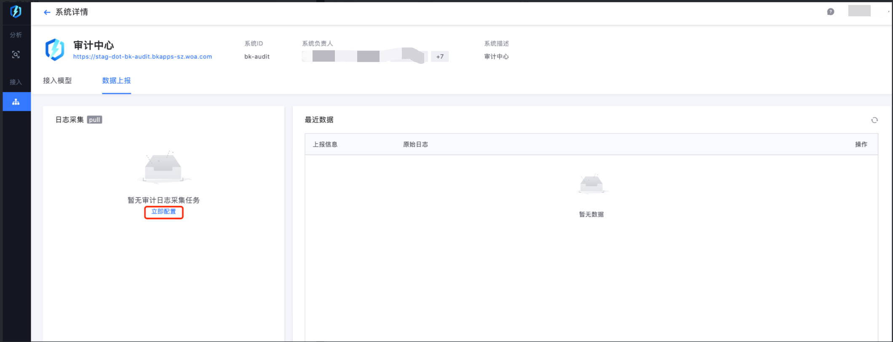
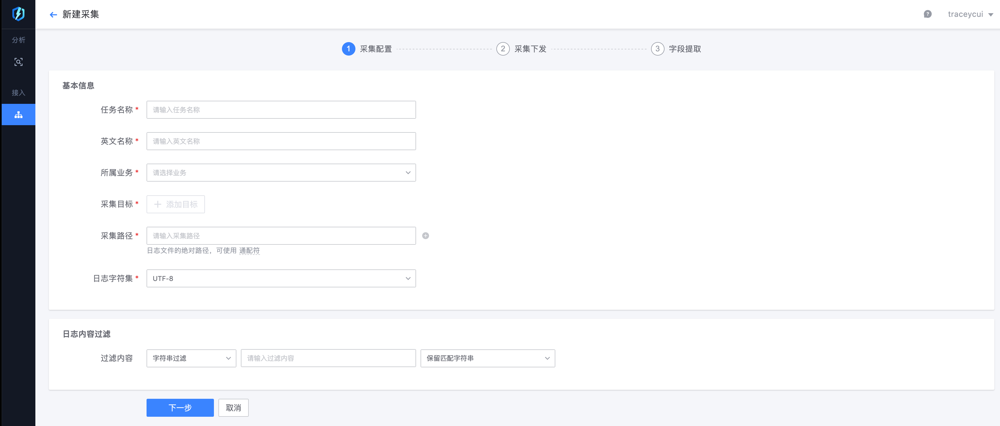
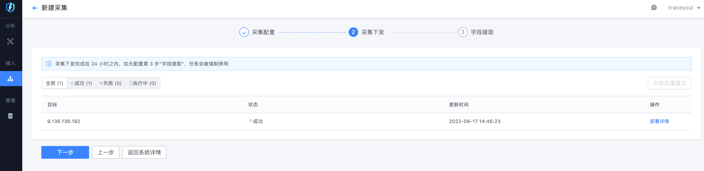
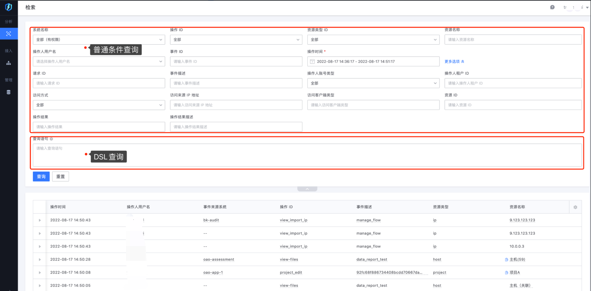
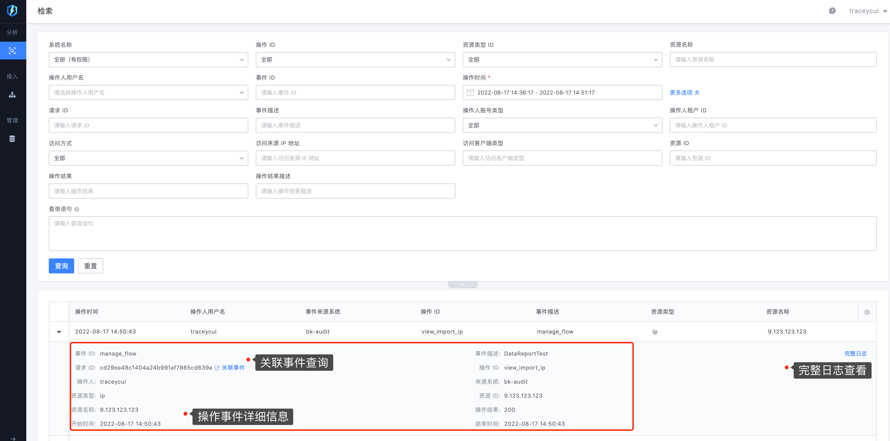
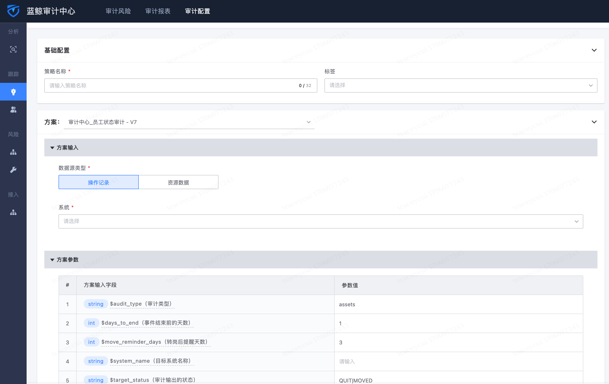

<h1>产品功能</h1>

<h2>1、系统接入</h2>

 系统按照指引接入审计中心后，在接入列表中可看到对应的系统信息

<h2>2、数据上报</h2>

 系统接入审计中心后，可进行数据上报。审计中心支持以日志采集、API推送的方式上报日志

<h3>2.1日志采集方式</h3>

 在数据上报中配置采集项，可通过采集配置->采集下发->字段提取三个步骤上报日志。审计中心支持配置多个采集项

 在字段提取环节，接入系统需按照[审计中心操作日志记录标准-用户](https://doc.weixin.qq.com/sheet/e3_AIkASgZ9ACc7rqrm9vaSqeH7A11N4?scode=AJEAIQdfAAoLJMDc67AIkASgZ9ACc&tab=BB08J2 "审计中心操作日志记录标准-用户")上报数据

<h3>2.2API推送方式</h3>

  建设中，敬请期待

<h2>3、数据检索</h2>

 审计中心支持多维度数据检索。支持普通条件查询及DSL查询

 审计中心支持查看时间详细信息，且可通过请求ID查看关联事件

 支持查看完整日志（经过审计中心统一拓展的数据，例如对操作人员的属性拓展等）、原始日志（系统上报的原始日志）

<h2>4、策略分析</h2>

 审计中心支持各种类型的审计策略，审计职能人员通过简单配置即可实现各场景的审计需求。
 例如当前已经实现对人员异动(转岗/离职)、公有云审计、虚拟资源审计等多场景的40+类审计策略

