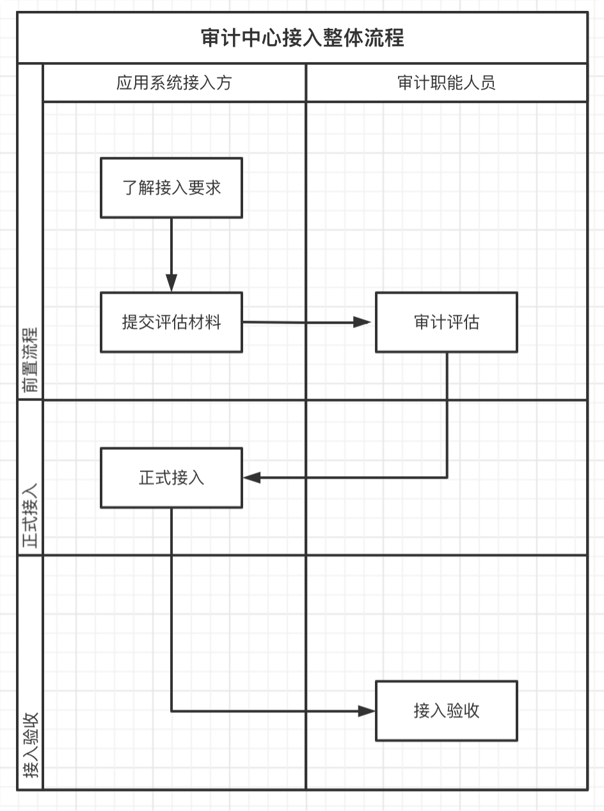
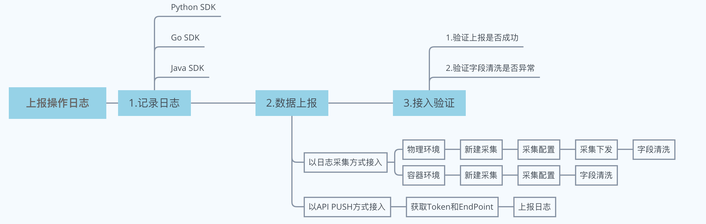

# 审计中心接入流程指引

当前版本：V1.1.4
更新时间：2024-10

## 1、背景
随着各类政策管理逐步精细化，为了确保互娱业务符合审计规范，全面降低业务风险，腾讯互动娱乐事业群组建审计中心对互娱业务数据进行统一审计，因此需各应用系统主动接入审计中心。

## 2、术语解释
● 应用系统：除审计中心外任意注册到审计中心的第三方系统，例如所有日常工作使用的应用系统（包含外网和内网，公用和部门内部使用的 WEB、移动端、小程序等）。

● 操作：系统中用户以各种形式触发的具体操作，如作业新建、主机转移、菜单查看等，一个操作最好是最小原子功能，需满足审计要求。操作应该是可枚举相对静态的，一个系统的操作数量有可能随着系统功能模块的增加而增加，但一般不会随着时间的推移无限增长。

● 操作权限：系统中用户执行操作所需具备的权限（如：ACL权限，角色权限，来源 IP，凭证等），已注册到权限中心的第三方系统，操作权限数据由权限中心提供，其他系统需要上报操作权限数据满足审计要求

● 资源类型：指各系统产生操作所关联的对象，如作业新建关联的对象是作业、主机转移关联的对象是主机等，作业、主机都是一种资源类型(在权限数据中的资源类型示例：用户权限、用户组权限、角色权限、来源IP、QQ号等)

● 资源实例：指各系统操作的某个具体对象，在该系统应有唯一标识，例如对 XXXXX主机进行操作，则XXXXX主机为一个资源实例。

● 事件：用户通过各种形式在各个系统中产生的一次操作为一个事件，一个操作日志可以理解为一个事件。

● IAM：蓝鲸权限中心。

## 3、流程说明

完成审计中心的接入主要有如下阶段：

### 3.1 前置流程
#### 3.1.1 了解接入要求

应用系统接入方了解并满足审计中心接入要求，如有疑问可咨询   @BK助手(蓝鲸助手)

### 3.2 正式接入
应用系统与审计职能人员沟通确认好相关接入数据标准之后，可参照正式接入操作（参见本文第4章）进行配置，接入过程中如遇到相关问题，请联系  @BK助手(蓝鲸助手)提供服务支持。

### 3.3 接入验收
应用系统完成接入配置后，审计职能人员将对实际上报的数据情况进行验核，确保数据正确。如有问题可能需要应用系统配合调整。

## 4、正式接入操作
在上报资源数据和操作日志之前，应用系统需要告知审计中心系统里都包含了哪些操作，不同操作的资源是什么，因此在接入前需要先注册系统、操作和资源。审计中心与蓝鲸权限中心(IAM）共用注册模型，若此前已经接入过IAM（IAM接入说明），则可跳过此步骤（下文中的4.1、4.2、4.3）。若此前没有接入过IAM，建议先接入IAM权限中心。

 
 审计中心接入步骤说明

### 4.1 注册系统(若已接入IAM可跳过)  
应用系统通过此步骤告知审计中心自己是哪个系统。因审计中心与IAM共用注册模型，若此前已经在IAM注册过系统，此步骤可跳过。

### 4.2 注册资源(若已接入IAM可跳过)

应用系统通过这一步骤告知审计中心自己系统管理了哪些资源(resourceType），每个资源是什么。因审计中心与IAM共用注册模型，若此前已经在IAM注册过系统，此步骤可跳过。

### 4.3 注册操作(若已接入IAM可跳过)
应用系统通过此步骤告知审计中心自己系统有哪些具体操作。因审计中心与IAM共用注册模型，若此前已经在IAM注册过系统，此步骤可跳过。

### 4.4 上报资源数据至审计中心
1、在上报资源数据至审计中心前，请再次确保资源数据符合接入标准

2、完成资源的注册后，应用系统需要上报自己系统的详细资源数据到审计中心，审计中心方可知道每个操作的具体资源对象。上报方式为：应用系统提供资源获取接口，审计中心通过接口拉取对应的资源数据。该过程分为以下三步：应用系统提供资源拉取接口地址，应用系统提供资源Schema拉取地址，审计中心通过接口获取应用系统资源数据(应用系统需鉴权)

#### 4.4.1：创建资源拉取接口    fetch_instance_list
该接口为应用系统自己创建，提供给审计中心查询自己系统资源信息的接口，审计中心会通过该接口拉取资源的详细信息

特别注意：
1、由于此接口主要通过变更时间搜索查询，接入系统需要做频率控制，并对资源实例的变更时间建立适当的索引机制或缓存机制，否则可能会引发接入系统负载过高而导致正常业务服务的故障
2、需支持的过滤查询：按照资源实例变更时间搜索查询

### 4.5 上报操作日志至审计中心

### 4.6 接入验证（可选）

#### 4.6.1 验证上报是否成功
在数据上报页面选中日志采集或者 API 推送，在右侧查看最近日志（若没有出现，可以点击右上角的刷新按钮进行刷新查看），如果有日志，则说明数据上报正常。

#### 4.6.2 验证字段清洗是否异常
选中一条记录，找到 event_id，在检索中用该 event_id 查询是否有对应日志，如果有则说明清洗无异常（如果没有说明清洗有问题，需要检查清洗配置）。

## 5、常见问题

1.采用日志采集的方式接入时，新建一个采集任务并完成采集配置后，在采集下发或字段清洗的步骤退出，采集任务是否还在？
任务存在，可以在应用系统详情的“数据上报”页面上看到未完成步骤的采集任务，点击可继续完成配置。

2.成功新建采集任务后，在应用系统详情的“数据上报”页面上，最近数据为空？
建议尝试通过右侧的刷新按钮进行刷新。若多次刷新且等待一段时间后仍然没有数据，通过日志采集接入的，建议排查采集配置，或者尝试重新新建采集任务；通过 API PUSH 方式接入的，建议排查 Token 和 EndPoint 是否出现错误，应用系统侧数据上传是否正常，或者尝试重新接入。
