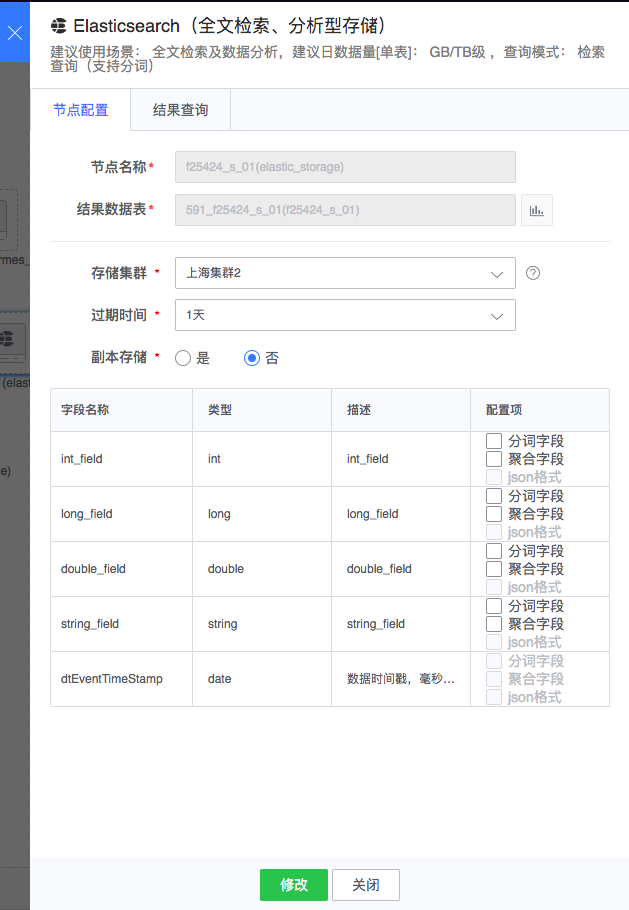

# Elasticsearch

Elasticsearch 节点底层基于 Elasticsearch，支持日志存储，全文检索等功能。

图例，Elasticsearch 节点

#### 使用方式
- 节点名称： 自动生成，由上游结果表和当前节点类型组成
- 结果数据表：从上游节点继承过来
- 存储集群：通常可选有默认集群组集群，其它可选集群与任务所属项目相关
- 过期时间：数据入库后保存的过期时间
- 副本存储：数据是否存副本，默认否

除此之外，Elasticsearch 节点可根据上游节点结果表的输出情况，指定字段是否为分词字段、聚合字段或 json 格式字段。

配置例子如下：

对于运行中的任务，双击节点后，在数据查询标签页可对 Elasticsearch 中的数据进行查询：

