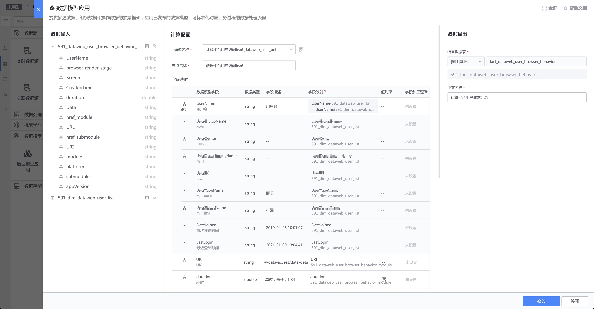

数据模型应用
----

模型发布后，在 数据开发任务中可以应用数据模型。

- 维度表数据模型: 输入表限定为 `实时数据源`。如果期望实例化后的维度表有全量数据，建议在数据开发任务启动成功后，全量上报输入表的数据，让全量数据过一遍模型应用任务。 
  当然，如果维度表数据模型和已经入库到 ignite 中的关联数据源表结构完全一致，可以不用实例化维度表数据模型。在事实表数据模型应用的时候，直接选择关联数据源即可。

- 事实表数据模型: 主表输入限定为 `实时数据源`，关联维度表限定为 `关联数据源`。其中 `关联数据源` 的表结构需要和维度表数据模型中表结构保持一致，不要求是维度表数据模型实例化后的关联数据源。

双击 `数据模型应用节点`，完成输入字段的自动映射。
> 如果输入字段和数据模型中输入字段一致，则会自动映射。

接下来批量生成 `指标节点`

选择需要构建的 `指标节点`

保存指标节点。

指标节点的结果表名由 4 部分组成：业务 ID 、指标统计口径、自定义、数据窗口，其中自定义部分可以修改，其他部分在工具上完成了结果表的规范定义。

每个指标节点保存后，接下来添加存储节点。完成添加后，启动数据开发任务即可完成数据模型应用。

