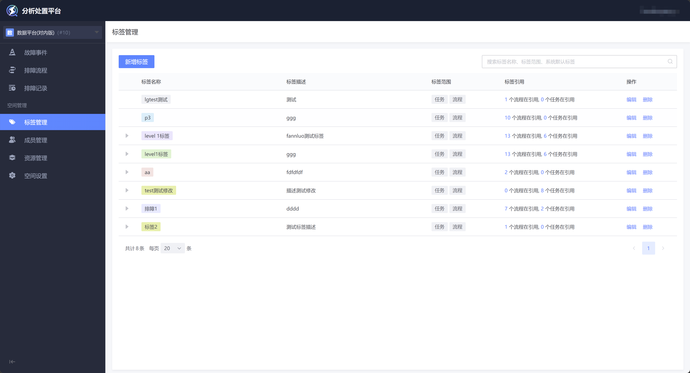
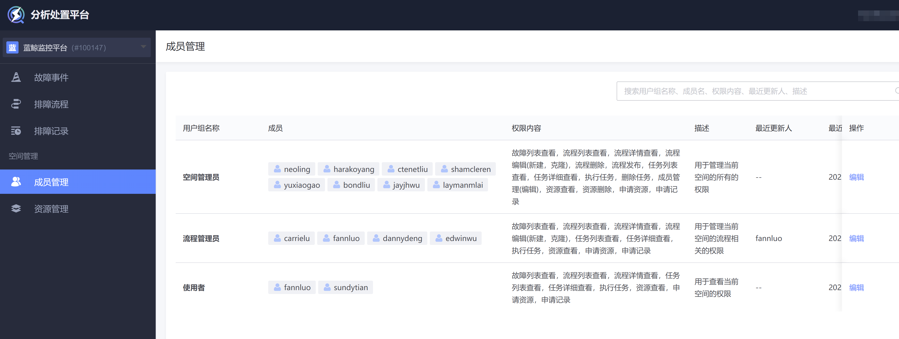
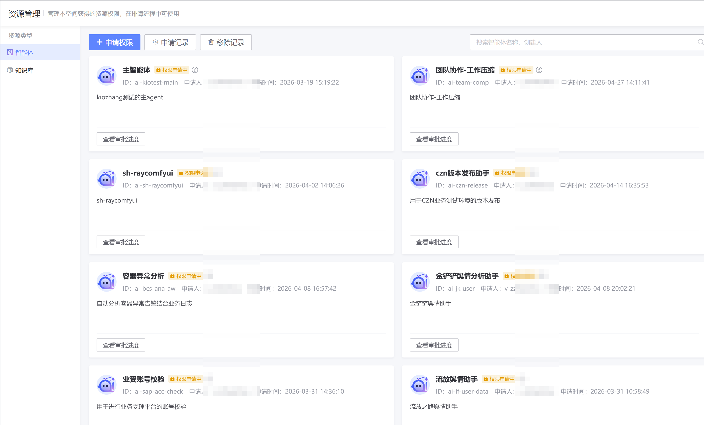
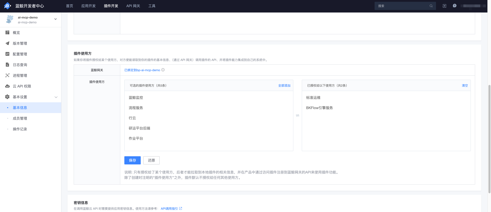
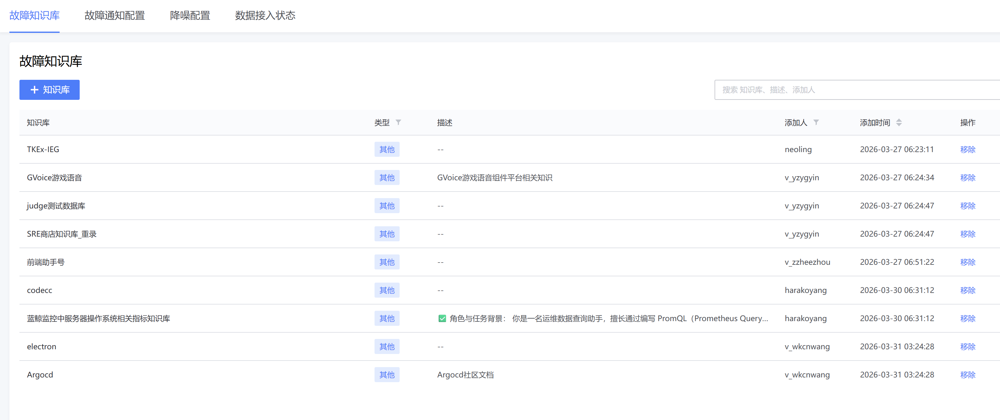
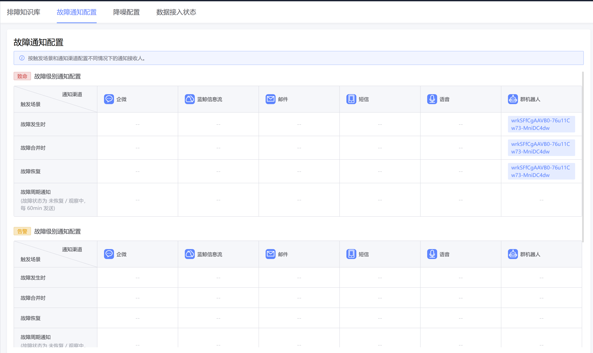
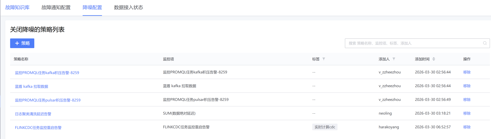
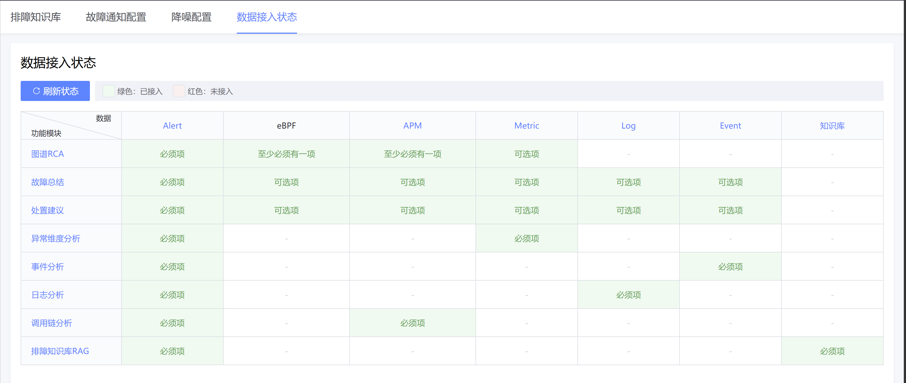

# 空间管理

## 标签管理

可管理当前空间内的标签，标签允许用于 流程、任务 这两类对象，用于快速检索。

## 成员管理

空间内的三种角色：

## 资源管理

故障分析处置平台 按照【业务】空间对资源进行权限管理。用户在【业务】空间内提交资源使用申请单，由来源平台审批。在【资源管理】页可进行单据管理、进度查看。

- AIDEV

  - 使用范围是“所有空间可见”状态的智能体，分析处置平台的所有空间 流程节点都可以直接选择使用，不需要申请授权。

  - 使用范围是“本空间可见”状态且已经开启“可授权”的智能体，分析处置平台的所有空间可以在【资源管理】里为当前空间申请这个智能体权限，获得授权后可以在当前空间里使用。

- 蓝鲸开发者中心

  - 复用现有蓝鲸插件授权方案，指定【故障分析处置平台】为使用方。

## 空间设置

### 故障知识库

可以绑定AIDEV的知识库，用于自动编排模式下的故障诊断。

### 故障通知配置

可以为不同级别的故障，指定通知方式。

### 降噪配置

关闭降噪：可以指定哪些策略产生的告警，不经过降噪，直接进入故障分析流程（**避免遗漏重要告警**）

自定义降噪（功能开发中）：可以指定哪些对象上的告警，必须作为噪声被过滤掉（**避免噪声干扰故障分析结果**）

### 数据接入状态

可以查看当前空间的数据接入状态，及其对应的故障分析能力开启情况。

