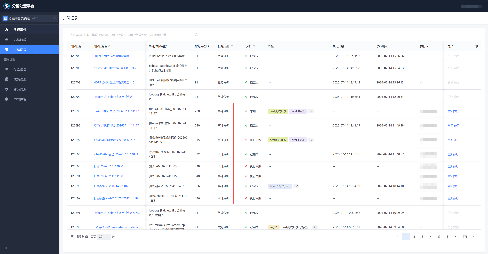
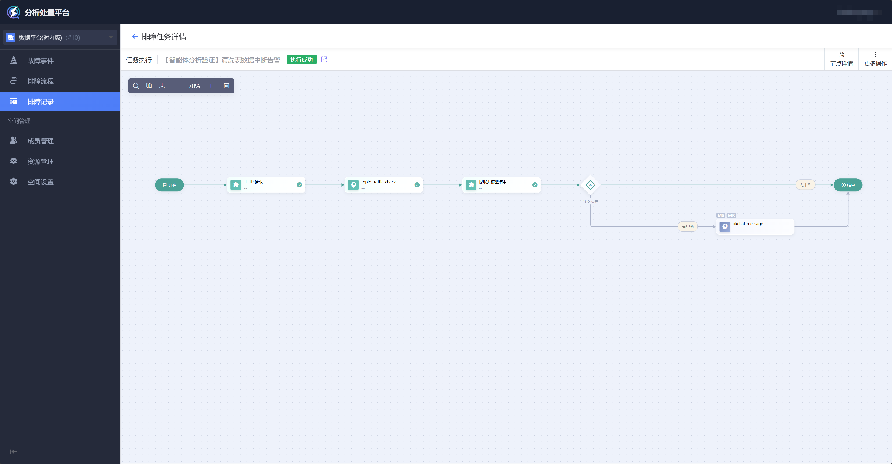
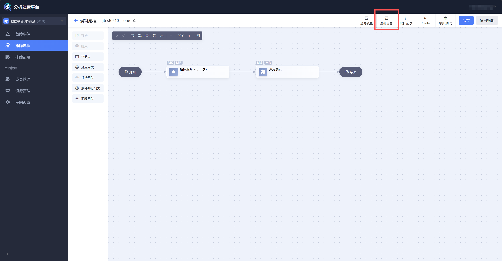
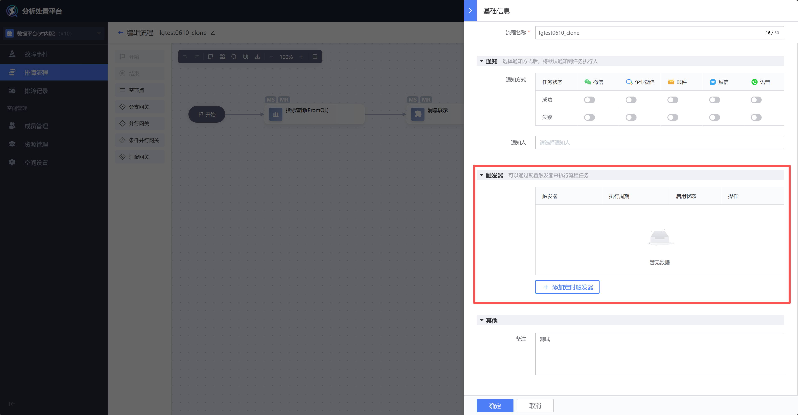
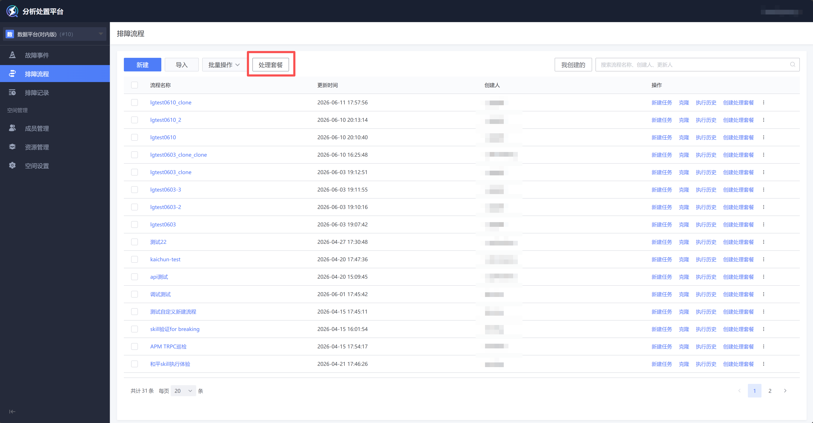
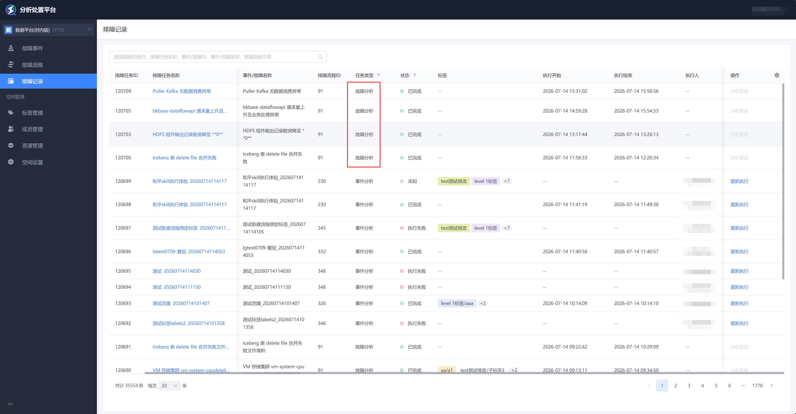
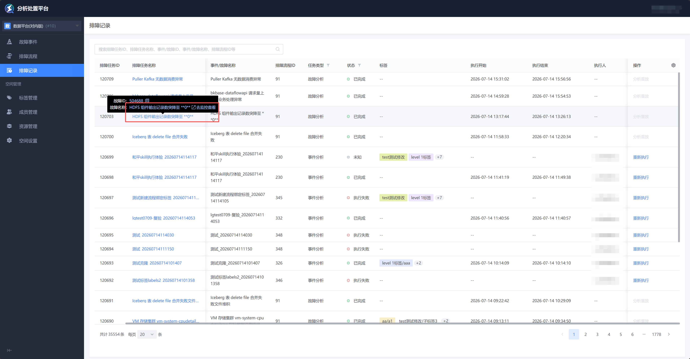

排障记录分两类：事件分析记录、故障分析记录。

# 事件分析记录

支持任务的启停、增删改查。

任务的触发（包含：周期触发、API触发）

周期触发：在 流程详情页 → 基础信息 → 触发器，配置周期触发规则。

API触发：在 流程列表页 → 处理套餐，可跳转至蓝鲸监控，查看和配置当前空间内流程的触发规则（套餐）。

# 故障分析记录

如 自动编排 章节介绍，故障分析记录 可查看自动编排功能所生成的排障画布。

也可跳转至蓝鲸监控查看故障详情。

