# 排障流程

## 手动编排

对于同类告警事件的分析处置逻辑，用户可编排自定义的流程，以便快速复用。在告警策略上挂载该流程，即可在产生告警时自动触发。

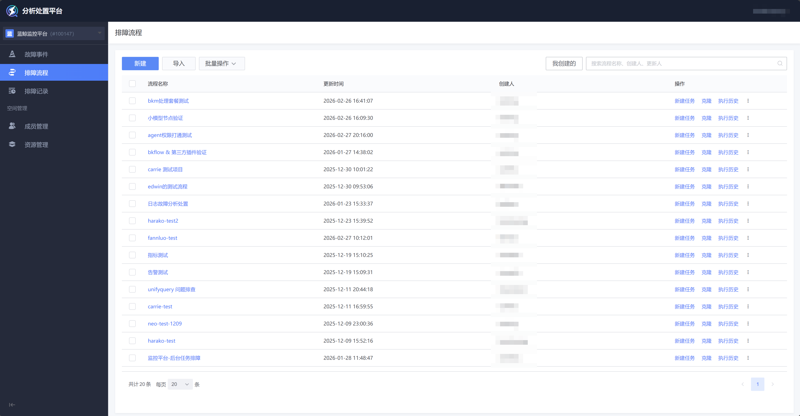

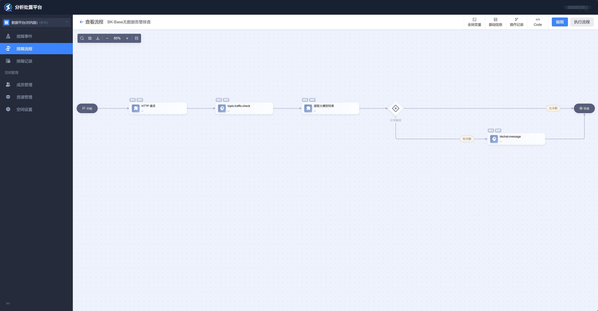

手动编排流程支持下列节点：

- 数据

    数据查询（指标、日志、告警、trace、profiling）。

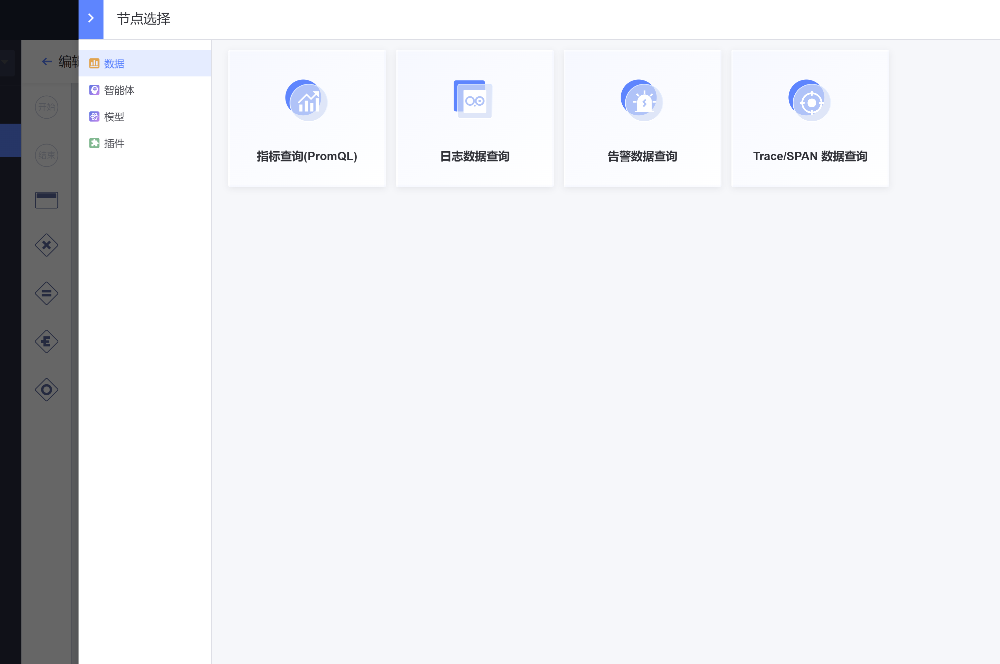

- 智能体

    包括公开使用权限的智能体，和当前空间已申请使用权限的智能体。

- 模型

    领域模型（单指标异常检测、多指标异常检测、时序预测、日志聚类…）。

    功能类似BKBase的模型应用节点。

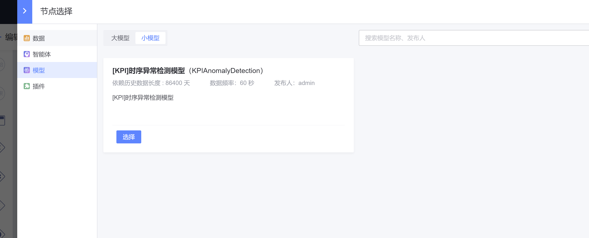

- 插件

    蓝鲸开发者中心授权的插件。

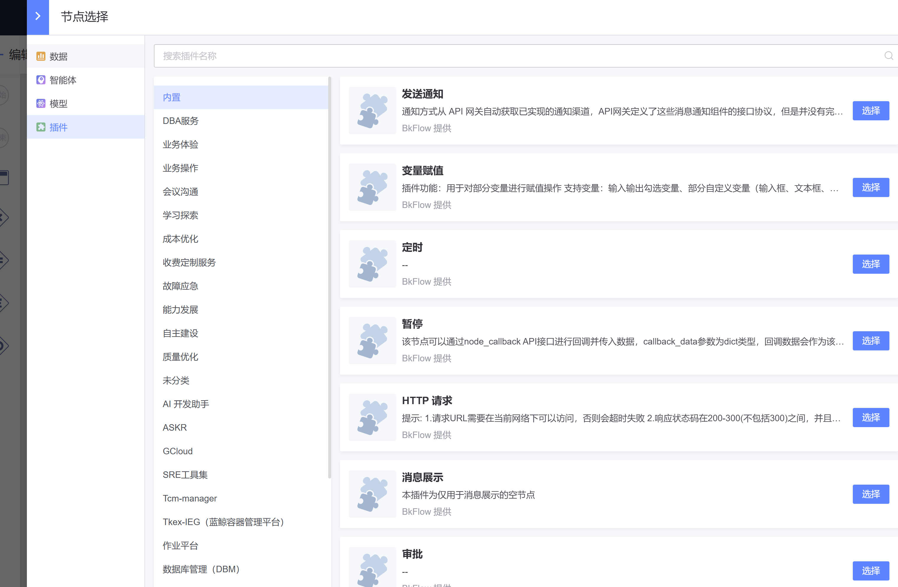

### 全局变量

可以在任何节点的输入参数中使用全局变量。

可以在任何节点的输出参数中勾选并定义新的全局变量。

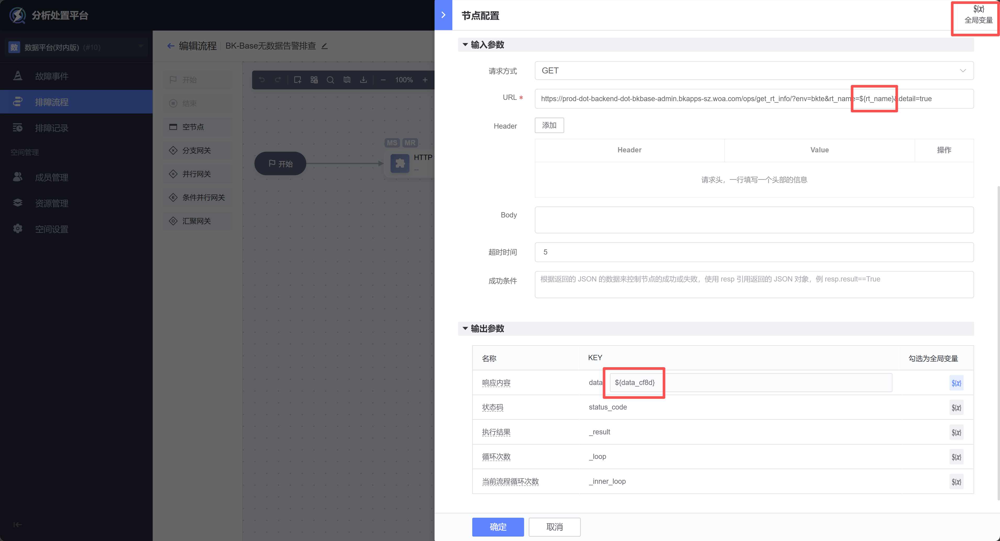

快捷查看当前流程的全局变量。

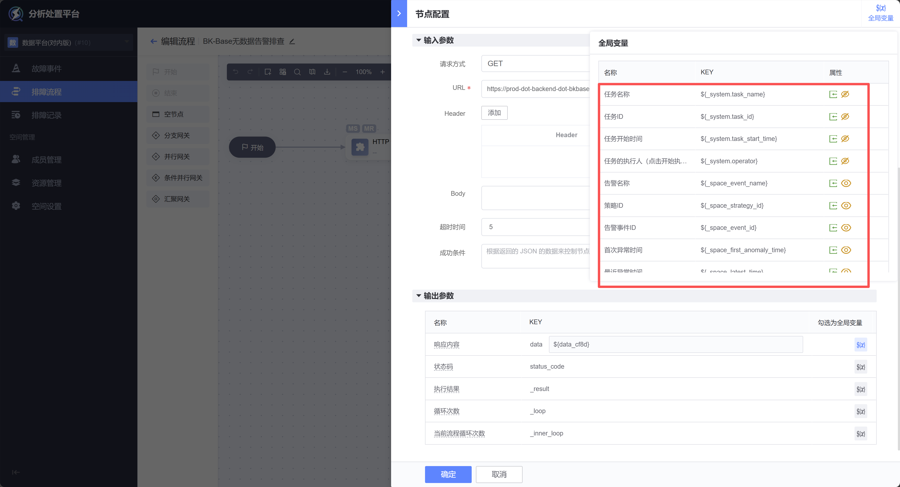

在画布中查看和管理全局变量。

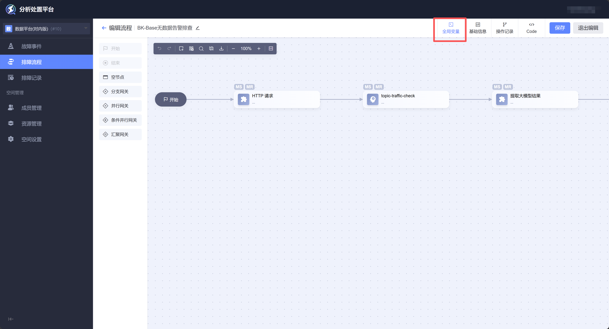

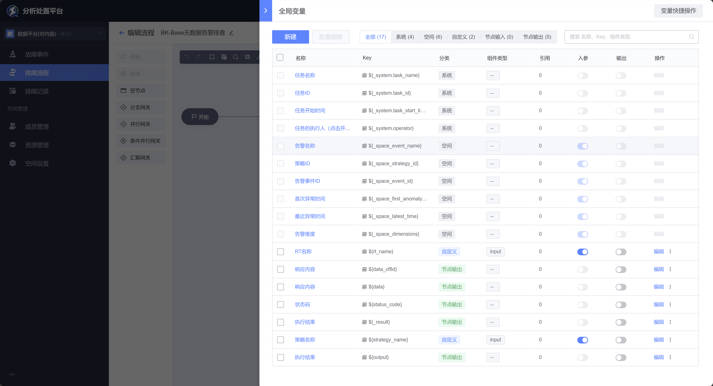

## 自动编排

除了支持单一告警的手动处理，平台还对海量告警提供了自动降噪、聚合、故障生成的能力。生成故障后，通过多Agent协作，自动编排分析处置流程，多轮迭代后选择最优路径，全过程无需用户干预。

故障生成后，在 故障 列表页，点击 排障记录，即可跳转至 排障记录 列表页并过滤出该故障的排障记录。

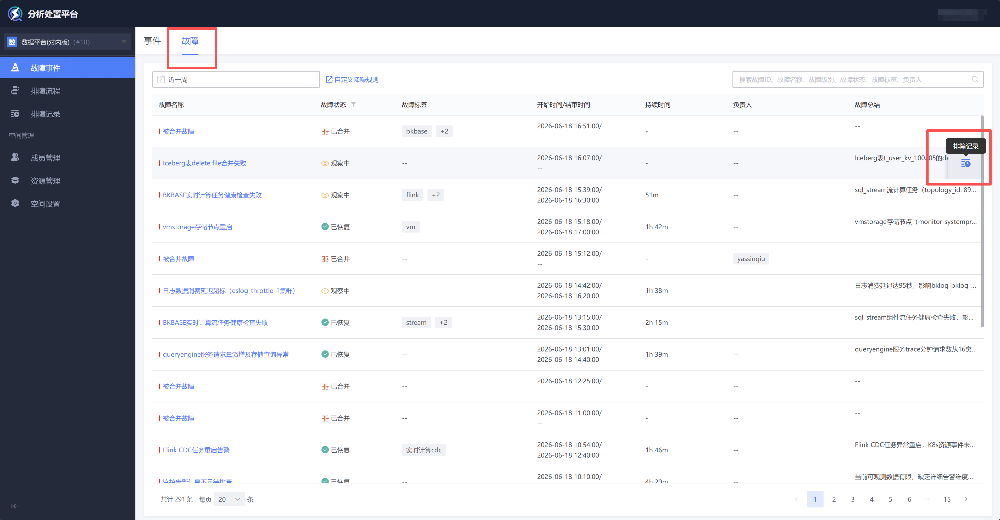

也可在 排障记录 列表页，直接过滤出任务类型为 故障分析 的任务，即可查看该故障的排障记录。

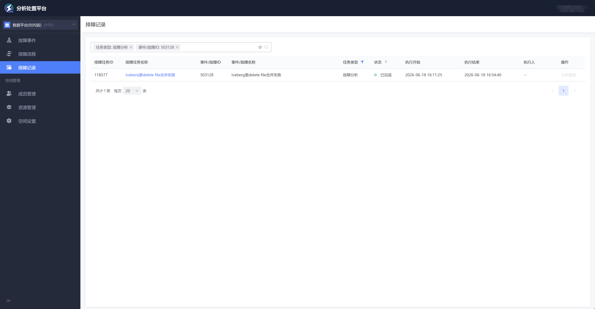

进入 排障记录 详情页，可以查看该故障的根因、针对该根因的排查假设、以及为了证实该假设而进行的排查过程。

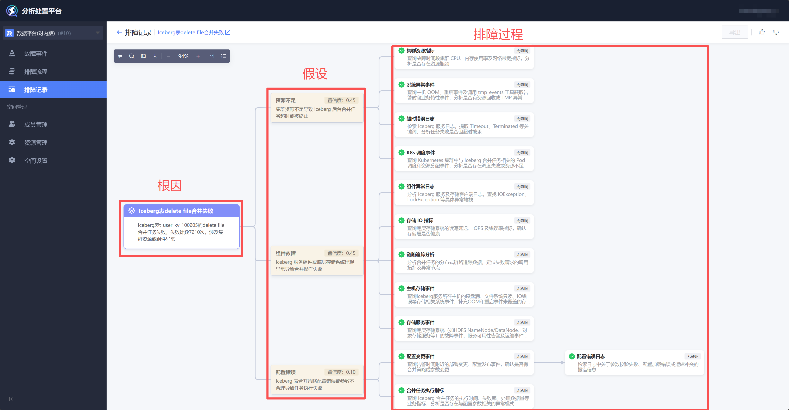

点击任何一个排查任务节点，可在右侧查看该节点的执行详情。

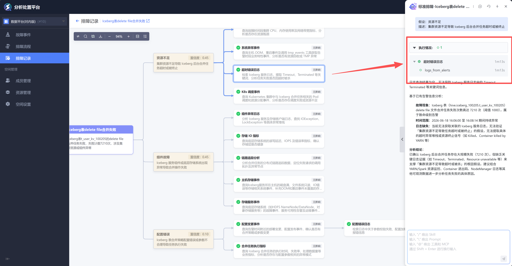

可以查看每个排障任务节点对于该假设的支持或反对情况。

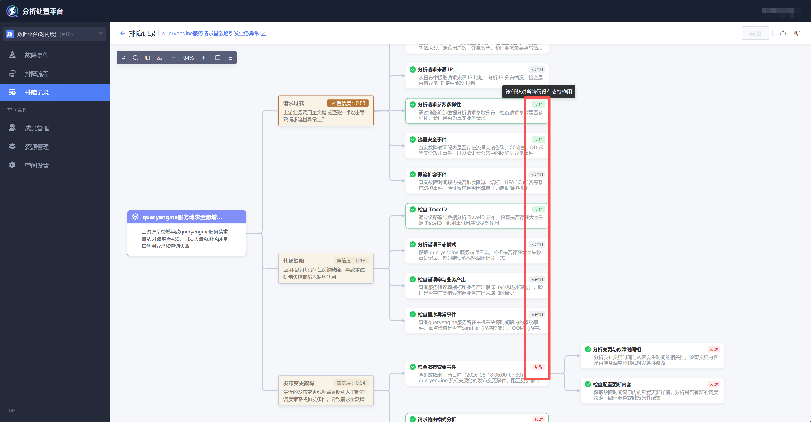

如果某一假设的置信度显著高于其他假设，会被标识为 已证实。

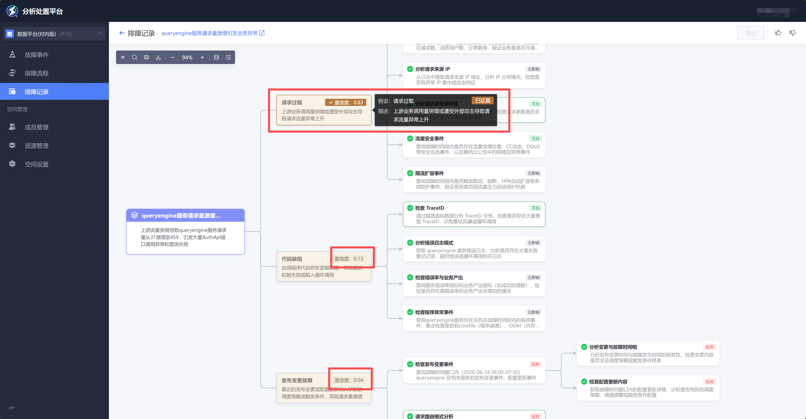

- 如何基于置信度得分得到 已证实/未证实 结论？

    - 结构化证据表示

        以结构化的形式，表达任务所涉及的假设，任务执行结果对假设的支持/反对/无影响，以及证据强度。

    - DST理论

        将每个任务结构化证据表示，表达为每个证据对假设置信度产生的影响。

    - PCR6和BetP

        基于PCR6和BetP，优化多个证据的合并，从而可以表达出最终的每个假设置信度得分。