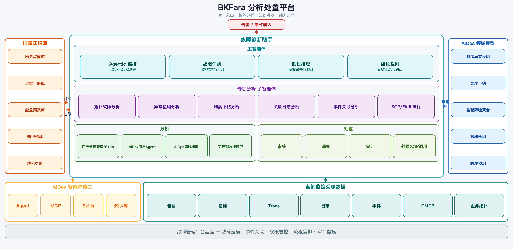

# 产品简介

基于故障分析处置场景提供的画布式工具。

- 支持包含 智能体、大模型、小模型、蓝鲸插件 在内的多种节点

- 提供手动和自动编排流程的能力

- 可通过自然语言进行故障重分析，调优排障结果

## 平台架构

- 统一入口层

归一化告警、事件、MCP 触发、主动巡检等多源信号，提供可审计、可人工审核的统一接入。

- 智能诊断层

主智能体负责 Agentic 编排（已知故障/未知故障双通道路由）、故障识别、假设推理、结论裁判；调度拓扑分析、异常检测、维度下钻、日志分析、事件关联、SOP/Skill 执行等专项子智能体协同工作。

- 分析与处置层

分析侧对接用户自定义流程/Skills、AIDev 用户 Agent、AIOps 领域模型、可观测数据获取；处置侧执行审核、通知、审计、处置 SOP 调用。

- 知识与模型层

排障知识库通过"召回—抽取"闭环持续积累故障经验与运维知识；AIOps 领域模型提供异常检测、维度下钻、告警降噪、离群检测、时序预测等算法能力。

- 平台基础设施层

AIDev 提供 Agent、MCP、Skills、知识库等智能体运行基础；蓝鲸监控提供告警、指标、Trace、日志、事件、CMDB、业务拓扑等观测数据；故障管理平台基座承载故障建模、事件关联、权限管控、流程编排与审计留痕。