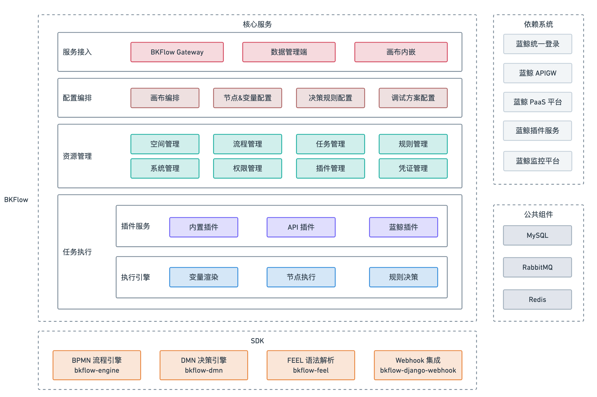

# 产品架构

BKFlow 服务是一款采用 Python 编写实现的 SaaS 平台产品，依赖相关蓝鲸基础服务和公共组件，对于相关的核心服务模块，BKFlow 进行了抽象并封装成一系列 SDK。

以下是各个模块的介绍：

**核心服务**

- 服务接入
  - BKFlow Gateway：BKFlow 服务暴露的 API 接口，用于接入系统调用和交互。
  - 数据管理端：满足接入系统开发者的数据管理需求，接入系统开发者可看见空间下的所有资源数据，并对资源进行配置和管理操作。
  - 画布内嵌：满足接入系统用户的画布展示和编排需求。
- 配置编排
  - 画布编排：定义流程结构，即任务执行的节点顺序模板。
  - 节点&变量配置：定义流程的业务执行逻辑和相关参数。
  - 决策规则管理：定义决策表，并绑定对应流程进行执行，可简化流程分支结构。
  - 调试方案配置：定义配置节点输出，可支持节点 MOCK 执行，适用于节点无法实际执行的场景调试。
- 资源管理
  - 空间管理
  - 流程管理
  - 任务管理
  - 规则管理
  - 系统管理
  - 权限管理
  - 插件管理
  - 凭证管理
- 任务执行
  - 插件服务
    - 内置插件：由 BKFlow 默认提供的公共业务逻辑封装，包括消息展示、定时、暂停、决策等一系列插件。
    - API 插件：由 接入系统开发者 自定义拓展的业务逻辑插件，接入系统开发者可以通过暴露特定协议的接口，实现自定义业务逻辑，并在 BKFlow 批量生成对应的插件，供给接入系统用户使用。
    - 蓝鲸插件：对接蓝鲸插件服务，由接入系统开发者或用户可以基于蓝鲸开发者中心自定义实现插件，并在 BKFlow 进行使用。
  - 任务执行
    - 变量渲染：任务执行过程中，将全局变量的值渲染为节点的输入参数。
    - 节点执行：任务执行过程中，根据节点的输入参数执行对应插件的业务逻辑，得到对应的节点输出。
    - 规则决策：任务执行过程中，根据决策表的输入匹配对应的规则，得到对应的决策输出。

**SDK**
- [bkflow-engine](https://github.com/TencentBlueKing/bamboo-engine)：一款基于事件驱动的通用流程引擎，用于任务的异步执行。
- [bkflow-dmn](https://github.com/TencentBlueKing/bkflow-dmn)：一款基于 Python 的 DMN(Decision Model Notation) 库，使用 FEEL(Friendly Enough Expression Language) 作为描述语言，可以作为决策引擎，用于解决实际业务场景中的决策问题。
- [bkflow-feel](https://github.com/TencentBlueKing/bkflow-feel)：一款基于 Python 的 FEEL (Friendly Enough Expression Language) 语法解析器，用于对 FEEL 语法表达式进行解析和运算，得到对应的 Python 对象作为计算结果。
- bkflow-django-webhook：一款支持系统快速集成 webhook 功能的 Django app。

**依赖系统**
- 必要依赖
  - 蓝鲸统一登录
  - 蓝鲸 APIGW
  - 蓝鲸 PaaS 平台
- 拓展依赖
  - 蓝鲸插件服务
  - 蓝鲸监控平台

**公共组件**
- MySQL：BKFlow 的数据库存储服务，记录相关资源数据。
- RabbitMQ：BKFlow 的消息队列服务，主要用于消息的异步处理和任务执行调度驱动。
- Redis： BKFlow 的分布式缓存服务。
