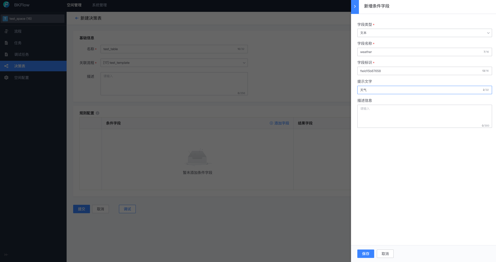

# 快速开始

> 这里介绍作为一个从来没有使用和对接过 BKFlow 的用户，如何快速在 BKFlow 中创建自己的空间，并以空间管理员身份完成相关功能的体验。系统接入的流程请参考[系统接入](../SystemAccess/system_access.md)文档。

## 创建空间

在项目首页点击【立即体验】。

填入对应的信息，点击提交即可创建空间，BKFlow 会自动将你添加为该空间的管理员。

## 空间配置

可以进行空间配置，可配置项包含空间管理员、画布模式、网关表达式等等，这些配置均会对整个空间生效。

## 流程管理

空间管理员可以查看并过滤流程列表。

可以直接在 Admin 管理端创建并编辑流程模板。

点击【调试】按钮，流程模板支持配置 Mock 数据方案作为节点输出，并执行调试。

点击【执行】按钮，即可创建调试任务并执行，可以看到，【暂停】节点以 MOCK 方式执行。

## 任务管理

空间管理员可以查看并过滤任务和调试任务列表。

## 规则决策管理

空间管理员可以直接新建决策表并关联流程模板，编辑决策表输入输出字段配置。

通过配置规则，得到决策表。

直接基于 Admin 管理端进行规则决策调试。

在流程中关联决策表并执行。

## 系统管理

如果你是 BKFlow 的系统管理员，还可以在 Admin 管理端进行空间和模块的配置管理。

空间配置可以查看并配置所有的空间信息。

模块配置可以配置空间和任务执行模块之间的映射关系。

