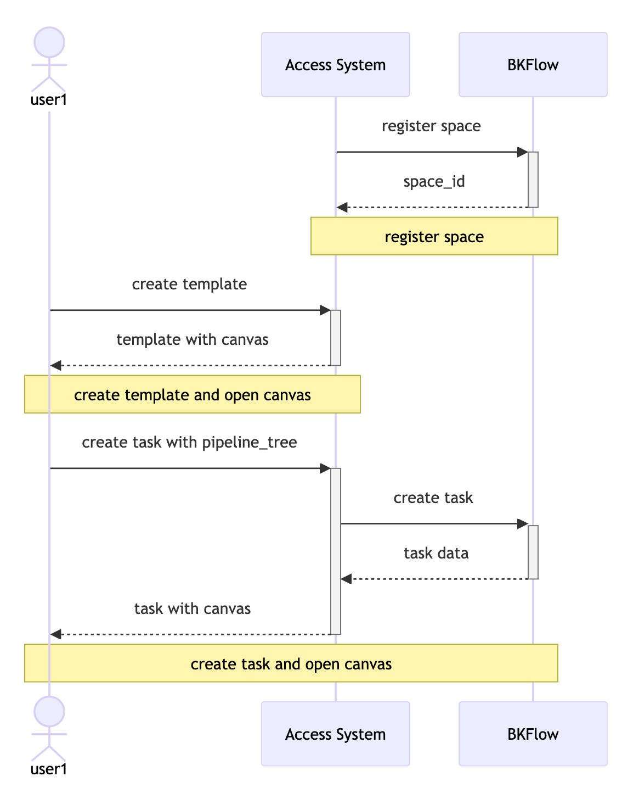

# 系统接入

## 接入方式

BKFlow 提供了两种不同的接入方式，您可以根据自己的需求选择合适的方式进行接入。

### 1. 接入系统嵌入 BKFlow 画布
在这种场景下，接入系统将 BKFlow 的画布嵌入到自己的应用程序中，以便接入系统的用户可以直观地创建、编辑和管理流程。

通过在 BKFlow 注册对应的空间，接入系统可以获取该空间下资源的管理权限，并通过 API 调用来管理这些资源。

通过嵌入 BKFlow 的画布，接入系统的用户无需感知到 BKFlow 的存在，但是其编辑和查看流程和任务的操作实际上是在 BKFlow 中进行的。接入系统通过替用户申请 Token 的方式来授予用户直接在画布中查看、编辑流程以及执行、操作任务的权限，用户带着 Token 和对应资源 id 访问 BKFlow 时，即可直接访问到对应的资源并进行操作。

以下是这种场景下用户、接入系统和 BKFlow 之间的交互流程图：

### 2. 接入系统实现画布
在这种场景下，接入系统需要自己实现画布，并通过调用 BKFlow 的 API 来实现流程和任务的管理和执行。

在这种场景下，接入系统需要理解 BKFlow 的流程和任务协议 pipeline_tree，并在接口交互中将 pipeline_tree 作为参数传递给 BKFlow。BKFlow 会根据 pipeline_tree 的定义来执行流程和任务。

以下是接入系统实现了自己的画布和流程管理，只依赖 BKFlow 进行任务执行的场景下，用户、接入系统和 BKFlow 之间的交互流程图：

## 快速接入

BKFlow 的所有 API 通过蓝鲸 APIGW 进行注册并发布，接入系统可以通过申请调用权限并调用 API 完成接入。

1. 创建空间: [create_space api](https://github.com/TencentBlueKing/BKFlow/blob/master/bkflow/apigw/docs/zh/create_space.md) 或 Admin 管理端
2. 进行空间配置: [renew_space_config api](https://github.com/TencentBlueKing/BKFlow/blob/master/bkflow/apigw/docs/zh/renew_space_config.md) 或 Admin 管理端
3. 创建流程: [create_template api](https://github.com/TencentBlueKing/BKFlow/blob/master/bkflow/apigw/docs/zh/create_template.md) 或 Admin 管理端
4. 创建任务: [create_task api](https://github.com/TencentBlueKing/BKFlow/blob/master/bkflow/apigw/docs/zh/create_task.md) 或 Admin 管理端
5. 执行任务: [operate_task api](https://github.com/TencentBlueKing/BKFlow/blob/master/bkflow/apigw/docs/zh/operate_task.md) 或 Admin 管理端

至此，就完成了最基础的平台接入和流程执行。

## 业务拓展

接入系统支持通过蓝鲸插件、API 插件和 Webhook 订阅进行业务拓展。

1. 蓝鲸插件开发：[开发文档](https://github.com/TencentBlueKing/bk-plugin-framework-python)
2. API 插件开发：[API 插件开发](api_plugin.md)
3. Webhook 订阅：通过调用 [apply_webhook_configs api](https://github.com/TencentBlueKing/BKFlow/blob/master/bkflow/apigw/docs/zh/apply_webhook_configs.md)，可以对事件进行订阅。当对应的事件触发时，BKFlow 会自动进行回调，接入系统可以对回调请求进行自定义处理。

## 资源隔离

出于节省资源的考虑，默认情况下所有的空间都会在同一个任务模块下执行，即不同空间的所有任务会使用相同的存储和计算资源，这样的弊端是不同空间的任务执行可能会相互干扰，比如当一个空间中执行大量任务时，可能会导致另一个空间的任务执行速度也变慢。

BKFlow 也提供了资源隔离的选项，需要联系环境管理员提前进行资源申请和相应配置。

目前 BKFlow 支持两种不同粒度的资源隔离方式：

1. 仅计算隔离：仅对任务执行的节点流转和计算进行隔离。
2. 计算隔离 + 存储隔离：除了计算隔离之外，同时对任务数据的存储进行隔离。