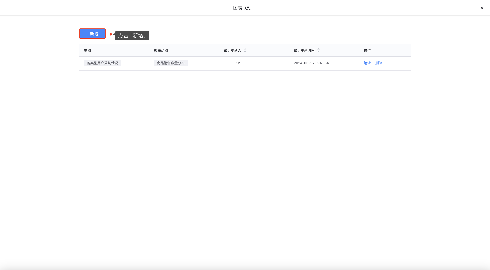
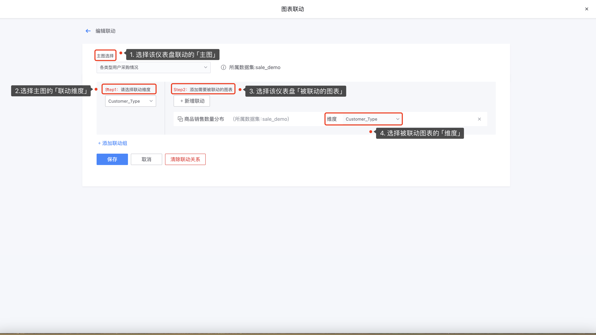
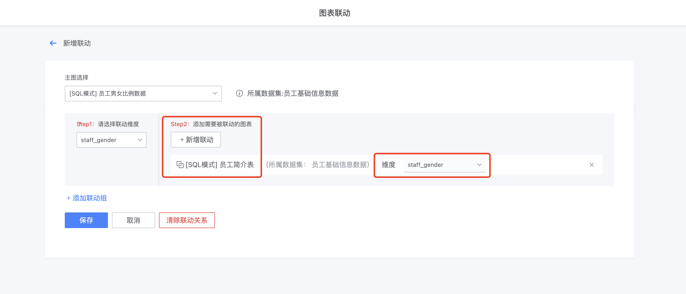

## 通过配置联动，让不同图表之间的数据交互更贴近场景！

联动是一种数据可视化的交互功能，它允许用户在查看一个数据视图时，所做的选择或操作能够实时影响到其他相关联的数据视图；

### 简易模式
简易模式下，每个图标会明确设定自己的“指标”和“维度”，所以在联动配置中可以方便快捷的选择进行设置：

- **设置联动**

进入「编辑模式」页面 — 点击 **`联动`**；


点击**`新增`**；



根据指引，选择联动的图表及维度信息；



- **联动结果展示如下**


- **注意**

不是所有的图表都支持下钻和联动，通过以下表格可以了解支持下钻和联动的图表分别有哪些：


### SQL模式

在SQL模式下，一则图表不用明确指明“数据集”，二则在复杂的联表查询语句中无法定位到用户可输出的字段列表；于是，我们类似“下钻”的配置一样约定了一套标准的声明式配置！用户只需按照要求声明当前图表可被设置为联动维度的字段，即可在联动配置页中选中该SQL模式图表的联动字段：

```sql
/*
linkage:              // 联动配置段落
  enable: true        // true:启用， false:停用
  field:              // 支持被设置联动的字段
    - field_a
    - field_b
    - field_c
*/
```

下图的示例中，`staff_gender` 被设置为可联动的维度：


接下来我们就可以在联动配置中，选择这个字段作为被联动的维度：



最终，我们通过下图的左边饼图点击 `F` 来联动右边的“员工简介表”，达到联动的效果：


