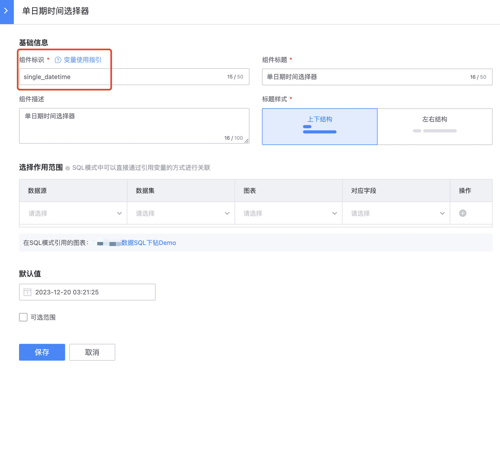

## SQL模式下，如何引用“交互组件”的参数值？

首先了解变量的引用方法和变量魅尾的用法：

#### 变量的引用方法

- {{var_name}}

  变量名使用双大括号{{}}，即可输出对应的变量值；需要注意一点，如果变量是选择器组件多选值，用这种方式引用时，平台会默认将多个值以逗号分隔的方式输出字符串;

- {{var_name}}(field_name)

  在变量后面追加括弧字段引用，平台会根据变量的值和类型自动适配并生成对应的SQL查询语法;

```
以MySQL为例：select field_a, field_b, field_c from table where {{userlist}}(username) group by field_a, field_b;

当userlist的交互组件为单选值时，平台会渲染为“等于”表达式，即：
select field_a, field_b, field_c from table where username = 'admin' group by field_a, field_b;

当userlist的交互组件为多选值时，平台会渲染为“in”表达式，即：
select field_a, field_b, field_c from table where username in ('admin1', 'admin2') group by field_a, field_b;
```

#### “变量魅尾”的用法

变量魅尾是平台提供的统一预定义的变量处理函数方法，用户可以通过这个能力改变变量的输出格式或内容；用法就像它的名字一样，只要在变量名的尾巴追加方法名，如：`{{变量名.方法名(方法参数)}}`;已支持的几种方法：

- .format()
  说明：支持对时间类型的变量进行格式化输出
  用法：`datetime.format('%Y-%m-%d %H:%M:%S')`
  参数：
  %Y：输出4位数的年份，如：2022
  %y：输出2位数的年份，如：22
  %m：输出2位数的月份，如：07
  %b 或 %h：输出英文简写的月份，如：Jul
  %B：输出完整的月份，如：July
  %d：输出2位数的日期，如：31
  %A：输出完整的星期几，如：Saturday
  %a：输出英文简写的星期几，如：Sat
  %H：输出24小时制的小时（00-23）
  %I：输出12小时制的小时（01-12）
  %M：输出2位数的分钟（00-59）
  %S：输出2位数的秒（00-60），60 是润秒
  %s：输出秒级时间戳，如：1700626692
  %p：输出上午/下午指示符，如：AM 或 PM
  %Z：输出时区名称，如：CST
  %z：输出时区偏移，如：+0800


以交互组件—时间选择器为例：



确定 **`组件标识`**，具有唯一性；


在「SQL查询」中按照「变量使用指引」将 **`组件标识`** 通过 **`where`** 语句进行查询；

