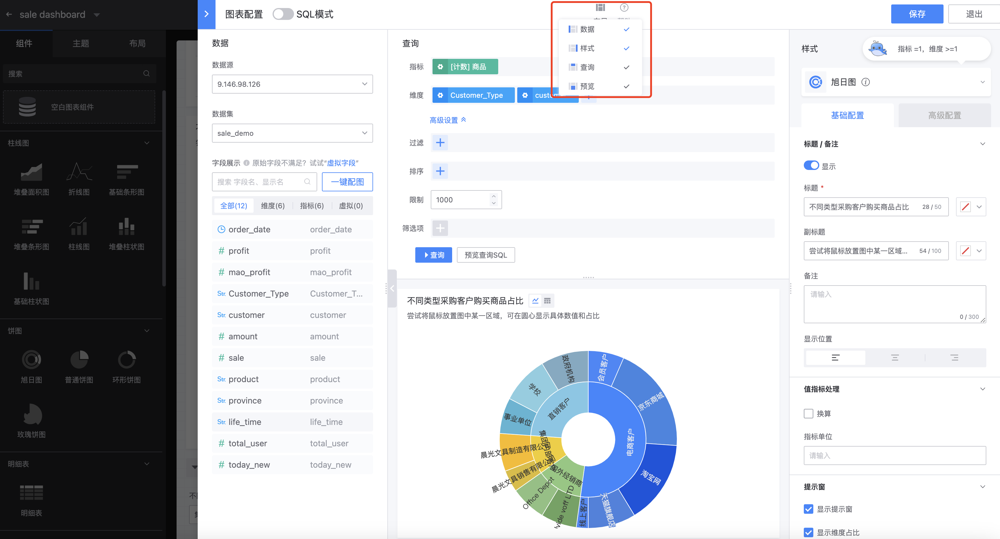
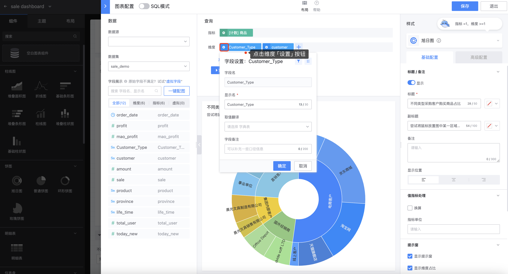
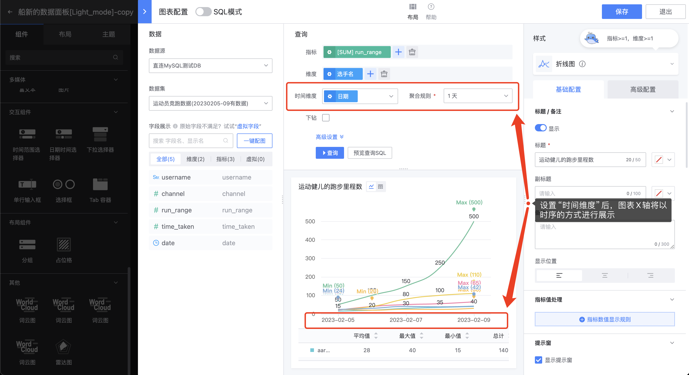
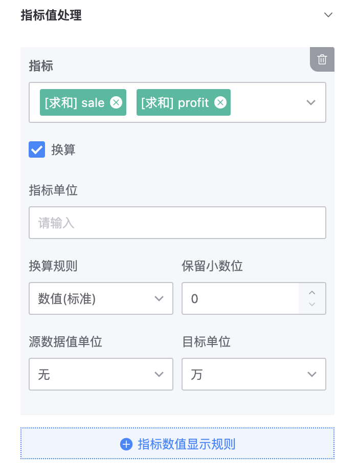
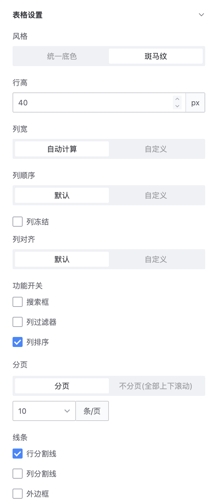
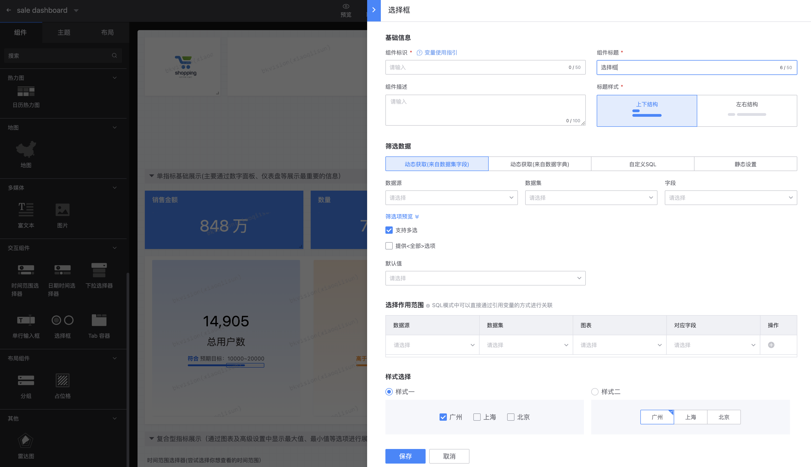
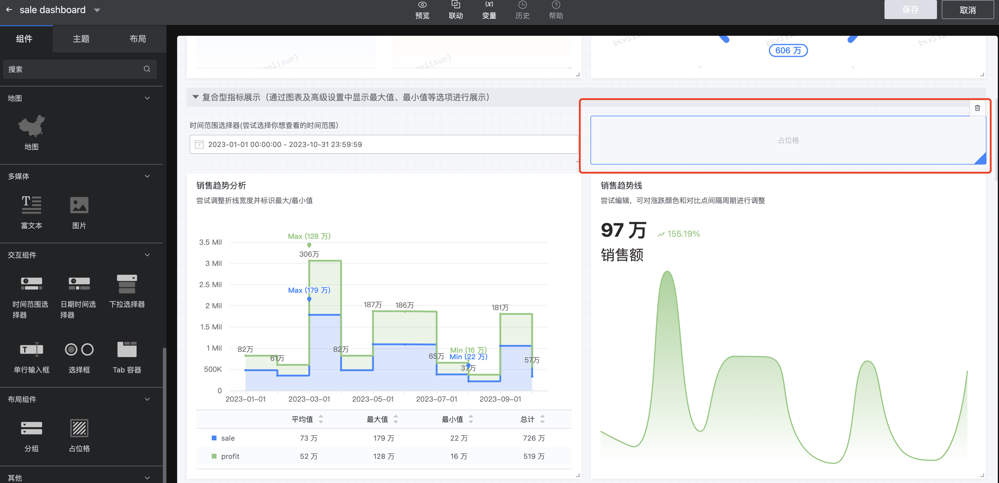

## 图表配置

作为图表平台的核心页面，其设计和功能对于用户体验和图表生成的效率至关重要。以下是对图表配置页面的进一步阐述：

### 模式选择

图表配置分为两种模式，分别为「**简易模式**」和「**SQL模式**」，两种模式的数据、样式和展示框都是一样的，只有查询方式不同，简易模式的查询需要用户选择指标和维度等进行设置，而SQL模式下的查询则是通过SQL语句输出进行查询；

- **简易模式**

- **SQL模式**

### 布局

 分为数据、样式、查询和预览，用户可根据具体需求选择布局，其中查询和预览不可隐藏；

### 数据

​           **`数据源`**：查找配置该图表的数据源；

​           **`数据集`**：查找配置该图表的数据集；

​           **`字段展示`**：基于选定的数据集，展示数据集的字段名和显示名；

​           **`虚拟字段`**：在数据库中并不实际存储数据的字段，而是通过计算或转换现有字段的数据来得到的，可以基于其他字段的值、函数、表达式来创建；点击虚拟字段，页面跳转到新建虚拟字段页面；

​            **`一键配图`**：帮助用户根据数据集自动化匹配合适的图表；

### 查询

- **简易模式**：从左侧数据的字段展示中选择该图表需配置的指标和维度；高级设置还包括过滤、排序、限制和筛选项；

​       **指标**：点击指标设置按钮，展示「字段设置」页面，其中字段名无法修改，显示名可修改，聚合算法包括计数、去重计数和不聚合等，以及字段备注通过输入信息来帮助用户理解字段含义;

​        **维度**：点击维度设置按钮，展示「字段设置」页面，其中字段名无法修改，显示名可修改，取值翻译为选取字典表，以及字段备注通过输入信息来帮助用户理解字段含义;

​      **时间维度**：时间维度适用于对时序类数据进行趋势展示的场景，例如通过折线图、柱状图展示一段时间的数据增长趋势；选择时间维度字段后，通过配置不同的聚合粒度来进行数据的聚合计算。

​         **高级设置**：

​         **过滤**：允许用户根据特定的条件或属性来筛选数据。例如，用户可以选择只显示销售额大于某个特定值的记录，或者只展示某个特定地区的销售数据；

​         **排序**：允许用户按照已选定的字段进行排序；用户可以选择升序（从小到大）或降序（从大到小）的排序方式；

​          **限制**：允许用户限制展示的数据量；

​          **筛选项**：暂未开放；

​          **预览查询SQL**：即显示查询模块对应的SQL语句；

- **SQL模式**：输入SQL语句，三步查询；

  **查询提示**：查询提示是一种辅助功能，它在用户编写SQL查询时提供实时的建议和反馈；这些提示可以帮助用户避免语法错误，并优化查询性能；

  

  **查询详情**：查询详情页面显示了用户所构建的SQL查询的进度；这包括提交查询、连接储存、执行查询和数据渲染；

  

  **查询结果**：展示了SQL查询的执行结果；这包括查询到的指标、维度和图表；

  

### 展示框

基于 **`查询`** 操作之后，可在该展示框内直观地查看配置的图表，便于及时调整和更改配置；

### 样式

不同类型的组件其样式设置各不相同，以下将组件分为图表、交互组件和布局组件分别阐述：

#### 1. 图表

分为 **`基础配置`** 和 **`高级配置`**，用户可根据需求自定义样式，满足不同场景应用，当然除了通用的配置例如：标题、指标值处理等，针对不同的图表提供不同的配置；

**基础配置**：

**通用**：

-    **标题/备注**：简明扼要概括了图表的主题或内容；可不显示标题/备注；

​                 标题和副标题：可修改字体颜色；

​                 备注：帮助用户更好地理解图表含义；

​                 显示位置：标题放置位置，分为左侧对其、居中和右侧对齐；

- **指标值处理**：即“单位换算”，防止图表单个数据长度过长影响可观测性；可选择不换算；支持多个指标值显示规则；

​                  换算信息：根据换算规则、保留小数位、源数据值单位和目标单位换算成合适的目标数值单位；

- **提示窗**：在用户悬停或点击图表元素时显示该位置的指标或维度的信息；可选择关闭提示窗；

​                  多维度排序方式：选择提示窗内信息展示方式分为不处理、正序和逆序；

-  **图例**：图例解释了图表中不同颜色所指代的维度的含义；可选择关闭图例；

​                  图例位置：确定图例的位置，如下方和右侧，以避免遮挡数据；

- **坐标轴**：即“X轴”和“Y轴”；调整坐标轴刻度间距及文字角度；

​                   X轴：输入标题；显示数值；可以调整X轴的文字角度；

​                   Y轴：输入标题；显示网格线；Y轴的刻度个数可选择自动计算和手动固定；显示数值；                 

- **背景**：支持用户调节图表背景的颜色和上传背景图；

- **边框**：调节图表边框的设计；

**特殊**：不同类型的**图形**设置不同；

- **折线图**

​               风格：选择折线的三种不同风格样式；

​               数值常驻显示：即是否在图表上展示各个数据点；

​               标识最大/最小值：对每一条折线的最大值和最小值进行标识；

​               数据点大小：各个数据点的圆圈大小范围，数据点越大越明显；

​               区域填充：折线距离x轴区域进行颜色填充；

​               显示总和：显示横坐标对应的纵坐标总和数值；

​               线条宽度：即对应折线的粗细；

​               空值处理：根据折线图的特殊性，可能存在某x轴对应的y值为空值，支持两种处理方式分别为不处理和连接前后有值的点；              

- **柱状图**

​               数值常驻显示：即是否在图表上展示各个数据点；

​               位置：即数值标识在柱子的位置，分为柱内、柱顶和柱右侧；

​               标识最大/最小值：对所有柱子的最大值和最小值进行标识；

​               柱子透明度：拖动显示柱子透明程度 并在右侧显示透明度数值；                  

- **饼图**

​                数值常驻显示：即是否在图表上展示各个数据点；

​                标签对齐：即每部分显示标签位置，分为不规则、边缘对齐和文字堆砌；

​                饼块大小：饼图外部圆圈大小；

​                内圈大小：即以圆心为中心的空心圆大小，使得基础饼图变成环形图；

​                环形图圆角：通过圆滑处理环形图的边缘，使其呈现出圆角的外观；

​                显示数量限制：放置饼图数据种类过多，导致堆叠无法判断关键信息，可限制数量限制，保持图表的美观性；

- **数字面板**

​               显示指标名：在数字面板上显示的数据指标的名称；

​               字体大小；字体颜色； 

​               多指标间距：数字面板上多个指标之间的水平距离，提高整体布局的清晰度；

​               多指标排列方式：多个指标的布局方式，分为分页和平铺；

​               每行展示数量：即每行显示的指标数量；

- **明细表**

  ​        风格：明细表总体风格，分为统一底色即白色和斑马纹；

  ​        行高：每一行的数据高度，自定义数值调节；

  ​        列宽：每一列数据的宽度，分为默认和自定义；

  ​        列顺序：各列的排列顺序，各自定义调整顺序；

  ​        列冻结：滚动明细表时，保持某些列始终可见的功能，可从左到右或从右到左锁定列；

  ​        列对齐：明细表中各列数据的水平对齐方式，分为左对齐、居中对齐和右对齐；

​               功能开关：提供一些可选功能，如搜索框、列过滤器和列排序；

​               分页：分成多个部分进行显示的功能，可分页并设置每页显示数据条数；

​               线条：用于分隔行、列的线条，支持行分割线、列分割线和外边框；

**高级配置**：仅部分图表支持；

- **汇总统计**：**柱线图**和**饼图**支持；即根据选中的不同指标分别统计其最大值、最小值、平均值、总和和最新值，并在展示框中图表底部以表格形式显示，便于用户对图表的特殊值一目了然；

-  **变形**：**数字面板**和**数字&趋势线**支持；

​                指标：选中已配置的需要变形的指标；支持多个指标变形；

​                选择条件：即需要变形的条件，分为值、范围和正则；

​                变形值：可以使用变量{{value}}l来读取原始值，如原始值为9999，变形值填写：“危!{{value}}”，最终渲染结果为：“危!9999“；

​                字体变化：改变指标值以及变形值的颜色；

​                额外标志：当满足选择条件并勾选额外标志，即可在图表上出现以下效果，支持三种标识并可以改变颜色；

- **辅助趋势线**：仅**数字&趋势线**；

  ​          是否数值对比：即是否对数据点进行对比，会在图表中显示趋势和百分比；

  ​          对比点间隔周期：自定义间隔周期；

  ​          对比标记：自定义红涨绿跌和绿涨红跌；

​                 备注后缀：简单阐述内容；

​                 是否展示趋势：可自定义Y轴起始值；        

- **标注**：仅**地图**；

​              字段：选择已配置的指标字段；

​              选择条件：即需要进行标注的具体条件；

​              标注图标：满足选择条件的即在地图对应位置进行标注，支持自定义图标；

​              标注颜色：图标的颜色；

​              提示信息：鼠标hover图标所标注的位置即可显示提示窗，显示提示信息；

#### 2. 交互组件

交互组件和布局组件没有图表配置页面，即弹出右侧编辑栏直接编辑；

**时间范围选择器**：通过选定时间范围进行数据过滤，来达到查看不同时间范围数据图形的诉求；

​        **基础信息**：

​               组件标识：用于唯一标识组件的字符，仅支持 **`a-z 0-9 _`** ;

​               组件标题：显示在仪表盘的文本，简洁穿搭功能和内容；

​               组件描述：对组件功能的详细说明，便于理解；

​               标题样式：提供两种样式可选择分别为上下结构和左右结构；

​               选择作用范围：选择时间范围筛选器作用的具体图表信息，包括数据源、数据集和相对应的时间字段；

​               默认值：即图表数据显示的时间范围；

**下拉选择器**：配置不同的下拉选项值，提供用户选择以筛选图表返回的数据；

​        基础信息：同时间范围选择器；

​        筛选数据：支持筛选多种数据；手动录入数据源、数据集和字段；支持多选，支持提供全部选项； 

​        选择作用范围：选择下拉选择器作用的具体图表信息，包括数据源、数据集和相对应的字段；               

**选择框**：提供不同的选项，提供用户勾选以筛选图表返回的数据；在下拉选择器的功能基础上提供两种样式选择；

#### 3. 布局组件

**分组**：将同类图表划分到一个分组，便于一同移动编辑或查看；

**占位格**：空白占位格，用于布局排版美观；

**Tab容器**：适用于需要在同一片区域内通过切换Tab来显示不同内容的场景；例如：电商的“电器”分类区，每一个Tab是一种电器类型，电视、洗衣机、空调等；每切换一个Tab可拖拽任一一个组件嵌入容器中；支持四种不同样式设置；

