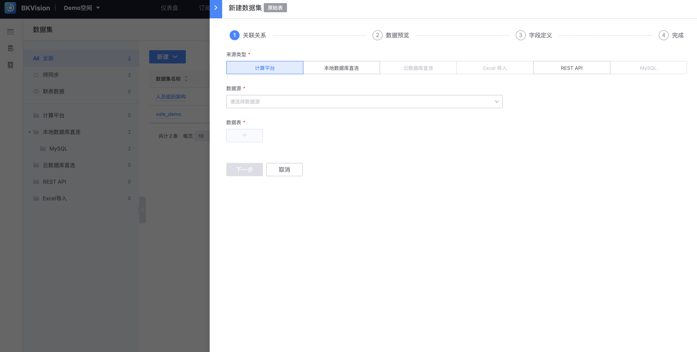
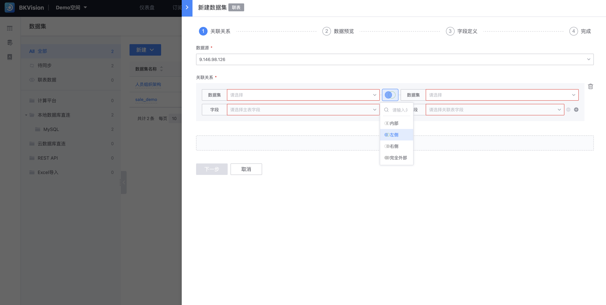

## 数据集

在图表平台中，数据集的本质是数据表；当用户成功接入数据源(数据库)后，并不代表数据源中的所有数据表都接入到图表平台来，用户需要在「数据集」页面接入配置仪表盘时所需要的数据表；

用户可通过左侧导航栏、列表、搜索框检索已接入到该空间的数据集信息；

### 新建数据集

点击 **`新建`**，选项分为 **`原始表`**和 **`联表`**

- **原始表**：即直接从数据源接入的数据表

  点击 **`原始表`**，进入「新建数据集」页面

1. **填写关联关系**

   ​        **`来源类型`**：分为 **`计算平台`**、 **`本地数据库直连`**、 **`REST API`**、**`云数据库直连`**、**`Excel导入`**、**`MySQL`**（后三个还未开发），通过选定数据源的信息方可快速锁定数据表；

   ​        **`数据源`**：选择已接入的数据源；

   ​        **`数据表`**：选择该数据源的数据表，可一次接入多个数据表；

2. **数据预览**: 当数据库中的表成功接入后，展示接入的数据表结构和前100条数据；

3. **填写字段定义**：除 **`原始字段名`**外，其他均可自定义；

   ​        **`原始字段名`**：数据源中实际存在的字段名称，即数据库中创建数据表的字段名；

   ​        **`字段名`**：适应不同场景对原始字段名进行重新命名或翻译后的名称，默认原始字段名；

   ​        **`显示名`**：最终展示给用户的字段名称；

   ​        **`字段类型`**：标识字段数据的类型，如字符串、数字（整型）、数字（浮点型）、时间等；

   ​        **`数据分类`**：分为“维度”和“指标”，便于图表配置时直接选择；

   读到这里可能还是对原始字段名、字段名和显示名有些模糊，举个例子：这是Demo空间已经创建的数据集，我们通过数据集详情可以看到「字段定义」页面下，显示字段名和显示名，不会显示您在数据库中创建数据表时的列名即原始字段名；

   

   那么用户可能疑惑设置字段名和显示名有什么作用呢？答案就是在「图表配置」页面中，会有数据字段的展示，可以看出左侧是显示名，右侧是字段名，目的都是为了帮助用户直观、快速地选择图表的指标和维度；

   

希望以上的例子可以帮助你更好的理解原始字段名、字段名和显示名的区别！

4. **完成**

​              **`数据集名称`**：即数据集的页面显示名；

​              **`数据集表名`**：数据集在数据库中的实际表名；

​              **`数据集描述`**：用于描述该数据集的用途、使用场景、说明等备注信息；

- **联表**：根据字段之间的关系从多个表中检索数据，并将他们组合成一个结果集；类比SQL语句中 **`join`** 的用法，用于将多个表中的数据关联起来的操作；

1. **填写关联关系**

​        **`数据源`**：选择已接入的数据源；

​        **`关联关系`** ：根据两个或多个表之间的共同列，将他们的行进行匹配，并返回满足特定条件的结果；共支持四种连接方式，类比join：

​                **`内部`**：内连接(INNER  JOIN)

​                **`左侧`**：左连接(LEFT JOIN)

​                **`右侧`**：右连接(RIGHT JOIN)

​                **`完全外部`**：全连接(FULL JOIN)

2. **数据预览**

3. **填写字段定义**（同原始表）

4. **完成**

​              **`数据集名称`**：即数据集的页面显示名；

​              **`数据集表名`**：数据集在数据库中的实际表名；

​              **`数据集描述`**：用于描述该数据集的用途、使用场景、说明等备注信息；

### 查看已有数据集

以上是从新建数据集的视角进行描述，接下来从查看已有数据集的视角进行描述： 

当点击数据集列表中任一数据集;

进入「数据集详情」页面，左侧展示创建该数据集时的基本信息和变更信息，右侧模块展示该数据集的内部数据信息；

**数据预览**：可展示 **`原始数据`**和 **`字典翻译`**，直观的展示原始数据信息和数据集相关联的字典；

**字段定义**：显示字段名、显示名、字段类型和数据分类并可手动编辑修改；支持 **`虚拟字段`**和 **`批量编辑`**功能；

**虚拟字段**：在数据库中并不实际存储数据的字段，而是通过计算、表达式等间接生成的；

​         **`字段ID`**：作为虚拟字段的唯一标识符；

​         **`字段显示名`**：在用户界面展示给用户看的名称；

​         **`备注`**：阐述该字段的含义，便于理解；

​         **`字段定义`**：填写SQL语句定义虚拟字段的表达式；

​         **`字段类型`**：选择储存的数据类型；

​         **`数据分类`**：选择指标或维度；

​         **`语法检查`**：验证输入的SQL语句是否符合正确的语法规则；

 **批量编辑**：批量修改字段名、显示名、字段类型和数据分类等信息；

**关联图表**：显示应用该数据集的所有图表名称和图表类型及所属仪表盘；

​     