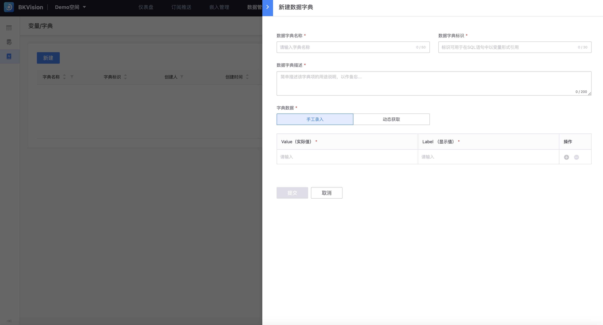

## 数据字典

支持用户自定义一组相关的数据值，并在仪表盘中使用这些值；不仅简化数据输入过程，还提高数据的一致性和可维护性；

1. 点击 **`数据管理`**  — 点击 **`变量/字典`** — 点击 **`新建`**

2. **填写数据字典信息**

​         **`数据字典名称`**：具体名称，在图表配置中可通过数据字典名称引用该字典；

​         **`数据字典标识`**：该标识为了图表配置「SQL模式」时以变量形式引导；

​         **`数据字典描述`**：对数据字典内容的详细概述，方便快速理解和使用；

​         **`字典数据`**：分为 **`手工录入`**和 **`动态获取`**；

​         **`手工录入`**：以表格形式一对一输入 **`Value(实际值)`** 和 **`Lable(显示值)`**，即实际数据集中的值使用数据字典之后对应显示值；

​         **`动态获取`**：分为**`指定数据集`**和**`自定义SQL`**；

​         **`指定数据集`**：选择指定的**`数据源`**、**`数据集`**、**`Value字段`**和对应 **`Lable字段`**；

​         **`自定义SQL`**：输出SQL语句指定某数据集的 **`Value字段`** 和对应的 **`Lable字段`**                  

3. **以手工录入为例：**

预先新建一组字典，数据字典名称为男女翻译字典，然后在图表配置应用此字典；

此图表员工性别初始为F和M；

点击员工性别设置按钮—选择取值翻译—选择男女翻译字典—点击查询；

图表中女性代替了F，男性代替了M；