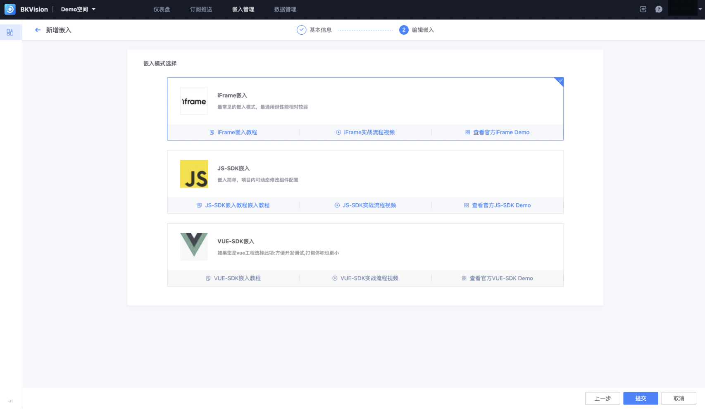

## 仪表盘嵌入管理

支持用户将已经创建好的仪表盘嵌入到其他平台或应用中，实现数据的跨平台展示和分析；

用户可通过列表查看、检索已嵌入到其他平台的嵌入信息；

点击 **`新建`**，进入「新增嵌入」页面；

1. **新增嵌入信息填写**

- **基础信息**：填写嵌入的仪表盘和应用ID

  ​        **`仪表盘`**：选择要嵌入的仪表盘；

  ​        **`版本`**：可选择不同版本号进行推送，默认为最新版本；

  ​        **`蓝鲸应用ID`**：选择要嵌入的蓝鲸平台，输入ID号；

- **参数配置**：用户可在参数配置中看到要嵌入的仪表盘上已配置的所有交互组件，用户可通过交互组件，自定义筛选仪表盘中的数据，可展示水印；

2. **编辑嵌入**

​       将仪表盘嵌入到其他平台或应用中时，用户可以根据自己的技术栈和需求选择不同的嵌入方式，现支持三种嵌入模式：**`iFrame嵌入`、`JS-SDK嵌入`、`VUE-SDK嵌入`**；