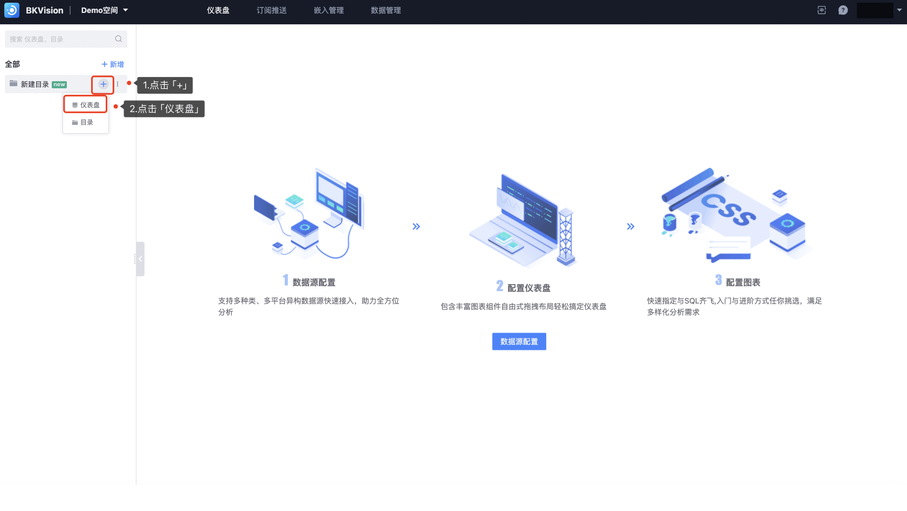

## 4. 创建目录和仪表盘

### 新增目录

1. 点击 **`新增`** — 点击 **`目录`** — 填写 **`目录名称`**— 选择 **`所属目录`**

    ​         **`所属目录`**：即目录表中已创建的目录，或根目录

2. 除了上述方法，还可以在已有的目录上进行新建：

### 新增仪表盘

1. 点击 **`新增`** — 点击 **`仪表盘`** — 填写**`仪表盘名称`**— 选择 **`所属目录`**

    **`所属目录`**：即目录表中已创建的目录，或根目录

2. 除了上述方法，还可以在已有的目录上进行新建：

