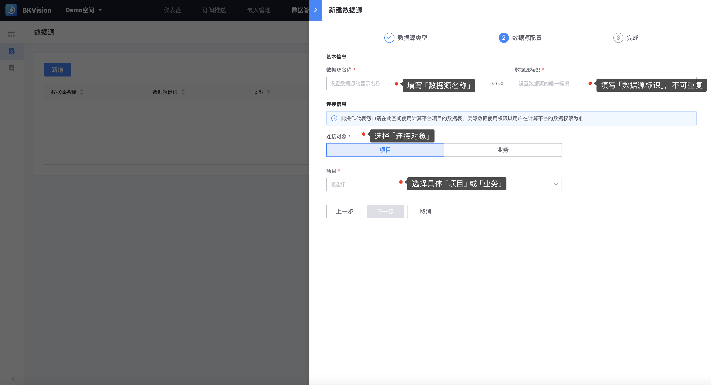

## 1.接入数据源

### 操作步骤

1. 前往 **空间**，确定接入数据源的空间范围

   点击 **`数据管理`** — 点击左侧导航栏  **`数据源`** — 点击 **`新增`**

2. **填写数据源信息**

进入「新建数据源」页面后，依次选择填写「数据源类型」和「数据源配置」信息

-  **数据源类型**

  图表平台支持**蓝鲸生态数据源**和**动态数据源**；

  其中**蓝鲸生态数据源**分为 **`蓝鲸计算平台`** 和 **`可视化开发平台`** （开发中）；

  **动态数据源**分为 **`MySQL`** 和 **`Web API`**；

由于「数据源类型」选择不同，填写「数据源配置」信息页面不同，以下分别展示不同数据源类型的信息填写：

- **计算平台**

​          **基本信息**：包括 **`数据源名称`** 和 **`数据源标识`**，帮助用户更高效地定位和识别所需数据源

​                 **`数据源名称`**：数据源显示名称，为数据源分配一个清晰、易懂的名称；

​                 **`数据源标识`**：唯一标识数据源的编码或符号，只允许包含这些字符：`a-z 0-9 _` ，具有唯一性；

​          **连接信息**：包括 **`选择对象`** 和 **`具体对象名称`**，此操作代表申请连接计算平台项目的数据表（实际数据使用权限以用户在计算平台的权限为准）

​                 **`选择对象`**：分为 **`项目`** 和 **`业务`**；

​                 **`项目/业务`**：确定项目/业务后，即可选择相对应的项目/业务名称；

- **MySql**

  ​      **基本信息**：包括 **`数据源名称`** 和 **`数据源标识`**，帮助用户更高效地定位和识别所需数据源

  ​              **`数据源名称`**：数据源显示名称，为数据源分配一个清晰、易懂的名称；
  
  ​              **`数据源标识`**：唯一标识数据源的编码或符号，只允许包含这些字符：`a-z 0-9 _` ，具有唯一性；
  
  ​      **连接信息**：填写平台访问数据库的相关信息，其中包括：
  
  ​               **` 数据库地址`**：数据库服务器的位置，通常表示为IP地址或域名，例如，“192.168.1.1
  
  ​               **`端口号`**：端口号是与特定数据库服务相关联的数字，当平台尝试连接到数据库时，它需要指定正确的端口号；
  
  ​               **`数据库名`**：用于区分同一服务器上的多个数据库；
  
  ​               **`用户名`**：用于连接到数据库的用户凭据之一；数据库管理员会创建具有不同权限的用户账户，平台使用正确的用户名和密码组合来获得访问权限；
  
  ​               **`密码`**：与用户名配对使用的凭据，用于验证应用程序的身份并授予访问数据库的权限；
  
  ​               **`字符集`**：定义了数据库中可以存储和使用的字符类型；

- **Web API**

  ​       **基本信息**：包括 **`数据源名称`** 和 **`数据源标识`**，帮助用户更高效地定位和识别所需数据源

  ​              **`数据源名称`**：数据源显示名称，为数据源分配一个清晰、易懂的名称；
  
  ​              **`数据源标识`**：唯一标识数据源的编码或符号，只允许包含这些字符：`a-z 0-9 _` ，具有唯一性；
  
  ​       **连接信息**：指定请求的资源
  
  ​              **`请求方法&链接`**：支持 **`GET`**、**`POST`** 两种请求方法，并输入链接，如：https://bkvision.blueking.com/rest_api/demo
  
  ​              **`header`**:HTTP请求的头部信息，也称为HTTP头,它包含有关请求或响应的应用程序特定信息；
  
  ​              **`请求参数`**:与HTTP请求一起发送的数据,用于向服务器传递额外的信息，以便服务器可以根据这些信息执行相应的操作；

