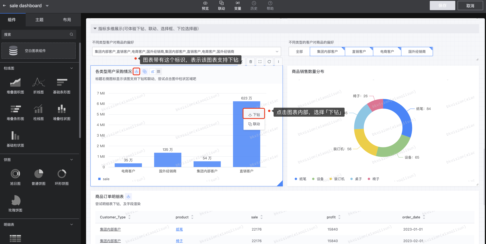
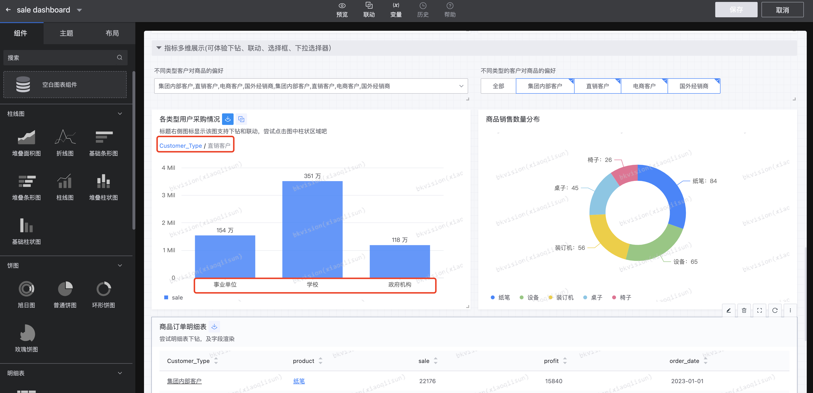
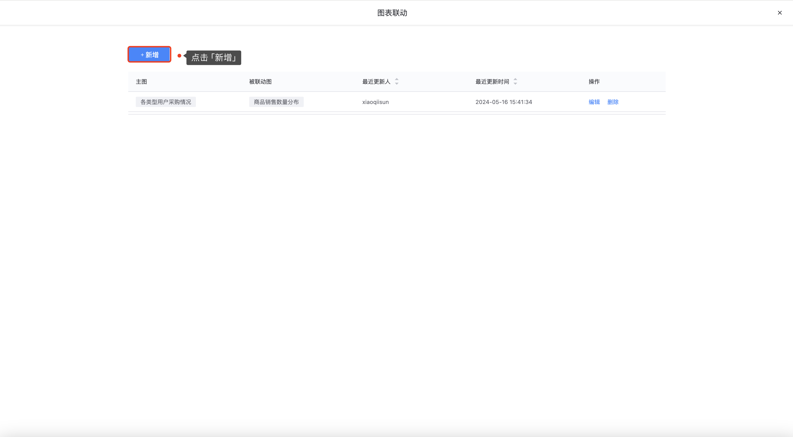

## 6.下钻、联动应用

### 下钻

下钻是一种深入数据细节的操作，它允许用户从当前的数据层级深入到更低一级的数据层级，从而查看更多关于数据的详细信息；

- **设置下钻**

在「图表配置」页面，勾选 **`下钻`**，按照下钻规则，选择下钻维度；图中下钻的一级维度是 **`Customer_Type`**，二级维度是 **`customer`**，配置完成，点击保存；

- **下钻效果展示如下**

选中一级维度为 **`Customer_Type`**下的 **`直销客户`**，即显示 **`直销客户`**下包括的二级维度 **`customer`** 的数据；

再次点击「下钻」标识即可恢复原样；

### 联动

联动是一种数据可视化的交互功能，它允许用户在查看一个数据视图时，所做的选择或操作能够实时影响到其他相关联的数据视图；

- **设置联动**

进入「编辑模式」页面 — 点击 **`联动`**；

点击**`新增`**；

根据指引，选择联动的图表及维度信息；

- **联动结果展示如下**

- **注意**

不是所有的图表都支持下钻和联动，通过以下表格可以了解支持下钻和联动的图表分别有哪些：

