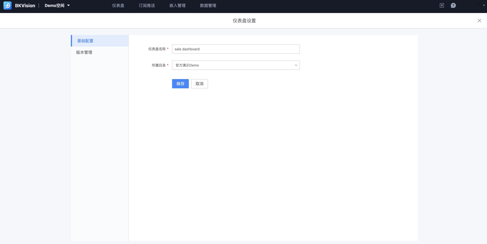

## 仪表盘

「仪表盘」作为图表平台核心页面之一，为用户提供直观的界面来浏览、编辑和管理各个仪表盘。

进入指定的「空间」后，

- 一级导航栏：仪表盘、订阅推送、嵌入管理和数据管理

- 左侧导航栏：仪表盘目录，便于快速查找指定仪表盘

- 中间展示区：仪表盘内容浏览及相关设置

  ​      「五角星」标识：收藏功能，可在目录列表置顶收藏的仪表盘；

  ​      「信封」标识：前往配置订阅推送，设置订阅条件推送该仪表盘；

  ​      「off」标识：自动刷新设置，可自定义设置刷新的时间间隔；

  ​      「刷新」标识：用户点击一次即刷新一次；

  ​      「全屏展示」标识：对仪表盘全屏展示；

  ​      「编辑」按键：点击进入仪表盘「编辑模式」页面；

  ​      「设置」标识：点击进入「仪表盘设置」页面，分为基础设置和版本管理

  

  可修改仪表盘名称和所属目录；

  

​       可切换不同版本；
