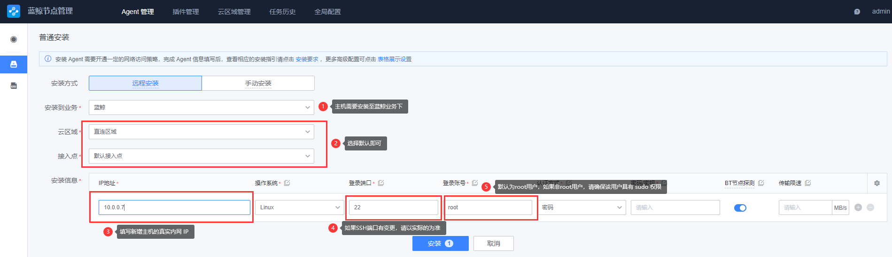
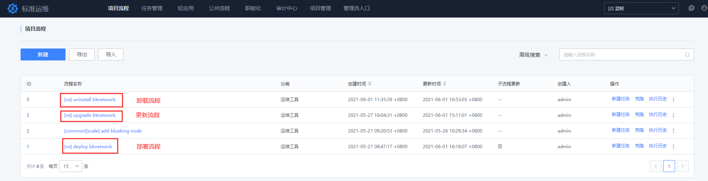

# 网络管理部署

网络管理平台可以实现对网络设备运维管理的需求，可以完成对网络设备的性能数据进行监控，以及对设备 syslog 事件进行监听及告警。

## 前期准备

网络管理部署是通过标准运维流程实现，在部署前需要做如下准备：

### 1.机器准备

建议使用独立的机器进行部署。如果蓝鲸基础环境主机资源充足的前提下，可进行复用。

**说明：** 网络管理平台分服务端与采集端，分别占用 1G 内存（共 2G），请合理安排该模块。

- 建议操作系统： CentOS 7.6

  - 建议机器配置：4 核 4G

### 2.实现免密

开始部署前，请确保新增主机跟中控机已实现免密。如果是复用机器，请忽略该步骤。

```bash
ssh-copy-id <ip>
```

### 3.请先前往节点管理，对新增主机进行 agent 安装

- 前往节点管理进行安装，根据图中步骤填写相关信息。如果是复用机器，请忽略该步骤。
  


### 4.下载套餐安装包

- 前往 [蓝鲸 S-mart 市场](https://bk.tencent.com/s-mart/application/270/detail) 下载网络管理软件包。
- 将该软件包放置中控机 /data 目录。

**注意： 软件包包含：网络管理 tgz 包以及网络管理标准运维部署模版文件。模版文件需要通过标准运维进行导入，具体操作流程请看下一步**

- **bk_sops_\*.dat**：为标准运维流程模板
- **bknetwork_2.x.x.tgz**：为网络管理软件包

### 5. 将网络管理标准运维流程模版导入至标准运维

**详细步骤：** `打开标准运维 -> 项目流程 -> 导入 -> 点击上传 -> 创建新流程`




## 开始部署

选择 `[ce] deploy bknetwork` 流程模版进行新建任务，根据提示填写相关信息。确认填写信息无误后，开始执行任务。

填写信息包括：

- `ctrl_ip`：蓝鲸环境的中控机 IP

- `deply_ip`：部署网络管理的机器。如果是新增机器部署，请先与蓝鲸环境的中控机进行免密，以及安装好 gse_agent。

- `whole_pkg_path`：网络管理平台整包在中控机的绝对路径

该部署流程主要相关操作：

- 将网络管理安装包放至指定目录

- 生成网络管理 install.config 配置

- 初始化新增节点机器

- 授权网络管理所需的 MySQL 访问权限

- 安装网络管理相关依赖、网络管理服务端、网络管理采集端


## 配置本地 host

> 下面介绍的操作均可能覆盖现有 hosts ，进行操作前请先确认是否需要备份。

在进行下述操作前，请先获取网络管理的域名：

**注意：** 网络管理默认会继承蓝鲸环境的顶级域名 (如：bktencent.com)

```bash
source /data/install/utils.fc
echo $BK_NETWORK_PUBLIC_URL
```

### 1.Windows 配置

用文本编辑器（如 `Notepad++`）打开文件：

```bash
C:\Windows\System32\drivers\etc\hosts
```

将以下内容复制到上述文件内，并将以下 IP 需更换为本机浏览器可以访问的 IP，然后保存。

**说明：** 10.0.0.2 为蓝鲸的 nginx 模块所在机器的外网 IP

```bash
10.0.0.2 bknetwork.bktencent.com
```

> 注意：如果遇到无法保存，请右键文件 hosts 并找到“属性” -> “安全”，然后选择你登录的用户名，最后点击编辑，勾选“写入”即可。

### 2.Linux / Mac OS 配置

将以下内容复制到 `/etc/hosts` 中，并将以下 IP 需更换为本机浏览器可以访问的 IP，然后保存。

```bash
10.0.0.2 bknetwork.bktencent.com
```

## 访问网络管理

完成上述操作后，可以直接前往 PaaS 平台点击访问。
