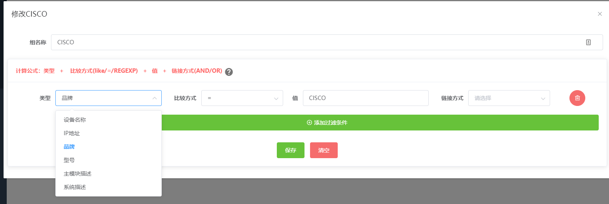
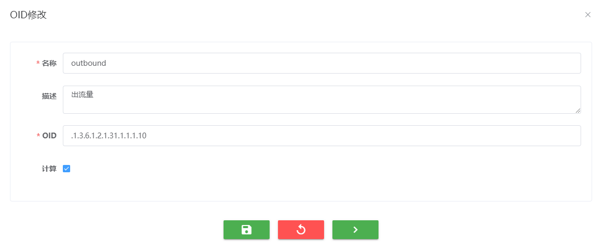
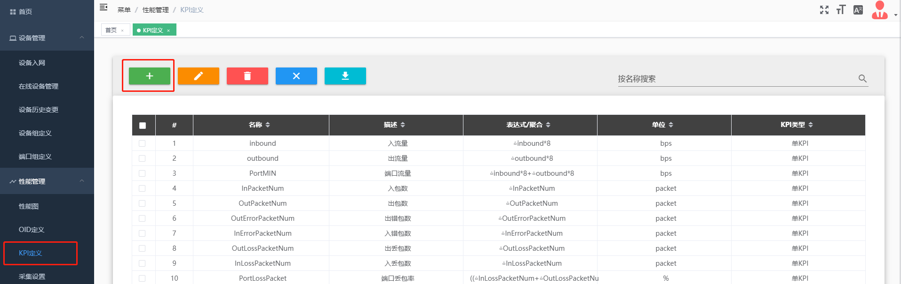
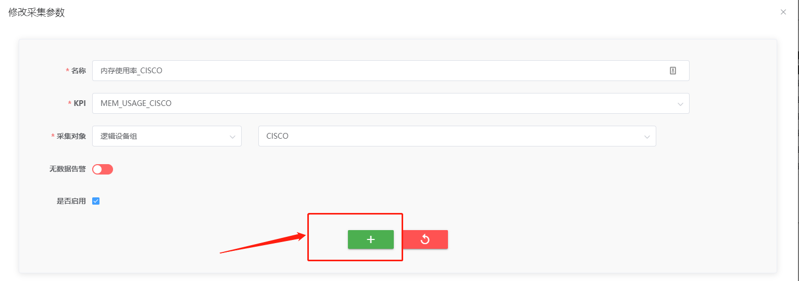
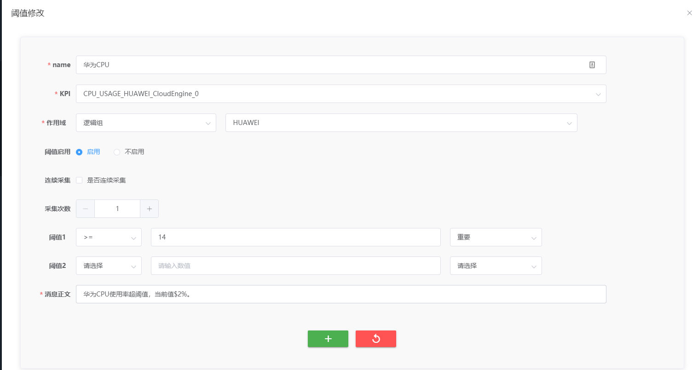
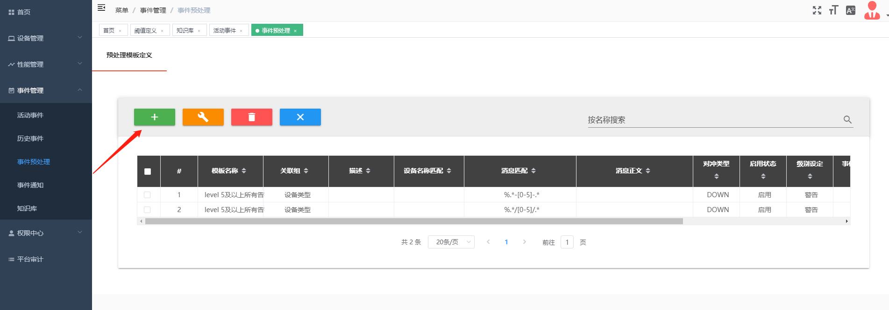
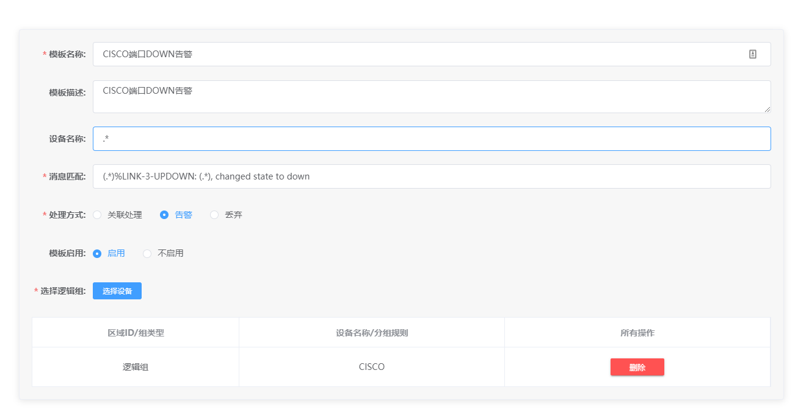
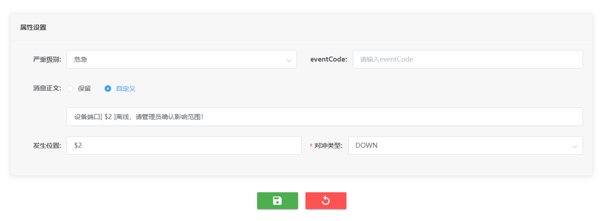
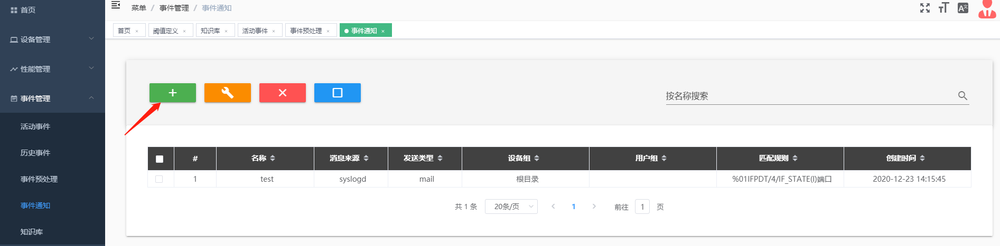
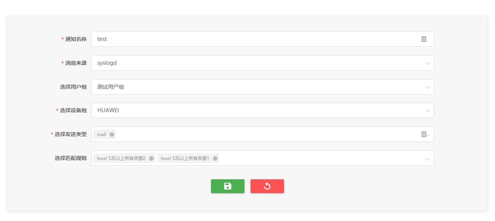

## 快速入门

在页面左上角内置了网管操作的向导说明可以引导用户完成网管的基本操作，结合向导说明可以帮助用户了解快速入门中介绍的系统操作流程。

### 添加设备进行设备入网

#### 前置条件

网络设备配置了 SNMP 代理

#### 操作步骤

1、选择 IP 类型，填写起始结束 IP，选定云区域 ID 及版本，点击搜索进行设备发现

2、通过在线设备管理模块可在线查看已入网设备的基本信息

### 设备组定义

#### 前置条件

已经有做过设备入网操作，添加过网络设备

#### 操作步骤

1、根目录下包含所有纳管设备，可以根据管理需求在根目录下面自定义创建子组。填写过滤条件进行设备筛选，不写过滤条件，默认添加所有设备。蓝鲸中默认按设备品牌分出了按品牌过滤的设备组，后续用户可以根据管理需求再基于其他维度对设备分组。

2、添加设备组后需进行用户绑定，普通用户才可查看设备，在父目录进行绑定用户后默认所有子目录生效。

3、设备组添加完成后可以点击展示组内设备，查看组内设备是否按照预设的过滤条件成功匹配上。

### 端口组定义

#### 前置条件

已经有做过设备入网操作，添加过网络设备

#### 操作步骤

1、编写端口组名称，自定义多种过滤属性，进行端口添加。

2、也可手动添加特定端口，不填写过滤条件，点击详情，右上角选择无关联，勾选需要添加的端口，点击”+“即可添加进端口组。

### 设备历史变更

#### 前置条件

无

#### 操作步骤

1、可通过设备历史变更，查看历史设备信息，支持查看特定时间段，特定设备的历史变更情况

### 手动配置监控项

#### 前置条件

完成设备入网并配置相应的设备组和端口组

#### 操作步骤

1、已经内置了常用设备的采集监控指标，如果是已经内置的指标则不需要配置 OID 和 KPI 直接配置采集设置即可。这里针对未内置的监控指标说明下如何配置。在 OID 定义界面点击添加 OID 按钮：

定义名称描述，填写 OID 信息点击保存。针对 OID 中有些值是累加值的情况下则需要勾选计算按钮进行差值计算，而如果 MIB 中定义该 OID 的字符值是一个实时值时则不需要勾选计算。差值计算多出现于一些端口性能的指标上，比如端口出、入包数，出、入流量等。

2、已经内置了常用设备的采集监控指标，如果是已经内置的 KPI 指标则跳过此步直接进行采集配置。这里针对不在内置范围之内的 KPI 指标说明下如何配置。在 KPI 定义界面点击添加 KPI 按钮

定义名称单位描述，选择 KPI 类型，选定 OID，这里支持利用多个 OID 进行四则运算来获取想要的监控指标，KPI 分为单 KPI 和聚合 KPI。一般选择单 KPI 就可以，聚合 KPI 常用在需要在一张性能图上同时查看设备的出入流量时使用。KPI 类型分为设备类型、端口类型、属性类型的 KPI，常见的 CPU、内存属于设备类型 KPI，端口出入流量，出入包数则属于端口类型 KPI，属性类型 KPI 则常用于多板卡设备的性能获取。

3、配置采集，点击采集设置，添加采集配置

定义名称，选择 KPI 指标，选定采集对象，勾选启用，点击保存按钮

### 性能图数据查看

#### 前置条件

完成采集相关配置

#### 操作步骤

1、选择设备组，定位到所有查看的设备，选择设备 KPI 直接查看性能图，若选择端口 KPI 则需手动选择所要查看到的端口。

另外也支持从在线设备管理页面右键设备快速跳转到性能图查询页面选择 KPI 查看

### 性能阈值设定

#### 前置条件

配置了性能数据采集

#### 操作步骤

1、在阈值定义添加阈值设置，弹出新建阈值对话框。

2、配置阈值设置名称，选择 KPI，选定作用域，启动阈值，设定阈值，最多支持两个阈值，撰写消息正文，点击“+”保存。为了消除突发性的临时阈值上升的告警，可以配置是否启用连续采集的机制，当连续采集次数的值都达到设定阈值了才告警。

### 事件预处理配置

#### 前置条件

网络设备开启了 syslog,并且已经将 syslog 配置转发给 NOP

#### 操作步骤

1、在事件预处理页面点击“+”添加模板，新建预处理模板。

填入模板名称、可选添加模板描述、设备名称、填写消息匹配的正则表达式，处理方式可以选择关联处理、告警、丢弃三种方式，选择是否启用这条模板，选择这个模板应用的设备组。

配置这条事件匹配的告警级别，eventCode 用来对同一类型的事件进行标记，方便事件压缩和归类，消息正文可以选择保留 syslog 的源消息显示也可以支持自定义消息正文，支持用占位符来表示变量代入到消息正文中，发生位置填写占位符变量，选择对冲类型，这样这条事件预处理就配置完成。

2、配置完预处理模板后可以在预处理模板优先级中调整策略应用的优先级，处理优先级高的模板可以直接鼠标拖拽至顶部，拖拽好优先级后点击确认优先级下发优先级

3、蓝鲸已经内置了 H3C、HUAWEI、CISCO 这三种品牌的 syslog 在级别 3 以上的告警作为兜底告警，用户可以在此基础上将不需要的告警配置丢弃动作

### 事件通知配置

#### 前置条件

配置了事件预处理模板

#### 操作步骤

1、在事件通知页面点击创建通知按钮创建事件通知条目

填写通知名称，选择消息来源为 syslogd，选择通知发送的用户组，选择告警应用的设备组，选择通知的发送类型，例如邮件、短信或者第三方统一告警平台，再选择事件匹配的规则即可。

