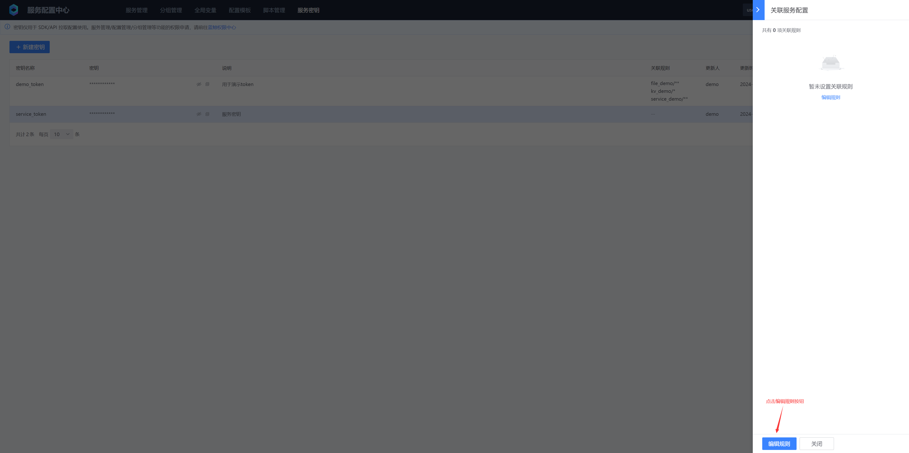

# 服务密钥管理
服务密钥为客户端拉取配置提供身份标识，服务密钥在文件型配置中控制粒度可以精确到单个文件，键值（KV）型配置中可以精确到单个配置项（键），如果客户端拉取没有被关联的服务配置，将会因权限不足而拉取配置失败
## 一、新建服务密钥


* 密钥名称
  服务密钥唯一描述，具备唯一性

* 密钥
  32位的随机字符，为客户端拉取配置提供身份标识

* 说明

  描述服务密钥的用途

* 关联规则

  决定使用此密钥可以拉取哪些服务的哪些配置文件或配置项

* 更新人

  服务密钥的更新人，这里的更新主要指更新密钥的状态（开启/停用），调整密钥的关联规则，更新密钥说明，密钥名称与密钥是不允许更新的

* 更新时间
  服务密钥的更新时间

## 二、关联服务配置




一个服务密钥可以关联多个服务的多个配置文件或配置项，关联规则支持通配符，具体规则示例如下：

```tex
1.文件型配置，以选择服务myservice为例
**
关联myservice服务下所有的配置(包含子目录)

etc/*
关联myservice服务/etc目录下所有的配置(不含子目录)

etc/nginx/nginx.conf
关联myservice服务/etc/nginx/nginx.conf文件

2. 键值（KV）型配置，以选择服务myservice为例
*
关联myservice服务下所有配置项

demo_*
关联myservice服务下所有以demo_开头的配置项
```


## 三、删除服务密钥

删除服务密钥属于高危操作， 需要先被禁用要删除的密钥，然后需要正确输入需要删除的密钥名称后才可以删除


