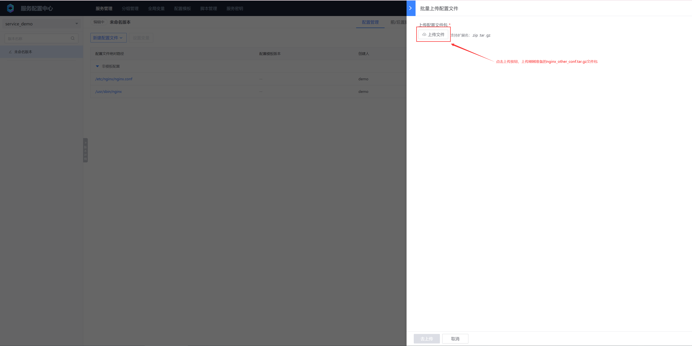
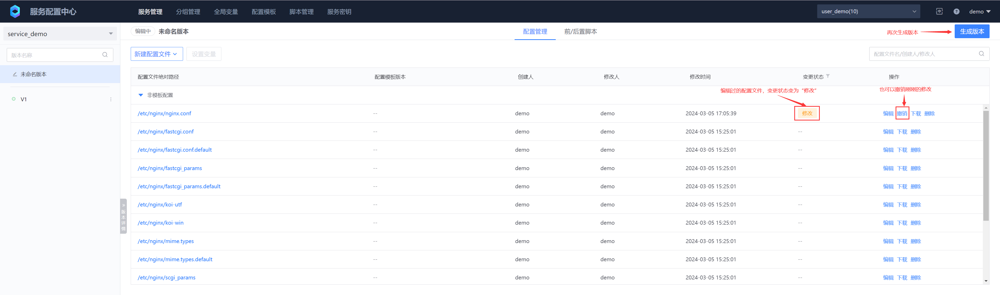
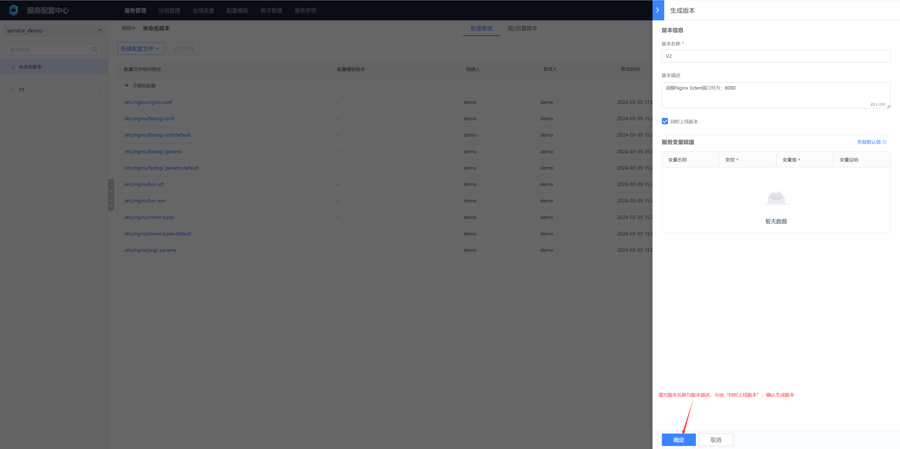
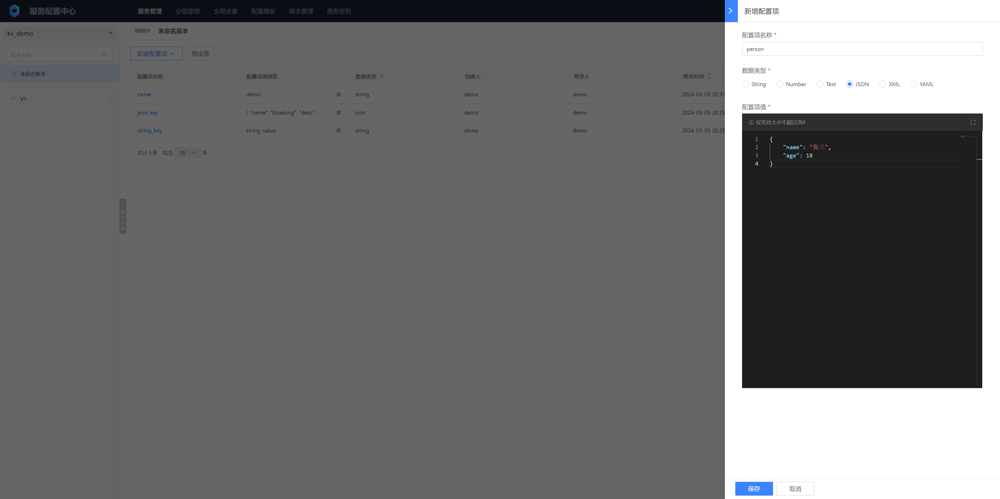
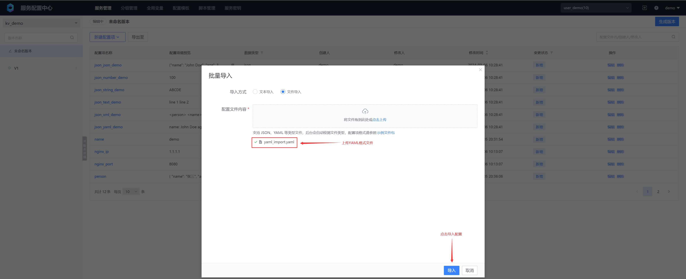

# 配置管理
## 一、添加文件型配置
### 1. 添加配置

#### 手动新增

新创建的服务下默认会有一个“未命名版本”，相当于暂存区，可以对里面的配置文件进行新删改，一旦生成服务版本后，服务版本里的配置文件变为只读状态


- 配置文件绝对路径
  配置文件放置的绝对路径，包含配置文件所在目录与配置文件名称

- 配置文件格式
  支持文本文件和二进制两种文件格式，文本文件支持编辑功能，二进制文件只支持上传与删除，不支持编辑

- 文件权限 / 用户 / 用户组
  需填写客户端操已存在的用户与用户组，否则配置文件会被赋予 **nobody:nobody** 权限

- 配置内容
  支持文件直接输入 / 从其它地方复制粘贴 / 从本地文件上传，配置文件需小于 **100MB**

#### 批量上传

把 Nginx 除 nginx.conf 以外的其他配置打包为：nginx_other_conf.tar.gz

```bash
ls -lR
.:
total 4
drwxr-xr-x 3 root root 4096 Mar  5 15:04 etc

./etc:
total 4
drwxr-xr-x 2 root root 4096 Mar  5 15:04 nginx

./etc/nginx:
total 60
-rw-r--r-- 1 root root 1077 Jan 20  2022 fastcgi.conf
-rw-r--r-- 1 root root 1077 Jan 20  2022 fastcgi.conf.default
-rw-r--r-- 1 root root 1007 Jan 20  2022 fastcgi_params
-rw-r--r-- 1 root root 1007 Jan 20  2022 fastcgi_params.default
-rw-r--r-- 1 root root 2837 Jan 20  2022 koi-utf
-rw-r--r-- 1 root root 2223 Jan 20  2022 koi-win
-rw-r--r-- 1 root root 5231 Jan 20  2022 mime.types
-rw-r--r-- 1 root root 5231 Jan 20  2022 mime.types.default
-rw-r--r-- 1 root root  636 Jan 20  2022 scgi_params
-rw-r--r-- 1 root root  636 Jan 20  2022 scgi_params.default
-rw-r--r-- 1 root root  664 Jan 20  2022 uwsgi_params
-rw-r--r-- 1 root root  664 Jan 20  2022 uwsgi_params.default
-rw-r--r-- 1 root root 3610 Jan 20  2022 win-utf
[root@bcs-op ~/workspace]# tar czf nginx_other_conf.tar.gz etc/
```





手工添加与批量上传的配置文件会被归类在“非模版配置”下

#### 从配置模版导入

这里不详细介绍从配置模版导入配置的具体内容，后续会在 [配置模版与变量](../Function/configuration_templates_and_variables.md) 章节详细介绍

### 2. 生成版本


填写好版本名称和版本描述后，下面还有两个参数：

* 同时上线版本
  沟通前面的复选框，生成版本完后会立即进入版本上线流程，否则不会进入版本上线流程

* 服务变量赋值
  变量用于业务下多个服务共用配置文件的场景，一般结合配置模板来使用，详情请见：[配置模板与变量](../Function/configuration_templates_and_variables.md) 章节

### 3. 上线版本


### 4. 编辑配置文件与版本对比







### 5. 版本列表详情


## 二、添加键值型配置
### 1. 添加配置
#### 手动新增




键值型配置支持单行配置

* String
  单行字符串，最大不超过 2 MB
* Number
  会校验配置项值是否为数字，支持整数与浮点数

键值型配置支持多行配置

* Text
  多行字符串，不做格式校验，最大不超过 2 MB
* JSON
  JSON格式字符，会做格式校验，最大不超过 2 MB
* XML
  XML格式字符，会做格式校验，最大不超过 2 MB
* YAML
  YAML格式字符，会做格式校验，最大不超过 2 MB


#### 批量导入


文本导入一般适用于简单的单行配置项导入，目前只支持String与Number


文件导入支持导入所有类型的配置项，目前支持 JSON 与 YAML 文件导入，都是以配置项名称作为 Key，数据类型与配置项值作为 Value，以下是两种文件的示例

 JSON 示例文件 json_import.json ：

```json
{
  "json_string_demo": {
    "kv_type": "string",
    "value": "ABCDE"
  },
  "json_number_demo": {
    "kv_type": "number",
    "value": 100
  },
  "json_text_demo": {
    "kv_type": "text",
    "value": "line 1\nline 2"
  },
  "json_json_demo": {
    "kv_type": "json",
    "value": "{\"name\": \"John Doe\", \"age\": 30, \"city\": \"New York\", \"hobbies\": [\"reading\", \"travelling\", \"sports\"]}"
  },
  "json_xml_demo": {
    "kv_type": "xml",
    "value": "<person>\n  <name>John Doe</name>\n  <age>30</age>\n  <city>New York</city>\n  <hobbies>\n    <hobby>reading</hobby>\n    <hobby>travelling</hobby>\n    <hobby>sports</hobby>\n  </hobbies>\n</person>"
  },
  "json_yaml_demo": {
    "kv_type": "yaml",
    "value": "name: John Doe\nage: 30\ncity: New York\nhobbies:\n  - reading\n  - travelling\n  - sports"
  }
}
```

YAML 示例文件 yaml_import.yaml ：

```yaml
yaml_string_demo:
  kv_type: string
  value: "ABCDE"

yaml_number_demo:
  kv_type: number
  value: 100

yaml_text_demo:
  kv_type: text
  value: |-
    line 1
    line 2

yaml_json_demo:
  kv_type: json
  value: |-
    {
      "name": "John Doe",
      "age": 30,
      "city": "New York",
      "hobbies": ["reading", "travelling", "sports"]
    }

yaml_xml_demo:
  kv_type: xml
  value: |-
    <person>
    <name>John Doe</name>
    <age>30</age>
    <city>New York</city>
    <hobbies>
      <hobby>reading</hobby>
      <hobby>travelling</hobby>
      <hobby>sports</hobby>
    </hobbies>
    </person>

yaml_yaml_demo:
  kv_type: yaml
  value: |-
    name: John Doe
    age: 30
    city: New York
    hobbies:
      - reading
      - travelling
      - sports
```





### 2. 导出配置项
导出配置项目前只能导出服务下所有的配置项，暂时不能选择配置项批量导出，导出配置项的应用场景主要有两个：
* 备份配置项到本地文件
* 使用导出导入功能，把一个服务下的配置项导出，然后导入到其他业务服务下，或者导入都其他服务平台下


### 3. 其他操作

生成版本、上线版本、编辑配置项、配置版本对比、版本列表详情都与文件型配置，这里不再赘述