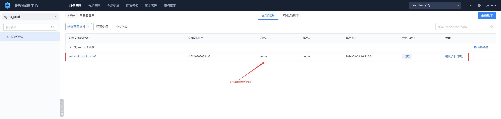
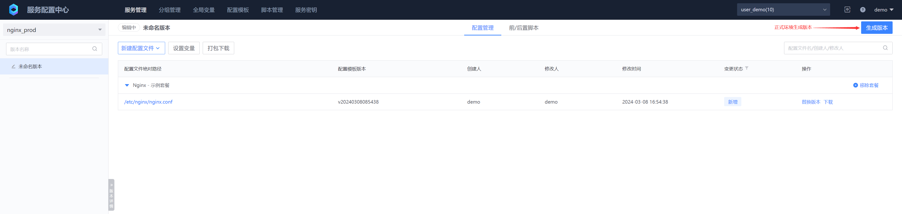
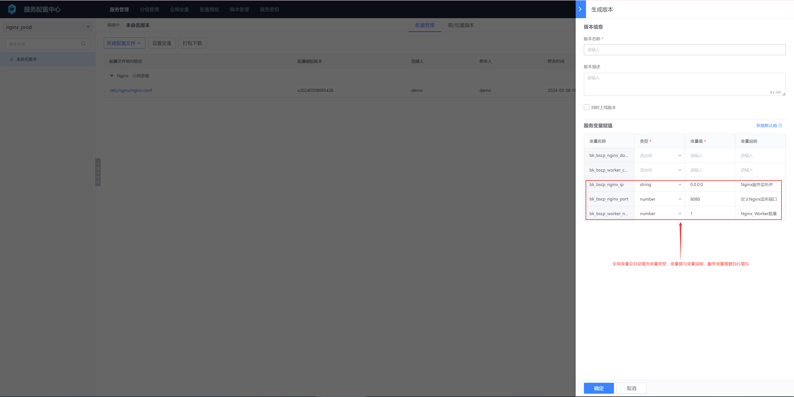

# 配置模版与变量
配置模板的主要目的是在多个服务之间共享一套公共配置文件。对于服务之间存在差异的部分，我们可以通过使用变量来解决这些差异。这样可以提高配置管理的效率和一致性，目前配置模版与变量仅适用于文件型配置服务

## 一、配置模板层级简介


* 配置模板属于业务级别，业务下多个服务可以共用一个或多个配置模板套餐
*  配置模板的具体层级为：模板空间 →  模板套餐 → 模板文件
* 同一业务下模板空间名称唯一，同一模板空间下模板套餐名称唯一，模板配置项名称 + 模板配置项路径唯一
* 一个服务可以导入一个或多个模板空间下的一个或多个配置模板套餐，不可直接导入配置模板文件
* 服务导入多个模板空间下的模板配置项名称 + 模板配置项路径需要保持唯一，如果有冲突则禁止导入


## 二、变量说明

变量分为两个层级：业务级别和服务级别。业务级别的变量作为全局变量，适用于整个业务范围。当服务需要使用全局变量时，可以根据实际需求修改全局变量的默认值，以满足特定服务的配置需求，这样可以确保配置的灵活性和一致性。

变量支持同时应用于模板和非模板文件配置，在模板配置中使用变量时，表示各个服务的变量值不同；而在非模板文件配置中使用变量时，表示各个版本的变量值有所不同。

### 1. 手动新建全局变量


* 变量名称

  为了统一和标识，我们规定变量以 bk_bscp_ 或 BK_BSCP_ 作为前缀，您可以根据自己的使用习惯选择合适的变量前缀，这样可以方便识别和管理您的变量

* 变量类型

  我们支持两种类型的变量值：string 和 number ，您可以根据实际需求和变量值的具体情况来选择适合的类型，以确保变量的正确性和有效性

* 变量默认值

  全局变量在预定义时就设定了默认值，这些默认值可以在后续使用中根据需要进行相应的调整。
  
### 2. 导入全局变量


批量导入格式：

每个变量占一行，共包含4个字段。第1个字段是变量名称，第2个字段是变量类型，第3个字段是变量默认值，第4个字段（直至最后一个字段）是变量描述。默认情况下，各字段之间使用空字符作为分隔符，但用户可以根据需要自定义分隔符


### 3. 使用全局变量

配置文件变量使用 **bk_bscp_** 或 **BK_BSCP_** 作为前缀，使用双大括号包含，格式如 **{{ .bk_bscp_name }}**，**{{ .BK_BSCP_NAME }}**

在后续的章节“新建配置模板”和“引用配置模板”中，我们将详细介绍全局变量和服务变量的使用方法，以便您更好地理解和应用这两种类型的变量。


## 三、新建配置模板
### 1. 创建模版空间
如果不创建模板空间，可以直接使用默认空间


### 2. 创建模版套餐

如果不创建模板套餐，可以直接使用默认套餐


### 3. 添加模版文件


模版文件内容：

```tex
#user  nobody;
worker_processes  {{ .bk_bscp_worker_num }};

#error_log  logs/error.log;
#error_log  logs/error.log  notice;
#error_log  logs/error.log  info;

#pid        logs/nginx.pid;


events {
    worker_connections  {{ .bk_bscp_worker_conn }};
}


http {
    include       mime.types;
    default_type  application/octet-stream;

    #log_format  main  '$remote_addr - $remote_user [$time_local] "$request" '
    #                  '$status $body_bytes_sent "$http_referer" '
    #                  '"$http_user_agent" "$http_x_forwarded_for"';

    #access_log  logs/access.log  main;

    sendfile        on;
    #tcp_nopush     on;

    #keepalive_timeout  0;
    keepalive_timeout  65;

    #gzip  on;

    server {
        listen       {{ .bk_bscp_nginx_ip }}:{{ .bk_bscp_nginx_port }};
        server_name  {{ .bk_bscp_nginx_domain }};

        #charset koi8-r;

        #access_log  logs/host.access.log  main;

        location / {
            root   html;
            index  index.html index.htm;
        }

        #error_page  404              /404.html;

        # redirect server error pages to the static page /50x.html
        #
        error_page   500 502 503 504  /50x.html;
        location = /50x.html {
            root   html;
        }

        # proxy the PHP scripts to Apache listening on 127.0.0.1:80
        #
        #location ~ \.php$ {
        #    proxy_pass   http://127.0.0.1;
        #}

        # pass the PHP scripts to FastCGI server listening on 127.0.0.1:9000
        #
        #location ~ \.php$ {
        #    root           html;
        #    fastcgi_pass   127.0.0.1:9000;
        #    fastcgi_index  index.php;
        #    fastcgi_param  SCRIPT_FILENAME  /scripts$fastcgi_script_name;
        #    include        fastcgi_params;
        #}

        # deny access to .htaccess files, if Apache's document root
        # concurs with nginx's one
        #
        #location ~ /\.ht {
        #    deny  all;
        #}
    }


    # another virtual host using mix of IP-, name-, and port-based configuration
    #
    #server {
    #    listen       8000;
    #    listen       somename:8080;
    #    server_name  somename  alias  another.alias;

    #    location / {
    #        root   html;
    #        index  index.html index.htm;
    #    }
    #}


    # HTTPS server
    #
    #server {
    #    listen       443 ssl;
    #    server_name  localhost;

    #    ssl_certificate      cert.pem;
    #    ssl_certificate_key  cert.key;

    #    ssl_session_cache    shared:SSL:1m;
    #    ssl_session_timeout  5m;

    #    ssl_ciphers  HIGH:!aNULL:!MD5;
    #    ssl_prefer_server_ciphers  on;

    #    location / {
    #        root   html;
    #        index  index.html index.htm;
    #    }
    #}

}
```

模版文件共包含 4 个变量：

- {{ .bk_bscp_worker_num }}

  Nginx Worker数量，全局变量

- {{ .bk_bscp_worker_conn }}

  Nginx 每个Worker最大连接数，非全局变量

- {{ .bk_bscp_nginx_ip }}

  Nginx服务监听IP地址，全局变量

- {{ .bk_bscp_nginx_port }}

  Nginx服务监听端口，全局变量

- {{ .bk_bscp_nginx_domain }}

  Nginx绑定域名，非全局变量


## 四、引用配置模板

新建两个文件型服务，Nginx测试环境 与 Nginx正式环境


在导入模板文件时，默认使用最新版本（latest），但您也可以选择指定特定版本。若指定了具体版本，在模板文件更新后，导入的模板文件不会自动更新，需要手动进行调整。




正式环境与测试环境填写变量信息，生成版本，生成版本时会自动检测配置模版文件中的变量






分别查看正式环境与测试环境生成的版本配置文件内容


