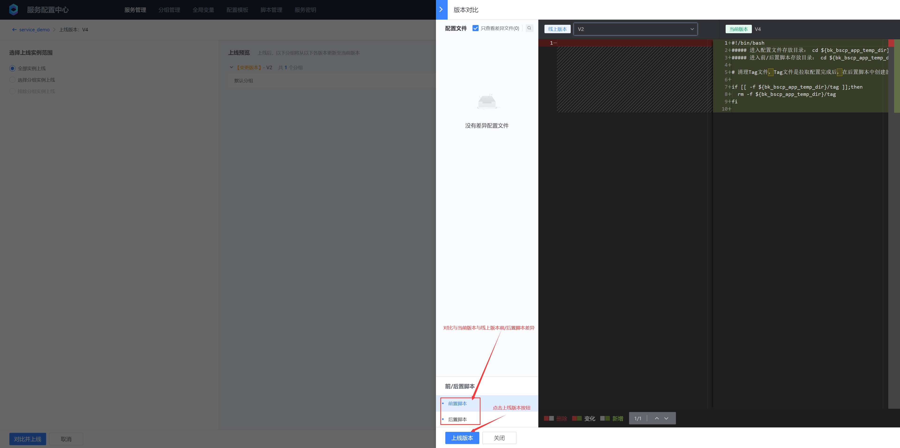

# 前/后置脚本
## 一、应用场景与限制

- 前/后置脚本目前只适用于文件型配置服务，键值、表格型配置服务暂不支持
- 与服务配置文件相同，前置和后置脚本也需要进行版本控制，以便跟踪它们的变更
- 客户端实例拉取配置文件之前执行前置脚本，拉取文件之后，执行后置脚本
- 前置脚本常用于准备环境、检查依赖等操作
- 后置脚本通常用于在客户端完成配置拉取后执行操作，如创建配置拉取完成的标识、验证配置文件以及应用配置更改等。

## 二、概念说明

- 脚本
  脚本支持 Python 和 Shell 两种类型。您可以根据自己的需求和编程语言偏好选择合适的脚本类型。
  
- 脚本版本
  脚本支持版本管理，允许您创建和维护多个版本的脚本。当您对脚本进行修改时，可以创建新的版本而不影响已绑定到服务的旧版本脚本。
  
- 上线
  一个脚本只能有一个已上线版本，服务绑定脚本时，默认绑定当前上线的脚本版本。
  
- 脚本执行

  容器场景下，前/后置脚本是在bscp初始化容器（Pod第一次启动时）和bscp-sidecar容器（服务配置版本有更新时）下执行，并不会在业务容器下执行，如果前/后置脚本需要对业务容器进程进行操作，可以参考：[在 Pod 中的容器之间共享进程命名空间](https://kubernetes.io/zh-cn/docs/tasks/configure-pod-container/share-process-namespace/)

## 三、执行流程


## 四、操作步骤
### 1. 创建前/后置脚本


* 脚本名称
  脚本唯一标识

* 分类标签

  脚本按功能、用途等方式分类，在脚本列表页面可以按分类查看

* 脚本描述

  用于描述脚本功能、用途等信息

* 版本号

  脚本有版本控制，默认按：v%Y%m%d%H%M%S命名，用户可以自定义版本号

* 脚本内容

  支持bash与python两种脚本，python使用python3版本

* 内置变量

  - 配置根目录

    ${bk_bscp_temp_dir}：客户端配置的配置存放临时目录（temp_dir），默认值为 /data/bscp

  - 业务ID

    ${bk_bscp_biz}：蓝鲸配置平台上的业务ID，例如：2

  - 服务名称：${bk_bscp_app}

    服务配置中心上的服务名称，例如：demo_service

  - 服务配置目录

    ${bk_bscp_app_temp_dir}：单个客户端可使用多个服务的配置，为保证路径唯一，服务配置需存放于：配置根目录/业务ID/服务名称，服务配置存放目录 = 配置存放根目录/业务ID/服务名称

  - 当前配置版本名称

    ${bk_bscp_current_version_name}：当前客户端最近一次成功拉取的服务配置版本名称，如 V1，通常会在后置脚本中为服务配置版本添加标识，以表示配置文件已经完成拉取


### 2. 使用前/后置脚本





### 3. 前/后置脚本执行结果

部署示例 demo.yaml，查看前/后置脚本执行结果

```yaml
apiVersion: apps/v1
kind: Deployment
metadata:
  name: test-listener
  namespace: default
spec:
  selector:
    matchLabels:
      app: test-listener
  template:
    metadata:
      labels:
        app: test-listener
    spec:
      initContainers:
        # BSCP init 容器，负责第一次拉取配置文件到指定目录下
        - name: bscp-init
          image: ccr.ccs.tencentyun.com/blueking/bscp-init:latest
          env:
            # BSCP 业务 ID
            - name: biz
              value: "10"
            # BSCP 服务名称
            - name: app
              value: "service_demo"
            # BSCP 服务订阅地址，在BSCP后台部署的集群上执行（默认在容器平台的“蓝鲸”项目下）,执行以下命令获取：
            # kubectl get svc bk-bscp-feed-feedserver-nodeport -n bk-bscp
            # 如果客户端到集群Node网络不通，可以自行给feedserver配置LoadBalancer
            - name: feed_addrs
              value: "10.0.0.1:31510"
            # 服务秘钥，填写上一步创建的服务密钥
            - name: token
              value: "ABCDEFGHIJKLMNOPQRSTUVWXYZ1234"
            # 配置文件临时目录，文件将下发到 {temp_dir}/files 目录下
            - name: temp_dir
              value: '/data/bscp'
          # 需要同时挂载文件临时目录到 init 容器，sidecar 容器，业务容器
          volumeMounts:
            - mountPath: /data/bscp
              name: bscp-temp-dir
      containers:
        # 业务容器
        - name: test-listener
          image: alpine
          command:
          - "/bin/sh"
          - "-c"
          - |
            apk add --no-cache inotify-tools
            echo "start watch ..."
            while true; do
            # 监听 /data/bscp/metadata.json 的写入事件
            inotifywait -m /data/bscp/metadata.json -e modify |
                while read path action file; do
                    # 递归遍历 /data/bscp/files 目录下的所有文件，输出其绝对路径
                    find /data/bscp/files
                done
            done
          resources:
            limits:
              memory: "128Mi"
              cpu: "500m"
          # 需要同时挂载文件临时目录到 init 容器，sidecar 容器，业务容器
          volumeMounts:
            - mountPath: /data/bscp
              name: bscp-temp-dir
        # BSCP sidecar 容器，负责监听版本变更时间，并更新临时目录下的配置文件，更新完成后向 metadata.json 写入事件
        - name: bscp-sidecar
          image: ccr.ccs.tencentyun.com/blueking/bscp-sidecar:latest
          env:
            # bscp-sidecar 容器的环境变量配置和 bscp-init 容器完全一致
            - name: biz
              value: "10"
            - name: app
              value: "service_demo"
            - name: feed_addrs
              value: "10.0.0.1:31510"
            - name: token
              value: "ABCDEFGHIJKLMNOPQRSTUVWXYZ1234"
            - name: temp_dir
              value: '/data/bscp'
          resources:
            limits:
              memory: "128Mi"
              cpu: "500m"
          volumeMounts:
            - mountPath: /data/bscp
              name: bscp-temp-dir
      volumes:
        - name: bscp-temp-dir
          emptyDir: {}
```

```bash
# 部署示例Deployment
kubectl apply -f demo.yaml

# 初次启动Pod查看bscp-init容器，之后看bscp-sidecar容器
kubectl logs test-listener-658f478944-5vzw8 -c bscp-init
===================================================================================
oooooooooo   oooo    oooo         oooooooooo     oooooooo     oooooo    oooooooooo
 888     Y8b  888   8P             888     Y8b d8P      Y8  d8P    Y8b   888    Y88
 888     888  888  d8              888     888 Y88bo       888           888    d88
 888oooo888   88888[      8888888  888oooo888     Y8888o   888           888ooo88P
 888     88b  888 88b              888     88b        Y88b 888           888
 888     88P  888   88b            888     88P oo      d8P  88b    ooo   888
o888bood8P   o888o  o888o         o888bood8P   88888888P     Y8bood8P   o888o
===================================================================================

Version  : v1.1.1
BuildTime: 2024-02-19T11:05:52+0800
GitHash  : bb1e4ecd29525971a894db35e22086999f0de625
GoVersion: go1.20.4
use command line args or environment variables
args: --biz=10 --app=service_demo --feed-addrs=10.0.5.10:31510 --token=*** --temp-dir=/data/bscp --port=9616 --file-cache-enabled=true --file-cache-dir=/data/bscp/cache --cache-threshold-gb=2.000000
time=2024-03-08T01:53:52.259Z level=INFO source=client/client.go:69 msg="instance fingerprint" fingerprint=172-17-2-165:606135
time=2024-03-08T01:53:52.260Z level=INFO source=upstream/upstream.go:143 msg="dial upstream server success" upstream=10.0.5.10:31510
time=2024-03-08T01:53:52.263Z level=INFO source=cache/cache.go:189 msg="start auto cleanup file cache " cacheDir=/data/bscp/cache cleanupIntervalSeconds=300s thresholdGB=2GB retentionRate=90%
time=2024-03-08T01:53:52.263Z level=INFO source=cache/cache.go:202 msg="calculate current cache directory size" currentSize="4.0 KiB"

# 执行前置脚本成功
time=2024-03-08T01:53:52.272Z level=INFO source=util/hook.go:76 msg="exec hook success" script=pre_hook output=""

# 开始拉取配置
time=2024-03-08T01:53:52.426Z level=INFO source=client/types.go:69 msg="copy file from cache success" dst=/data/bscp/10/service_demo/files/etc/nginx/fastcgi.conf.default
time=2024-03-08T01:53:52.426Z level=INFO source=client/types.go:69 msg="copy file from cache success" dst=/data/bscp/10/service_demo/files/etc/nginx/fastcgi_params.default
time=2024-03-08T01:53:52.427Z level=INFO source=client/types.go:69 msg="copy file from cache success" dst=/data/bscp/10/service_demo/files/etc/nginx/koi-utf
time=2024-03-08T01:53:52.427Z level=INFO source=client/types.go:69 msg="copy file from cache success" dst=/data/bscp/10/service_demo/files/etc/nginx/fastcgi.conf
time=2024-03-08T01:53:52.427Z level=INFO source=client/types.go:69 msg="copy file from cache success" dst=/data/bscp/10/service_demo/files/etc/nginx/fastcgi_params
time=2024-03-08T01:53:52.629Z level=INFO source=client/types.go:69 msg="copy file from cache success" dst=/data/bscp/10/service_demo/files/etc/nginx/scgi_params
time=2024-03-08T01:53:52.629Z level=INFO source=client/types.go:69 msg="copy file from cache success" dst=/data/bscp/10/service_demo/files/etc/nginx/scgi_params.default
time=2024-03-08T01:53:52.629Z level=INFO source=client/types.go:69 msg="copy file from cache success" dst=/data/bscp/10/service_demo/files/etc/nginx/koi-win
time=2024-03-08T01:53:52.629Z level=INFO source=client/types.go:69 msg="copy file from cache success" dst=/data/bscp/10/service_demo/files/etc/nginx/mime.types.default
time=2024-03-08T01:53:52.629Z level=INFO source=client/types.go:69 msg="copy file from cache success" dst=/data/bscp/10/service_demo/files/etc/nginx/mime.types
time=2024-03-08T01:53:52.832Z level=INFO source=client/types.go:69 msg="copy file from cache success" dst=/data/bscp/10/service_demo/files/etc/nginx/uwsgi_params.default
time=2024-03-08T01:53:52.832Z level=INFO source=client/types.go:69 msg="copy file from cache success" dst=/data/bscp/10/service_demo/files/etc/nginx/nginx.conf
time=2024-03-08T01:53:52.832Z level=INFO source=client/types.go:69 msg="copy file from cache success" dst=/data/bscp/10/service_demo/files/etc/nginx/win-utf
time=2024-03-08T01:53:52.832Z level=INFO source=client/types.go:69 msg="copy file from cache success" dst=/data/bscp/10/service_demo/files/etc/nginx/uwsgi_params
time=2024-03-08T01:53:52.843Z level=INFO source=client/types.go:69 msg="copy file from cache success" dst=/data/bscp/10/service_demo/files/usr/sbin/nginx

# 执行后置脚本成功
time=2024-03-08T01:53:52.845Z level=INFO source=util/hook.go:76 msg="exec hook success" script=post_hook output=""

# 把本次配置拉取结果写入meta文件
time=2024-03-08T01:53:52.845Z level=INFO source=eventmeta/metadata.go:79 msg="append event metadata to metadata.json success" event="{\"releaseID\":376,\"status\":\"SUCCESS\",\"message\":\"\",\"eventTime\":\"2024-03-08T01:53:52Z\"}"
time=2024-03-08T01:53:52.845Z level=INFO source=pull.go:131 msg="pull files success" releaseID=376

# 进入bscp-sidecar容器查看前后置脚本所在路径
kubectl exec -it test-listener-658f478944-5vzw8 -c bscp-sidecar -- /bin/bash
cd /data/bscp/10/service_demo/hooks/
pwd
/data/bscp/10/service_demo/hooks
ls -l
total 8
-rwxr-xr-x    1 root     root           271 Mar  8 01:53 post_hook.sh
-rwxr-xr-x    1 root     root           332 Mar  8 01:53 pre_hook.sh

# 查看前/后置脚本内容
cat pre_hook.sh 
#!/bin/bash
##### 进入配置文件存放目录： cd ${bk_bscp_app_temp_dir}/files
##### 进入前/后置脚本存放目录： cd ${bk_bscp_app_temp_dir}/hooks

# 清理Tag文件，Tag文件是拉取配置完成后，在后置脚本中创建的

if [[ -f ${bk_bscp_app_temp_dir}/tag ]];then
  rm -f ${bk_bscp_app_temp_dir}/tag
fi

cat post_hook.sh 
#!/bin/bash
##### 进入配置文件存放目录： cd ${bk_bscp_app_temp_dir}/files
##### 进入前/后置脚本存放目录： cd ${bk_bscp_app_temp_dir}/hooks

# 配置拉取完毕后创建tag文件
echo "${bk_bscp_current_version_name}" >${bk_bscp_app_temp_dir}/tag

# 查看后置脚本写入tag文件内容
cat ../tag 
V4
