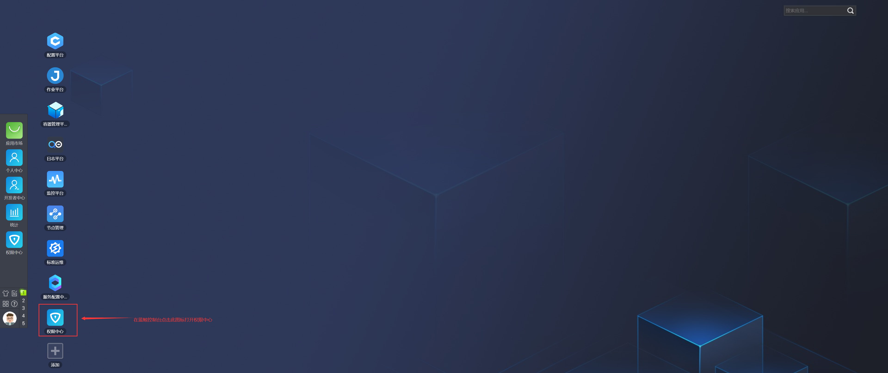

# 权限配置
服务配置中心（BSCP）使用蓝鲸权限中心（BKIAM）提供权限管理服务

为简化蓝鲸各平台的管理，创建业务时，蓝鲸配置平台将自动在权限中心（BKIAM）生成两个用户组： 业务查看组 与 业务运维组

- 业务查看组（只读）

  此组关联该业务在蓝鲸各平台的查看权限，通常供非运维人员浏览蓝鲸平台各类信息

- 业务运维组（读写）

  此组绑定了该业务在蓝鲸各平台的管理权限，通常供运维人员查看平台各类信息并操作各平台以管理业务

 在权限中心查看这两个用户组信息

业务查看组默认不包含任何成员，需要在后期由业务运维人员进行添加

业务运维组默认包含在配置平台业务资源下设置的业务运维角色的人员，后续也可以由业务运维人员进行成员的增减

业务查看组与业务运维组的权限管理粒度为业务维度，若需更细粒度的管理，可在权限中心创建用户组并关联相应操作权限。也可使用权限中心的自定义权限功能（不推荐）来管理更精细的权限范围。详情请参考以下文档：

[创建权限模板](https://bk.tencent.com/docs/markdown/ZH/IAM/1.12/UserGuide/QuickStart/CreatePremissionTemplates.md)

[创建用户组](https://bk.tencent.com/docs/markdown/ZH/IAM/1.12/UserGuide/QuickStart/CreateGroups.md)

[申请自定义权限](https://bk.tencent.com/docs/markdown/ZH/IAM/1.12/UserGuide/QuickStart/ApplyToCustomPermissions.md)